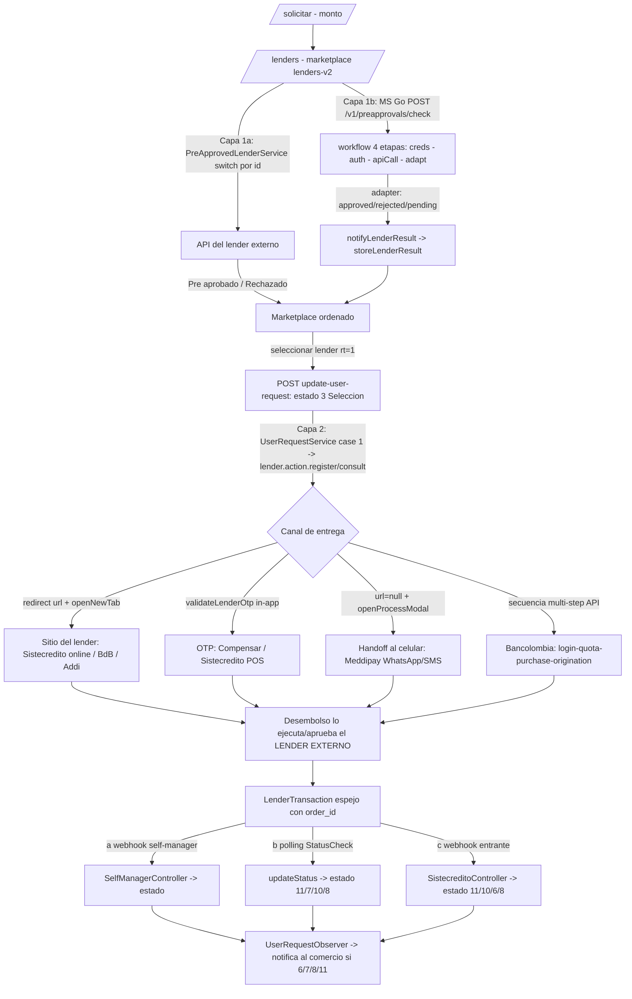

# Agregadores rt=1 — patrón común y diferencias por lender

> Documento de contexto para arrancar tareas sobre los flujos de **agregador** (`response_type=1`). Síntesis de dos lecturas paralelas profundas sobre `legacy-backend`, el microservicio Go `pre-approvals-service` y el `application` viejo (bitbucket), más los docs del equipo.
>
> Convención (igual que `CREDIFAMILIA-FLUJO-ANALISIS.md`): se cita `archivo:línea` en todo el documento. Los identificadores de código (clases, métodos, constantes, endpoints) van **verbatim**; la prosa va en español. Donde una afirmación es frágil, está sin verificar o contradice otro doc, **se dice explícitamente**.
>
> **Backbone `response_type`** (de `CREDITOP.md §4`): rt=0 redirección (el banco decide en su sitio), **rt=1 agregador/integración (la API del lender decide y el lender externo gestiona la cartera)**, rt=2/3 CreditopX in-platform (CreditOp decide y gestiona), rt=4 híbrido (Credifamilia: origina in-platform, radica por SOAP). Este doc cubre **rt=1**.
>
> **Alcance:** Bancolombia (BNPL 68 / Consumo 100), Sistecrédito (9), Welli (23/141/142/166), Meddipay (39), Prami (12), Banco de Bogotá (credi-convenio + CeroPay 133), Compensar, Addi, y **Corbeta** (canal retail batch, que NO es un lender). Credifamilia (rt=4) tiene su propio doc; acá solo se contrasta.
>
> **Dónde encaja:** esta ficha cubre solo lo **distintivo** de los agregadores rt=1. El **tronco común** que dan por sabido (entrada → OTP → datos personales/laborales → marketplace) es dueño de [REFERENCIA-FLUJOS.md §1](./REFERENCIA-FLUJOS.md); el **encadenamiento FE↔BE**, de [MAPA-FLUJOS.md](./MAPA-FLUJOS.md); y la **comparación transversal por entidad** (quién decide/financia/cobra/cierra/simulable), de [lenders/README.md](../lenders/README.md).

---

## 1. Resumen ejecutivo

Un **agregador rt=1** es un lender en el que **CreditOp solo origina**: muestra la opción en el marketplace, arma la solicitud y hace el handoff, pero **la decisión de crédito la toma la API del lender externo** y **el lender externo gestiona la cartera**. CreditOp no desembolsa, no firma el crédito y **no lleva cobranza/mora/cuotas** post-desembolso; solo **"espeja" el estado** vía webhook, polling o el retorno del redirect (`CREDITOP.md §4`, memoria `continuacion-credito-servicing`).

Esto lo separa tajantemente de **CreditopX (rt=2/3)**, donde CreditOp decide in-platform (el cupo se sella en `getLenders`) y gestiona todo el ciclo con crons propios. Por eso **rt=2/3 es inyectable** en pruebas sintéticas y **rt=1 NO** (la decisión vive en un HTTP externo; a lo sumo se mockea a nivel de transporte). Ver §6.

**Flujo punta a punta (1 párrafo):** el cliente/asesor llega al marketplace (`/lenders` = `lenders-v2`). La **pre-aprobación** se resuelve contra la API del lender por una de dos vías que coexisten (strangler/parallel-run, memoria `migracion-application-a-legacy-estado`): (a) el orquestador legacy `PreApprovedLenderService::validatePreApproveLender` (`PreApprovedLenderService.php:41`), un gran switch **bifurcado por `lender->id`** que consulta cada API externa y empuja el lender a "Pre aprobado" o lo saca del listado; o (b) el microservicio Go `pre-approvals-service` (POST `/v1/preapprovals/check`), que corre un **workflow genérico de 4 etapas** (`workflow.go:52`) con un *adapter* por lender que canoniza la respuesta a `approved/rejected/pending` y **notifica el resultado al legacy** (`storeLenderResult`). Al **seleccionar** un lender rt=1 se hace POST `update-user-request/:id` (estado 3 = Selección) y empieza el **handoff**, cuyo canal difiere por lender: **redirect** al sitio del lender (Sistecrédito online, Banco de Bogotá, Addi), **handoff in-app por OTP** (Compensar, Sistecrédito POS), **handoff al celular** del cliente por WhatsApp/SMS (Meddipay), o secuencia multi-step de API (Bancolombia). El **desembolso lo ejecuta/aprueba el lender externo** al final de su propia secuencia; CreditOp crea un `LenderTransaction` **espejo** y **sincroniza el estado** por webhook self-manager, polling (`StatusCheck`) o webhook entrante propio (Sistecrédito). **Corbeta** añade sobre Bancolombia una capa aparte de **facturación/conciliación batch** por crons para el retail físico (PIN de caja → factura → confirmación al lender).

**Aviso transversal:** en `legacy-backend` **falta cerrar el ciclo de webhooks rt=1** (es un PENDIENTE conocido de la migración, memoria `migracion-application-a-legacy-estado`). Las rutas del webhook `self-manager` de los redirect-aggregators y los crons de Corbeta viven **hoy en el `application` viejo**, no en legacy. Ver §6 y §8.

---

## 2. Patrón común end-to-end

El patrón rt=1 tiene **dos capas independientes**:

1. **Pre-aprobación / listado** (¿aparece "Pre aprobado" y con qué cupo?) → la resuelve el **MS Go** (`pre-approvals-service`) o el legacy `PreApprovedLenderService`, consultando la API del lender.
2. **Entrega** (¿cómo continúa el cliente tras seleccionar?) → la decide **legacy** `UserRequestService` según `response_type` + presencia de credencial, instanciando `$lender->action` (clase en `app/Actions/Lenders/*`) y llamando `register()`/`consult()`/`validate()`.

### 2.1 Capa 1a — Pre-aprobación legacy (switch por id)

`LenderRetrievalService::getLenders` arma el marketplace y delega en `PreApprovedLenderService::validatePreApproveLender` (`PreApprovedLenderService.php:41`). El servicio itera cada lender y **bifurca por id** (no polimórfico): un bloque `if ($lender->id == N)` por proveedor (68 BNPL, 100 Consumo, [23,141,142] Welli, 9 Sistecrédito, 39 Meddipay, 12 Prami, 24 Credifamilia, 133 BdB…). Cada bloque:

- Consulta la **API externa** vía la clase Action (`new BancolombiaBnpl()->validateQuota(...)`, `PreApprovedLenderService.php:171`).
- Según la respuesta, **empuja** el lender a `$approvedLenders` (arriba, `probability='Pre aprobado'`, `probability_color='text-success'`, `sort=1`, `pre_approved_lender=true`, `PreApprovedLenderService.php:172-179`) **o lo saca** con `unset($format_lenders[$key])`.
- Cierre: `array_merge($approvedLenders, $format_lenders, $asyncLenders)`.

**La decisión es 100% del proveedor externo**; CreditOp solo **mapea** la respuesta a los campos de contrato del front.

### 2.2 Capa 1b — Pre-aprobación por microservicio Go

El front nuevo llama al MS: POST `/v1/preapprovals/check` (`handler.go:45`), que valida la `lending_product_key` y los requisitos por lender (`validateLenderRequirements`: `RequiresAmount`, `MinimumAmount`, `RequiresAlliedBranchHash`, `lending_product.go:27-61`), crea el `LendingProduct` por factory y ejecuta `CheckPreApprovalUseCase.Execute` (`check_preapproval.go:56`). El use case: cache-check (`ShouldCheckAgain`), `GetApplicant`, corre el **workflow genérico** y persiste en DynamoDB.

**Workflow de 4 etapas** (idéntico para todo rt=1, `workflow.go:52`): `runCredentials` → `runAuth` → `runAPICall` → `runAdapt`. Cada lender aporta 3 piezas intercambiables:

- **CredentialsService** — scope per-branch vs per-merchant (`CredentialScope`, `lending_product.go`).
- **AuthStrategy** — p.ej. `bancolombia_bnpl/oauth2_strategy.go` (OAuth2 client_credentials).
- **Adapter** — traduce la respuesta cruda del lender a `domain.PreApproval` (`StatusApproved`/`StatusRejected`/`StatusPending`, `lending_product.go:79-81`).

`BuildContractFields` (`contract_fields.go:20`) fija el contrato compartido con el front: Approved → `'Pre aprobado'` / `text-success` / `sort=1` / `pre_approved_lender=true`; else → `'Rechazado'` / `text-info` / `sort=2` (`contract_fields.go:32-37`).

**Notificación de resultado (MS → legacy):** si el resultado es terminal (approved/rejected) y hay `user_request_id`, `notifyLenderResult` (`check_preapproval.go:160,199`) llama `LenderResultService.NotifyLenderResult` = POST `{legacy}/api/onboarding/loan-application/{id}/lender-result` con `{lender_id, is_approved, available_amount}`. En legacy lo recibe `ListLenderController::storeLenderResult` (`ListLenderController.php:88`) que repuebla `profiling_reviews.displayed_lenders` vía `updateAsyncLender`. Ruta **backend-to-backend sin Cognito**, `withoutMiddleware(AddOriginationFlowType)` (`Modules/Onboarding/routes/webhooks.php:18-20`).

### 2.3 Capa 2 — Selección + handoff + entrega

Al elegir un lender rt=1 el front hace POST `update-user-request/:id`: se fija `user_request.lender_id` y se marca **Selección (estado 3)**. La **entrega** la decide `UserRequestService` (`UserRequestService.php`): rt=1 con credencial entra al `case 1` que instancia `$lender->action` y llama `register()`/`consult()`; el campo `url` de la transacción y flags (`openProcessModal`/`validateLenderOtp`/`showModal`/`openNewTab`) definen el **canal**. La fuente única de `openNewTab` es `LenderTabBehaviorResolver` (`LenderTabBehaviorResolver.php:22`, `NON_NEW_TAB_LENDER_NAMES = ['Compensar','Sistecrédito','Meddipay']`; `:24` "solo estos response_type producen una redirección externa").

**Contraste con rt=2:** CreditopX se sella in-platform en `getLenders` y NO redirige; rt=1 sí hace handoff externo.

### 2.4 Desembolso + sync de estado

El **desembolso lo ejecuta/aprueba el LENDER EXTERNO** al final de su propia secuencia; CreditOp NO desembolsa ni firma. Se crea un **`LenderTransaction` espejo** (con `order_id` como clave de cruce) y su estado se sincroniza por una de tres vías:

- **(a) Webhook self-manager** (redirect-aggregators): `application/app/Http/Controllers/Api/SelfManagerController::webhook` (`:28`) busca el `LenderTransaction`, resuelve `$lender->action->selfManagerStatusId($request)` (`:72`) y mapea `completed`→'Facturado'/'Autorizada', `failed`→'Negada', `cancelled`→'No terminó proceso' (`:104-106`).
- **(b) Polling** (Banco de Bogotá credi-convenio, Welli): un job (`StatusCheck`) llama `updateStatus()` contra `/transaction/status` o `get_app/{id}` hasta un estado terminal.
- **(c) Webhook entrante propio** (Sistecrédito online): `Modules/Risk/.../SistecreditoController::webhook` consulta `GetTransactionResponse` y mapea estados.

**CreditOp NO lleva cartera post-desembolso en rt=1** (a diferencia de los 6 crons post-11 de CreditopX en `CONTINUACION-CREDITO-ANALISIS.md`).

### 2.5 Diagrama

---

## 3. Tabla comparativa por lender

> Notación: "MS" = criterio del adapter del microservicio Go; "legacy" = criterio de la Action en `legacy-backend`. Los ids de estado (3/6/7/8/10/11/26) se **infirieron de los callers/comentarios**; no hay seeder confirmado de `user_request_statuses` en el repo (ver §8, pregunta abierta).

| Lender (id) | Criterio de aprobación | Forma de entrega | Webhook / cierre de estado | Particularidad | ¿Inyectable? |
|---|---|---|---|---|---|
| **Bancolombia BNPL (68)** | legacy: `validateQuota` OAuth + POST `/prospect-validation/validate-quota`; `data.validate==true` → 'Pre aprobado' (`BancolombiaBnpl.php:646`, `PreApprovedLenderService.php:171-179`). MS: `Data.Validate==true && sin Errors` (`bancolombia_bnpl/adapter.go:37-40`). Corte por horario `available_until` (`PreApprovedLenderService.php:167`). | Secuencia multi-step de API: provide/login/retrieveQuota/selectAccount/purchase/terms/**origination** (`BancolombiaBnpl.php:566`); crea `LenderTransaction` (`:612-618`). **No** pasa por el `register()` genérico. | `LenderTransaction` espejo; `selfManagerStatusId` (`:955`) completed→approved, failed→'PENDIENTE DESEMBOLSO', cancelled→Aborted. Confirmación de factura vía `bnplConfirmed` (`:839`). | Multiproducto con Consumo (PLS001-005). Auth de canal fuerte: OAuth2 por scope + JWT RS256 firmado con privkey del comercio + X-Client-Certificate (mTLS). | **NO** — decide en API propia de Bancolombia; frontera synth (memoria `synth-lender-type-boundary`). |
| **Bancolombia Consumo (100)** | legacy: fuerza `amount=1000000`, `validate` OAuth scope `ConsumerLoan-Consumer:read:user` + POST `/customers/validate`; `data.validate=='Success'` → 'Pre aprobado', else 'Probabilidad media' (**igual se muestra**, `PreApprovedLenderService.php:193-218`, `BancolombiaConsumerLoan.php:29`). | Secuencia: validate/authenticate/terms/enableOffers/simulation/confirm/**disbursement** (`BancolombiaConsumerLoan.php:565`); crea `LenderTransaction`. | Igual patrón espejo; `consumoConfirmed` (`:623`) confirma factura. | 409 `BP40920507` = 'persona no habilitada' se trata como **NO-cupo**, no error (`:72-92`). Estudio con formulario del front (`BancolombiaConsumerLoanOfferEvaluation`). | **NO** — igual que BNPL. |
| **Sistecrédito (9)** | legacy POS: `getCreditLimitClient` → decide por `statusName`/`availableCreditLimit`/`defaulter` (`SistecreditoPos.php:86`). MS: `Data.Status==1 && IsActive`; available=`AvailableCreditLimit` (`sistecredito/adapter.go:51-59`). | **DOS sub-modos por credencial** (dispatch en `Sistecredito.php:60-71` — `:68` POS / `:71` Pay — según `credential->has('sistecredito_pos')`; ojo: `:19-36` es `consult()`, solo POS): **POS presencial** (getCreditToken → OTP → `/create`) vs **online/Pay** (`/pay/create` → `paymentRedirectUrl`, redirect, `SistecreditoPay.php:24`). | POS: OTP in-app, sin pestaña. Online: webhook **entrante propio** `SistecreditoController::webhook` (`:80-128`): Approved→11 (+voucher, `updateDisbursedLender(9)`), Pending/PendingForPaymentMethod/Started→10, Expired/Abandoned/Failed/Rejected→6, Cancelled→8. | **Único** con dos canales físicos (POS OTP vs online redirect+webhook). | **SÍ** — HTTP externo mockeable (`getCreditLimitClient`/`/pay/create`). |
| **Welli (23 Tasa Full / 141 Tasa Cero / 142 Subvencionada / 166 Riesgo Compartido)** | legacy: `run_risk` POST `/api/externals/risk/run_risk/`; estado en `data.estado` (`Welli.php:223`). MS: `estado=='approved' && monto_aprobado>0`; available=`monto_maximo_credito` (`welli/adapter.go:111`). | Handoff a Welli: `url = data.next_step_url` (`Welli.php:280`). Tras `register` hace `changeClinic`+`updateStatus`. | **Polling** `StatusCheck` job (ttl 1800s, redispatch 2s) → `Welli::updateStatus`. STATUS_MAP (`Welli.php:29`). | **Único** con 4 variantes sobre la misma Action; `changeClinic` (salud); `NO` extiende `Integration`. El MS colapsa 141/142→'23' (`check_preapproval.go:122`); **166 NO se colapsa**. | **SÍ** — `run_risk` mockeable. Necesita `amount` mínimo (legacy fuerza 180000). |
| **Meddipay (39)** | legacy: `CreateOrder` → `creditLimit.result=='APP'` (`Meddipay.php:186`). MS: `creditLimit.Result=='APP'` (`meddipay/adapter.go:67`). | **Handoff al CELULAR** del cliente (link por WhatsApp/SMS/email): `url=null`, `openProcessModal=true`, modal 'el cliente continúa en su celular'. NO redirige ni queda in-app. | (Meddipay gestiona el resto por su canal). | **Único** con handoff a celular. **Recheck forzado en cada request** (nuevo order_id): `ShouldCheckAgain` siempre true (`preapproval.go:45`). | **SÍ** — `CreateOrder` mockeable. |
| **Prami (12)** | legacy: `consult` arma `experianRequest` REAL desde datacrédito + `VW_Risk_Central_Experian` + funciones SQL (`FN_User_Income_Average`/`FN_User_Occupation`) → POST `/v1/creditop/evaluate`; `maxApprovedAmount>0` → quota-options (`Prami.php:230,492`). MS: `Evaluate.MaxApprovedAmount>0` (`prami/adapter.go:25`). | `register` POST `/v1/creditop/confirm-credit`; **no redirige** (`url=''`, `Prami.php:132`). | (Prami gestiona). | **Único** que exige **perfil Experian REAL reconstruido**. El MS falla temprano si falta `ExperianProfile`/`date_of_birth` (`prami/client.go:91-97`). | **SÍ pero el más costoso** — necesita datacrédito Experian sembrado, no basta el status. |
| **Banco de Bogotá credi-convenio** | `authorize` con **mTLS** (cert PEM+key por credencial) → POST `/V1/Enterprise/transaction` con `Financing-Method 'credi-convenio'` (`BancoDeBogota.php:69,115`). | Redirect externo (`RedirectUrl`) con `UrlReturn` a `/solicitud/respuesta`. | **Polling** `StatusCheck` (dispatch delay 5s, `:155`) → `updateStatus` GET `/transaction/status`: Disbursed→11 (+voucher, `updateDisbursedLender(5)`), Failed→7, Pending→10, Aborted→8 (`:233-275`). | **Único** con mTLS (cert+key+passphrase por credencial) **y** cierre por polling (no webhook). | **SÍ** — HTTP externo mockeable. |
| **Banco de Bogotá CeroPay (133)** | `consult` GET `/V2/Enterprise/KYC` previo; `register` mTLS → POST `/V1/Enterprise/transaction` con `Financing-Method 'cero-pay'` (`BancoDeBogotaCeroPay.php:57,211`). | Redirect (`RedirectUrl`) con `UrlReturn` a `route('customer.purchase-code-lender')`. | Diferencia vs credi-convenio: **NO** dispara `StatusCheck` (comentado, `:323`); cierra por flujo purchase-code + `selfManager` (marca 'Disbursed', `:328`). | Variante **0%** con KYC previo y flujo purchase-code. | **SÍ** — mockeable. |
| **Compensar (cupo rotativo)** | `authorize` client_credentials scope `cuporotativo` → POST `utilizacionCupo/generacionOtp` (genera OTP; valida `idrespuesta=='SLI1000'` vía response middleware, `Compensar.php:46,73`). | **In-app por OTP**: `register` genera OTP, `validate` POST `utilizacionCupo/validacionOtp` → `LenderTransaction 'Disbursed'` (`:117`). No usa MS ni webhook ni redirect. | Cierre inmediato al validar OTP (Disbursed). | Cupo rotativo puro por OTP; valida header `idrespuesta==SLI1000` para forzar 400 en errores de negocio. | **SÍ** — `generacionOtp`/`validacionOtp` mockeables. |
| **Addi** | Action **STUB**: `register()`/`consult()` vacíos (`Addi.php:17,22`). | Redirect 100% al sitio de Addi. | `selfManager` crea `LenderTransaction 'Pending'` (`:27`); `selfManagerStatusId` mapea completed/failed/cancelled (`:44`). CreditOp solo espeja el redirect-return. | **Redirect-aggregator puro**: decisión y entrega 100% en Addi. | **SÍ** — decisión externa (en su sitio). |

---

## 4. Corbeta — integración retail batch sobre Bancolombia

> Corbeta **NO es un lender**: es un **Ally (canal)** del retail físico grande (Alkosto/Alkomprar). El crédito sigue siendo **Bancolombia rt=1** (Bancolombia decide y gestiona); Corbeta solo aporta la capa de **facturación/conciliación batch** (`CREDITOP.md §4`). **Ojo:** todo Corbeta vive en el **`application` viejo** (bitbucket), no en legacy (memoria `continuacion-credito-servicing`: "servicing corre 100% en application").

**Modelo:** el cliente no se desembolsa online; obtiene un **PIN/barcode de caja** y **factura en tienda**; Corbeta (operador de cajas/fondos) informa la factura y CreditOp la **CONFIRMA al lender** (Bancolombia).

| Etapa | Comando / método | Qué hace | Ancla |
|---|---|---|---|
| **C1 — Generación de orden/PIN** (en originación) | `CodeGenerationService::getFromCorbeta` → `Corbeta::register(user, value, address, contract)` | POST `/GenerarOrden/setOrder` tras `/ObtenerToken/getToken`; el contrato depende del producto (`convenio_bnpl` para 68 vs `convenio_consumo` para 100). Extrae PIN (regex `PIN <hex>`) → guarda como `barcode`/`verification_token`. | `application/app/Actions/Allies/Corbeta.php:58,72,38` |
| **C2 — Facturación batch** (crons diarios) | `app:invoice-process-corbeta` (06:05, Consumo/100), `app:invoice-process-corbeta-bnpl` (03:00, BNPL/68) | `Corbeta::query(minDate,maxDate,status=3)` (`EstadoOrden=3` = facturado, dedup por pin); cruzan por PIN contra `UserRequestAdditionalInformation`; setean `purchase_amount`+`invoice_number`; confirman al lender: BNPL → `bnplConfirmed` (POST `/bnplConfirmed`); Consumo → `consumoConfirmed`. Si `status=='Recibida'` → persiste + `barcode_checked`. | `Corbeta.php:131,139`; `Kernel.php:52,55`; `InvoiceProcessCorbeta(Bnpl).php` |
| **C3 — Update de órdenes** (cron cada 2h) | `app:update-orders-from-corbeta` | Trae solicitudes de ayer-hoy, consulta Corbeta del día, indexa por pin; si cambió valor/factura setea `purchase_amount`+`invoice_number` y `user_request_status_id=26` (FACTURADO). | `Kernel.php:58`; `UpdateOrdersFromCorbeta.php:89-97` |
| **C4 — Confirmación individual** | `app:invoice-process-confirm {user_request_id}` | Reconfirma BNPL de una UR puntual; se dispara desde `SelfManagerController::webhook` cuando la UR queda en estado 26 y lender 68 (`Artisan::call`, `SelfManagerController.php:151`). | `InvoiceProcessConfirm.php` |
| **C5 — Conciliación** (cron 07:00) | `app:corbeta-conciliation-report-command` | Dispara `CorbetaConciliationReportController::sendReport` (reporte de conciliación). | `Kernel.php:60`; `CorbetaConciliationReportCommand.php` |

**Lo que hace único a Corbeta:** ningún otro flujo tiene esta capa de **facturación/conciliación diferida** (T+1) cruzando por PIN. Usa **dos convenios** (`convenio_bnpl` vs `convenio_consumo`) y **dos crons separados** con ventanas horarias distintas.

---

## 5. Sistemas externos

| Sistema | Para qué | Dónde se configura |
|---|---|---|
| **pre-approvals-service** (MS Go, puerto 8082) | Orquesta pre-aprobación de rt≠0 contra las APIs externas (POST `/v1/preapprovals/check`), cachea en DynamoDB y notifica el resultado a legacy (`/lender-result`). | `VITE_PREAPPROVALS_ENDPOINT` (front); `services.pre_approvals.base_url` (back) |
| **Bancolombia API** (prefijos bnpl / consumer-loan) | Lender rt=1: decide (`validate-quota`/`customers/validate`), ejecuta la secuencia de compra/desembolso, recibe confirmación de factura (`bnplConfirmed`/`consumoConfirmed`). OAuth2 client_credentials + JWT RS256 de canal + X-Client-Certificate (mTLS). | `services.bancolombia.*` + credenciales por comercio (privkey + cert) |
| **Sistecrédito API** | POS: `getCreditLimitClient`/`getCreditDetails`/`getCreditToken`/`create` (OTP). Online: `/pay/create` (redirect) + webhook `GetTransactionResponse`. | `services.sistecredito.host` |
| **Welli run_risk API** | `run_risk` (decisión), `get_app/{id}` (estado), `change-clinic`, `update-amount`; entrega vía `next_step_url`. | `services.welli.host` |
| **Meddipay API** | `User/Login` (token), `CreateOrder` (decide `creditLimit.result=APP`), `ConfirmOrder`; entrega el link al cliente. | `services.meddipay.host` + `.host_auth` |
| **Prami API** | `evaluate` (decide `maxApprovedAmount` desde `experianRequest`), `quota-options`, `confirm-credit`; requiere perfil Experian real. | `services.prami.host` |
| **Banco de Bogotá Enterprise API** (mTLS) | `authorizations`, `/V1/Enterprise/transaction` (credi-convenio y cero-pay), `/transaction/status` (polling), `/V2/Enterprise/KYC` (CeroPay). | `services.banco_de_bogota.host` + cert/key por credencial |
| **Compensar cupo rotativo API** | OAuth2 client_credentials; `generacionOtp`/`validacionOtp`; decide/desembolsa por OTP (respuesta `SLI1000`). | `services.compensar.host` + `.host_oauth` |
| **Addi** | Decide y entrega 100% en su propio sitio; CreditOp solo espeja el redirect-return. | (redirect) |
| **Corbeta** (Fondos / cajas Alkosto-Alkomprar) | Genera la orden y el PIN (`setOrder`), reporta facturas (`getOrder` por `EstadoOrden`) para el cruce/confirmación batch. **NO es el lender.** | `application` (Ally) |
| **DynamoDB** | Store del MS: `preapproval_repository` + `lender_attempt_repository` (idempotencia, cache `ShouldCheckAgain`, Replace de sesión pending). | MS |
| **Experian / DataCrédito** | Fuente de datos que Prami exige para el `experianRequest` y que Welli usa para `economic_activity`/income; encriptada con `app.key`. | `VW_Risk_Central_Experian`, tabla `datacredito`, funciones `FN_*` |
| **SMS** (`SmsController`) | Alertas operativas del pipeline Corbeta/BNPL a soporte. | `application` |

---

## 6. Frontera de inyectabilidad (por qué rt=1 NO es simulable)

**La regla:** en rt=1 **la decisión de crédito la toma una API externa** (validate-quota / run_risk / CreateOrder / evaluate / generacionOtp / KYC), no CreditOp. Por eso rt=1 **no es inyectable de punta a punta** con un usuario sintético: no alcanza con sembrar datos locales; la respuesta viene de un HTTP externo (`CREDITOP.md §4`, memoria `synth-lender-type-boundary`).

**Matiz importante (dos sub-fronteras):**

- **Bancolombia rt=1 = NO inyectable ni siquiera mockeando fácil.** Decide en su API propia vía `PreApprovedLenderService → BancolombiaBnpl` / `BancolombiaConsumerLoan`. Es la frontera dura ya documentada (memoria `synth-lender-type-boundary`: rt=1 integración → NO inyectable).
- **El resto de rt=1 (Sistecrédito, Welli, Meddipay, Prami, Compensar, BdB CeroPay) = inyectable SOLO a nivel HTTP:** la decisión vive en un endpoint externo mockeable (`getCreditLimitClient`/`run_risk`/`CreateOrder`/`evaluate`/`generacionOtp`/`KYC`). Se puede simular **stubbeando el transporte**, no sembrando datos. **Prami es el más costoso**: además del stub necesita datacrédito Experian **REAL** sembrado (el MS falla temprano sin `ExperianProfile`, `prami/client.go:91-97`).

**El filtro `[12, 23, 141, 142, 166]`** (`LenderRetrievalService.php:252`, comentario en `:248`): saca **Prami (12)** y **TODAS las variantes Welli (23/141/142)** más **el lender 166** del preaprobado v1. **Es un parche TEMPORAL** (dice `// TODO: [TEMPORAL]`), no una regla de negocio: esos lenders **erroran por falta de datos previos** en el punto `employment-info` del flujo nuevo, así que se los excluye del preaprobado sincrónico. Coincide con la frontera de inyectabilidad — son justamente los que exigen datos que aún no existen en ese paso. (Coincide con lo documentado en `ONBOARDING-DATOS-DECISION-ANALISIS.md`.)

---

## 7. Implicancias para el harness (OKR de metodología de pruebas)

| Escenario | ¿Simulable E2E? | Cómo abordarlo en el harness |
|---|---|---|
| **Bancolombia rt=1** (68/100) | **No** | Frontera dura. E2E real requiere sandbox de Bancolombia (payloads con document_number remapeado a `1998228194` con-cupo / `1998228111` sin-cupo, `validateQuota`). No confiar en respuestas locales como señal real. |
| **Sistecrédito/Welli/Meddipay/Prami/Compensar/BdB CeroPay** | **Parcial** (mock HTTP) | Stubbear el transporte externo (VCR/wiremock del endpoint del lender). Prami además necesita datacrédito Experian sembrado. |
| **Corbeta batch** | **Parcial** | Los crons (`invoice-process-*`, `update-orders-*`, conciliation) cruzan por PIN; testear requiere fixtures de `UserRequestAdditionalInformation` con `verification_token` + un stub de `Corbeta::query`. Corre en `application`, no legacy. |
| **Webhooks self-manager / redirect-return** | **Bloqueado en legacy** | Las rutas viven en `application/routes/api.php`; en legacy **faltan** (§8). Un harness sobre legacy **no puede cerrar el ciclo rt=1 hoy** para redirect-aggregators. |

**Consecuencia para alertas de salud de microservicios (OKR de Miguel):** el punto de instrumentación natural de rt=1 es el **MS `pre-approvals-service`** (workflow de 4 etapas: fallos por lender en `runAuth`/`runAPICall`/`runAdapt`) y las Actions legacy `App\Actions\Lenders\*` (excepciones de las APIs externas). El **cierre de estado** (webhook/polling) es el otro punto crítico, hoy fragmentado entre `application` y legacy.

---

## 8. Gotchas + preguntas abiertas

### 8.1 Gotchas (bugs / fragilidades confirmadas en código)

1. **Bug lógico muerto en el guard de barcode:** `SelfManagerController.php:87` es `if ($purchaseCode->barcode_checked && ($lender->id == 68 && $lender->id == 133))` — la condición interna **nunca es true** (un id no puede ser 68 **Y** 133), así que el guard de 'código ya utilizado' está muerto para ese caso.
2. **Consumo (100) siempre se muestra aunque no tenga cupo:** el bloque `else` en `validatePreApproveLender` empuja el lender a `$approvedLenders` con 'Probabilidad media'/sort=2 **con un ToDo del propio código** (`PreApprovedLenderService.php:212-218`, `// ToDo: Validar el flujo de respuesta al frente / solo se muestran preaprobados`) — puede mostrar Consumo sin cupo real.
3. **Código duplicado en `validateBancolombiaPreapprove`:** el array `$context` se define dos veces seguidas en los dos bloques de monto mínimo (~`PreApprovedLenderService.php:759-782` y `:799-822`) — copy-paste; la primera asignación es muerta.
4. **Ventana rara del cron BNPL de Corbeta:** `InvoiceProcessCorbetaBnpl` usa `minDate=ayer 00:00, maxDate=hoy 03:30` con `setTime` (no `endOfDay`) — riesgo de perder facturas del día si el cron corre tarde.
5. **`pending` en el MS no repuebla `displayed_lenders`:** solo `approved`/`rejected` disparan `notifyLenderResult` (`check_preapproval.go:160`); un lender que se queda `pending` mantiene la MISMA fila (Replace, para no romper el polling) y NO repuebla el listado.
6. **Mucho mock en no-producción (Bancolombia):** `document_number` remapeado a sandbox (`1998228194` con-cupo / `1998228111` sin-cupo) en `validateQuota`; el MS hace lo mismo (`client.go sandboxValidatePayload`). En sandbox, `BancolombiaConsumerLoanOfferEvaluation` manda `customerValidateKey` hardcodeado y montos ficticios. **No confiar en respuestas locales como señal real.**
7. **Cruce Corbeta por convención de string frágil:** el cruce es por PIN (`verification_token`) con `LIKE '% barcode%'` sobre `type_data` — un cambio en cómo se nombra el barcode rompería el cruce **silenciosamente**.
8. **Welli TODO de paridad en STATUS_MAP:** `'pendiente_desembolso' => 11` (`Welli.php:37-40`) marca como **desembolsado** un crédito que aún no lo está (application lo mapea a estado 28) — puede disparar `final_amount` prematuro en `updateStatus`.
9. **CrossCore/Welli self-healing peligroso** (contexto Welli polling): `StatusCheck` re-ejecuta upstream sincrónicamente en ciertos estados; verificar timeouts en el harness.
10. **`CredentialScope` distinto por lender** (`factory.go`): Bancolombia y Meddipay = **merchant** (una credencial por comercio); Sistecrédito/Welli/Prami = **branch** (por sucursal). Cambia si se reenvía el `allied_branch_hash` al servicio de credenciales.

### 8.2 GAP de migración (rutas que faltan en legacy)

- **Webhook self-manager (redirect-aggregators):** `SelfManagerController@webhook` (`self-manager.webhook`) **solo existe en `application/routes/api.php`**, NO en legacy. Los métodos `selfManager`/`selfManagerStatusId` de las Actions legacy (Addi/BdB/BdBCeroPay/Sistecrédito) están listos **pero sin ruta que los invoque en legacy**.
- **Webhook Sistecrédito online:** `api.sistecredito.webhook` (que referencia `SistecreditoPay.php` en `urlConfirmation`) solo está en `application/routes/api.php`; en legacy el `SistecreditoController@webhook` (Modules/Risk) existe pero **su Route no aparece registrada**.
- **Crons Corbeta:** todos en `application` (`Kernel.php:52-60`), no en legacy.

Esto confirma el pendiente de la migración (memoria `migracion-application-a-legacy-estado`): "faltan webhooks agregadores rt=1". **Sin esas rutas en legacy el cutover de estos rt=1 queda incompleto.**

### 8.3 Preguntas abiertas

1. **¿Qué path gana por comercio (MS Go vs `PreApprovedLenderService`)?** Coexisten en parallel-run/strangler; no se verificó cuál gana por comercio en el front nuevo.
2. **¿legacy-backend cierra el ciclo rt=1 hoy?** El webhook self-manager y los crons Corbeta están en `application`; la memoria dice que los webhooks agregadores rt=1 son un PENDIENTE. Confirmar si legacy tiene equivalentes activos o son "copias muertas".
3. **Mapeo exacto `id → user_request_statuses`:** no se encontró el seeder por ese nombre; los ids 3/6/7/8/10/11/26 se infirieron de callers/comentarios, no de la tabla fuente.
4. **`EstadoOrden` de Corbeta:** los crons llaman con `status=3` (facturado) pero el default del método es 2 (`Corbeta.php:131`); no hay doc del enum del proveedor (1/2/3/4).
5. **¿Meddipay tiene un "corte horario" de negocio real** (la memoria lo menciona) o el único mecanismo en código es el recheck forzado por nuevo order_id/expiración? No se halló lógica de horario en el código; parece del lado de Meddipay.
6. **BdB CeroPay:** ¿el cierre definitivo (Disbursed→11) lo hace solo `selfManager` (marca 'Disbursed' de entrada) o hay un checkStatus/purchase-code que confirma contra `/transaction/status` antes de sellar el 11?
7. **Orquestador del wizard para Bancolombia BNPL:** las rutas `bancolombia-bnpl/*` existen en `Onboarding/routes/api.php` pero no se rastreó quién dispara la secuencia completa `provide→login→…→origination` desde el front nuevo.
8. **`response_type` real en BD:** confirmado **por código** que 23/141/142/166/39/12/9/133 se comportan como rt=1, pero no se leyó el seeder/tabla `lenders` que fije `id→response_type→action class` de Addi/Compensar/BdB base.

---

## 9. Diferencias vs los otros flujos

### 9.1 rt=1 (agregador) vs rt=2/3 (CreditopX in-platform)

| Dimensión | Agregador rt=1 | CreditopX rt=2/3 |
|---|---|---|
| **Quién decide** | API del lender externo (`validate-quota`/`run_risk`/`evaluate`…) | CreditOp in-platform (el cupo se **sella en `getLenders`**) |
| **Quién gestiona la cartera** | El lender externo | **CreditOp** (6 crons post-11, ledger `creditop_x_requests_history`, `CONTINUACION-CREDITO-ANALISIS.md`) |
| **Handoff** | Redirect / OTP in-app / celular / secuencia API | **No redirige** — journey in-platform (`/confirmation`) |
| **Cierre de estado** | Webhook / polling / redirect-return (espejo) | Estado gestionado por CreditOp de punta a punta |
| **Inyectable en synth** | **No** (decisión externa) | **Sí** (datos locales inyectables) |

### 9.2 rt=1 (agregador) vs rt=4 (Credifamilia híbrido)

| Dimensión | Agregador rt=1 | Credifamilia rt=4 |
|---|---|---|
| **Originación** | Marketplace + handoff; CreditOp NO hace KYC del crédito | CreditOp hace **KYC/identidad/plan/firma in-platform** (Evidente/CrossCore/Jumio, motor de amortización, Netco/Deceval) |
| **Decisión de crédito** | API del lender | CreditOp origina; pre-aprobación por polling contra el MS (`CREDIFAMILIA-FLUJO-ANALISIS.md:73`) |
| **Formalización** | El lender desembolsa en su secuencia | **Radicación SOAP** (`transaccionConsumo` + `guardarDocumentoOpenKm`) tras estado 11 |
| **Inyectable** | No | **Parcial** (originación sí; KYC V2 + SOAP externos, `CREDITOP.md §4`) |
| **Pre-aprobación** | Un `attemptOnce` por lender en el MS | **Polling** exclusivo (único lender con polling, id=24) |

**Nota sobre la ambigüedad rt=2 vs rt=4 de Credifamilia:** el `application` viejo **hardcodeaba `response_type=1`** para el id 24 (lender de integración BNPL, `CREDIFAMILIA-FLUJO-ANALISIS.md:40`). Ese hardcode confirma la ambigüedad documentada, pero **NO se debe extrapolar a Bancolombia** — Bancolombia es rt=1 genuino.

### 9.3 Diferencias internas dentro del set rt=1

- **Sistecrédito (9)** es el único con **dos canales físicos** por credencial (POS OTP vs online redirect+webhook).
- **Welli (23/141/142/166)** es el único con **4 variantes** sobre la misma Action, `changeClinic`, `update-amount` y **polling propio**; no extiende `Integration`.
- **Meddipay (39)** es el único con **handoff al celular** (ni redirect ni in-app) y **recheck forzado** en cada request.
- **Prami (12)** es el único que exige **perfil Experian REAL reconstruido**.
- **Banco de Bogotá credi-convenio** es el único con **mTLS** + cierre por **polling**; **CeroPay (133)** es la variante 0% con KYC previo y cierre por purchase-code/selfManager (sin polling).
- **Compensar** es cupo rotativo puro por **OTP** (sin MS, sin redirect, sin webhook).
- **Addi** es un **stub redirect-aggregator puro**.
- **Bancolombia (68/100)** es el único **multiproducto** (PLS001-005) con auth de canal fuerte (JWT RS256 + mTLS) y secuencia multi-step (no `register()` genérico).
- **Corbeta** es el único con **capa de facturación/conciliación batch** (no es un lender: es un canal sobre Bancolombia).

---

## 10. Anclas de código

### legacy-backend
- `Modules/Onboarding/App/Services/lenders/PreApprovedLenderService.php` — orquestador switch-por-id de pre-aprobación (`:41` validatePreApproveLender; `:167` BNPL 68; `:193` Consumo 100; `:646` validateBancolombiaPreapprove; `:722-726` PLS codes; `:846` estado 8).
- `Modules/Onboarding/App/Services/lenders/LenderRetrievalService.php` — cascada de listado; filtro exclusión `[12,23,141,142,166]` (`:248` TODO temporal, `:252`).
- `Modules/Onboarding/App/Services/lenders/UserRequestService.php` — decide la entrega por `response_type` (case 1); flags url/openProcessModal/validateLenderOtp/showModal.
- `Modules/Onboarding/App/Services/lenders/LenderTabBehaviorResolver.php` — fuente única de `openNewTab` (`:22` NON_NEW_TAB, `:24`).
- `Modules/Onboarding/App/Http/Controllers/ListLenderController.php:88` — `storeLenderResult` (recibe resultado del MS).
- `Modules/Onboarding/routes/webhooks.php:18-20` — rutas backend-to-backend sin Cognito (lender-result, simulator).
- `app/Actions/Lenders/Bancolombia.php` — base OAuth client_credentials + JWT RS256 de canal + cert base64.
- `app/Actions/Lenders/BancolombiaBnpl.php` — lender 68 (`:646` validateQuota, `:566` origination, `:612` LenderTransaction, `:839` bnplConfirmed, `:955` selfManagerStatusId).
- `app/Actions/Lenders/BancolombiaConsumerLoan.php` — lender 100 (`:29` validate + 409 `BP40920507` en `:72-92`, `:565` disbursement, `:623` consumoConfirmed).
- `app/Actions/Lenders/BancolombiaConsumerLoanOfferEvaluation.php` — estudio con formulario (`validateCreditStudy`, reintentos `BP40420548`).
- `app/Actions/Lenders/Sistecredito.php` — dispatcher POS vs Pay en `register()` (`:60-71`; `:19-36` es `consult()`, solo POS); `SistecreditoPos.php` (`:86` getCreditLimit, `:223` validate OTP); `SistecreditoPay.php` (`:24` /pay/create redirect).
- `app/Actions/Lenders/Welli.php` — `:29` STATUS_MAP (`:40` pendiente_desembolso→11 TODO), `:223` register, `:280` next_step_url.
- `app/Actions/Lenders/Meddipay.php` — `:186` consult CreateOrder, register ConfirmOrder.
- `app/Actions/Lenders/Prami.php` — `:230` consult evaluate (experianRequest), `:492` quota-options, `:132` register confirm-credit.
- `app/Actions/Lenders/BancoDeBogota.php` — `:69` register credi-convenio mTLS, `:155` StatusCheck dispatch, `:163/:233-275` updateStatus (Disbursed→11/Failed→7/Pending→10/Aborted→8), `:311` selfManager completed→Disbursed.
- `app/Actions/Lenders/BancoDeBogotaCeroPay.php` — `:57` consult KYC, `:211` register cero-pay, `:323` StatusCheck comentado, `:328` selfManager.
- `app/Actions/Lenders/Compensar.php` — `:46` register generacionOtp, `:73` middleware SLI1000, `:117` validate validacionOtp.
- `app/Actions/Lenders/Addi.php` — stub (`:17/:22` vacíos, `:27` selfManager, `:44` selfManagerStatusId).
- `app/Actions/Lenders/Integration.php` — base de agregadores (handleException + LenderErrorCode); Welli NO la extiende.
- `Modules/Risk/App/Http/Controllers/Api/SistecreditoController.php` — webhook entrante online (Approved→11/Pending→10/Failed→6/Cancelled→8).
- `Modules/Onboarding/App/Http/Controllers/EcommerceSimulatorController.php` — simulador de resultado de agregador (testing, bloqueado en prod).

### pre-approvals-service (MS Go)
- `internal/infra/handlers/preapprovals/handler.go:45` — `Check` (endpoint), `:103` validateLenderRequirements.
- `internal/core/usecases/preapproval/check_preapproval.go:56` — Execute; `:122` override Welli 141/142→'23'; `:160/:199` notifyLenderResult.
- `internal/infra/lending_products/workflow.go:52` — CheckPreApproval (credentials→auth→apiCall→adapt).
- `internal/core/domain/lending_product.go:27-61` — requisitos por lender; `:79-81` StatusApproved/Rejected/Pending.
- `internal/core/domain/preapproval.go:42` — ShouldCheckAgain (`:45` Meddipay siempre; `:53-57` rejected 12h; `:61` approved válido si ExpiresAt futuro).
- `internal/infra/lending_products/contract_fields.go:20` — BuildContractFields (`:32-37` Approved→'Pre aprobado'/text-success/sort=1).
- `internal/infra/lending_products/{bancolombia_bnpl,sistecredito,welli,meddipay,prami}/adapter.go` — criterios por lender (bnpl `:37-40`, sistecredito `:51-59`, welli `:111`, meddipay `:67`, prami `:25`).
- `internal/infra/services/lender_result_service.go` — POST `/lender-result` a legacy.
- `internal/infra/lending_products/factory/factory.go` — client+authStrategy+adapter+CredentialScope por lender.

### application (viejo — Corbeta + webhooks rt=1)
- `app/Actions/Allies/Corbeta.php:38` authorize/getToken, `:58` register/setOrder (PIN), `:131/:139` query/getOrder por EstadoOrden.
- `app/Services/CodeGenerationService.php` — getFromCorbeta (convenio_bnpl vs convenio_consumo).
- `app/Console/Kernel.php:52-60` — scheduler Corbeta (invoice 06:05/03:00, update 2h, conciliation 07:00).
- `app/Console/Commands/{InvoiceProcessCorbeta,InvoiceProcessCorbetaBnpl,UpdateOrdersFromCorbeta,InvoiceProcessConfirm,CorbetaConciliationReportCommand}.php`.
- `app/Http/Controllers/Api/SelfManagerController.php:28` webhook, `:72` selfManagerStatusId, `:87` bug guard, `:104-106` mapeo, `:151` invoice-process-confirm.

---

> **Estado de verificación:** las anclas load-bearing (switch por id en `PreApprovedLenderService`, filtro `[12,23,141,142,166]`, workflow de 4 etapas del MS, `contract_fields`, criterios de adapters, secuencia Bancolombia/`LenderTransaction`, crons Corbeta, bug `SelfManagerController.php:87`, mapeo de estados BdB/Sistecrédito) fueron **verificadas contra el código real** en esta síntesis. Los puntos marcados "abierto"/"frágil" en §8 quedan sin confirmar por diseño (dependen de seeders/rutas no presentes en los repos o de comportamiento del lado del lender).
