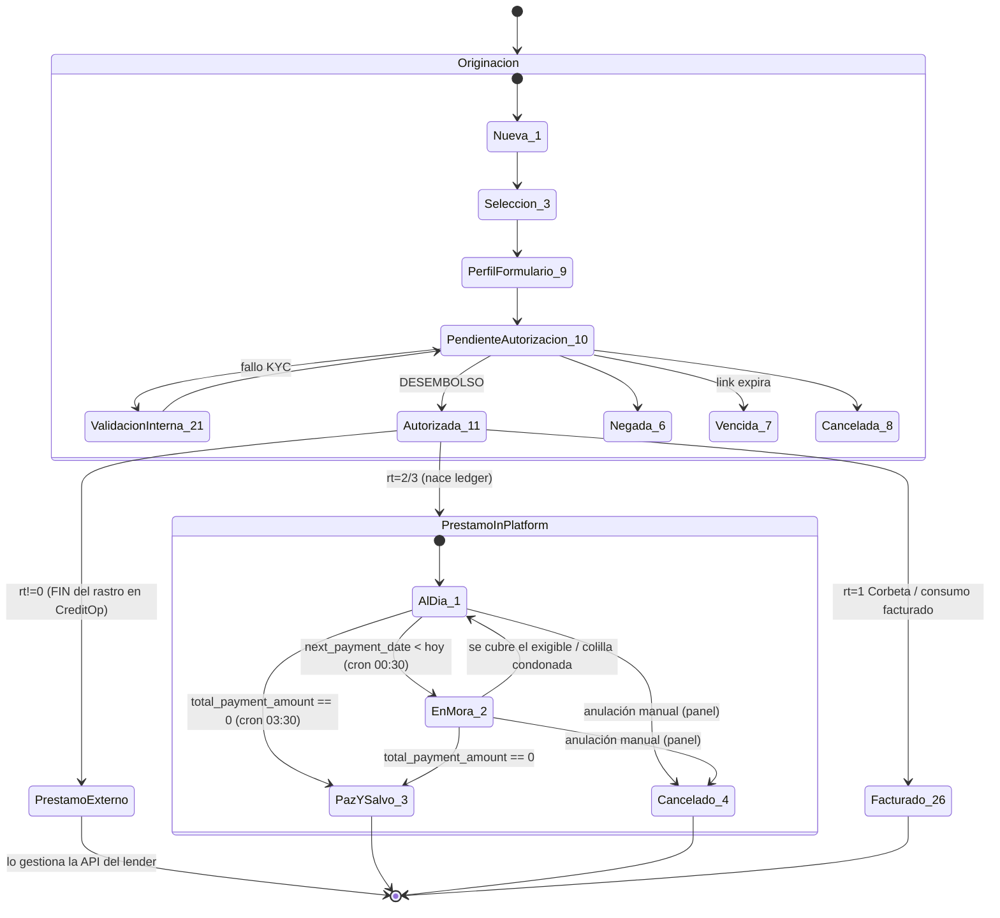

# Continuación del crédito — ciclo de vida post-desembolso (Estado 11) en CreditOp

> Documento maestro del **servicing** del crédito: qué pasa DESPUÉS del desembolso/voucher/notificación al comercio.
> Complementa la originación mapeada en `CREDIFAMILIA-FLUJO-ANALISIS.md` y `ONBOARDING-DATOS-DECISION-ANALISIS.md`.
> Todo el código citado vive en el monolito viejo `application` (`/Users/miguelochoa/Desktop/CREDITOP/bitbucket/application`) salvo donde se indica `legacy-backend` (`/Users/miguelochoa/Desktop/CREDITOP/github/legacy-backend`).
> Regla de lectura: se distingue SIEMPRE **CreditopX in-platform (rt=2/3)** — el servicing/cobranza lo **opera** CreditOp — vs **rt!=0** — el préstamo lo gestiona la API del lender externo.
> **Nota de negocio:** en CreditopX el **capital y el riesgo son del comercio**, no de CreditOp; CreditOp opera la cobranza y gana **comisión por recaudo** (ver [CREDITOP.md §1](../CREDITOP.md)). Lo de abajo describe la **operación** (que sí corre CreditOp), no la propiedad del capital.

---

## 1. Resumen ejecutivo

### Dónde termina la originación y dónde empieza la continuación

La originación **termina en el Estado 11 (`user_request_status_id = 11`, "Autorizada" = desembolsado)**. Ese es el estado terminal de la máquina de estados de la SOLICITUD. Se sella en el gateway de pago de cuota inicial:

- CreditopX (Payvalida/Wompi): `app/Http/Controllers/Api/PayvalidaController.php:73-80` (STATE APROBADA → 11, comentario `// 11 AUTORIZADA`), `app/Http/Controllers/Customer/ConsentController.php:196`.
- rt!=0: cada Action del lender mapea el estado externo a 11 (`app/Actions/Lenders/BancoDeBogota.php:262` Disbursed→11; `app/Actions/Lenders/Welli.php:28-40` desembolsado/fulfilled→11; `app/Http/Controllers/Api/BancolombiaController.php:80-84` approved→Autorizada).

En Estado 11 se ejecuta el **cierre de la originación**: voucher PDF a S3 + SMS/email al cliente (`app/Http/Controllers/Customer/VoucherController.php:17`), perfilamiento, y notificación al comercio ecommerce (`app/Http/Controllers/Customer/WoocommerceController.php:231-365`).

La **continuación empieza aquí**, pero SOLO existe como ciclo de vida real para CreditopX in-platform. Para rt!=0 el rastro se detiene: guards explícitos frenan cualquier re-update tras el 11 (`SelfManagerController.php:83` "La transacción ya fue terminada"; `Welli.php:214`; `BancoDeBogota.php:253`).

### La frontera CreditopX vs rt!=0

| Aspecto | **CreditopX in-platform (rt=2/3)** | **rt!=0 (Bancolombia BNPL/ConsumerLoan, Sistecrédito, Addi, Welli, Meddipay, Banco de Bogotá, Prami, Compensar)** |
|---|---|---|
| ¿Quién presta? | **CreditOp** (préstamo propio) | El **lender externo** |
| ¿Quién gestiona el préstamo? | **CreditOp** — motor de causación/cartera propio | La **API del tercero**, en SU portal |
| Ledger / saldos en CreditOp | SÍ — `creditop_x_requests_history` (event-sourced) + `creditop_x_revolving_credits` | NO — solo `LenderTransaction` (espejo de estado hasta el desembolso) |
| Causación de interés, mora, cobranza | SÍ — 6 crons diarios | NO existe en CreditOp |
| Estado del PRÉSTAMO | `creditop_x_requests_status_id` (1 Al día / 2 En mora / 3 Paz y salvo / 4 Cancelado) | No hay; solo el estado de originación llega a 11/26 |
| Cierre / paz y salvo | SÍ — lo marca CreditOp al saldar | Lo administra el lender; CreditOp no se entera |
| Inyectable en pruebas sintéticas | SÍ (decide 100% legacy) | NO (decide la API externa) |

**Conclusión clave:** hay **DOS máquinas de estado independientes** que se confunden fácil (ver §2). El Estado 11 es el PUENTE: la solicitud queda en 11 para siempre y, si es in-platform, a partir de ahí el préstamo vive en el ledger CreditopX; si es rt!=0, el rastro se acaba.

---

## 2. Máquina de estados completa

### Catálogo A — `user_request_statuses` (estado de ORIGINACIÓN de la solicitud)

> ⚠️ **FRÁGIL:** esta tabla NO se siembra con ningún seeder PHP ni con INSERT en `migrate.sql` (solo se crea el schema en `database/migrations/2023_04_20_175349_create_user_request_statuses_table.php`). Los ids/nombres reales viven en la BD productiva; abajo están **reconstruidos desde comentarios y `UserRequestStatus::where('name',...)`**. Los ids 2 y 7 son los menos confirmados.

| id | Nombre | Significado | Evidencia |
|---|---|---|---|
| 1 | Nueva/Creada | Solicitud recién insertada | `UserRequestController.php:97,137,156` |
| 2 | (estado temprano marginal) | Anterior a selección; sin rol post-11 | `TwilioController.php:405` |
| 3 | Selección de entidad | | `UserRequestController.php:356` `// Seleccion de entidad` |
| 6 | Negada / Rechazada | | `UserRequestController.php:38`; `PayvalidaController.php:99` (ANULADA); `StandByController.php` case 6 |
| 7 | Vencida / Aprobada-no-desembolsada | Link expirado no desembolsado | `PayvalidaController.php:106` (VENCIDA); `BancoDeBogota.php:283` (Failed→7) |
| 8 | Cancelada | | `UserRequestController.php:1140`; `PayvalidaController.php:119` |
| 9 | Formulario de perfil | | `UserRequestController.php:191` |
| 10 | Pendiente de autorización | | `PayvalidaController.php:113` (PENDIENTE→10) |
| **11** | **Autorizada** | **= desembolsado. ESTADO TERMINAL DE ORIGINACIÓN** | `PayvalidaController.php:77`; `StandByController.php` case 11 "Desembolsada" |
| 21 | Validación interna / stand-by | Tras fallo de compare-faces | `RekognitionController.php:836+`; `StandByController.php` case 21 |
| 25 | Pendiente desembolso | | `BancolombiaBnplController.php:171` |
| 26 | Facturado | Consumo facturado (Corbeta rt=1) | `PurchaseCodeController.php:61`; `UpdateOrdersFromCorbeta.php:95`; SelfManager completed→Facturado |

Nombres adicionales confirmados por string pero sin id fijo: `'No terminó proceso'` (`SelfManagerController.php:104` cancelled), `'Aprobada no desembolsada'` (`PramiController.php:54`).

### Catálogo B — `creditop_x_user_request_statuses` (estado del PRÉSTAMO in-platform) — **el que importa post-11**

> ⚠️ **FRÁGIL:** el seeder `database/seeders/CreditopXUserRequestsStatusesSeeder.php` solo crea **1 "Al día" y 2 "En mora"** (verificado). Los ids **3 (Paz y salvo) y 4 (Cancelado) se usan en el código pero NO están en el seeder** — viven solo en la BD real. El seeder es engañosamente incompleto.

| id | Nombre | Significado | Dónde se fija |
|---|---|---|---|
| 1 | Al día | Cuota al corriente / recuperación de mora | seeder `:18`; `UpdateCreditopXRequestsCommand.php:250` (recuperación) |
| 2 | En mora | `next_payment_date < hoy` | `UpdateCreditopXRequestsCommand.php:229` (`$new_creditop_x_status_id = 2`, verificado) |
| 3 | Paz y salvo | Préstamo saldado (`total_payment_amount == 0`) | `CreditopXPaymentController.php:1014-1016` (`$status = 3; $new_ctopx_status = 3`, verificado) |
| 4 | Cancelado | Anulación manual del cupo / `approved_limit <= 0` | `RevolvingCreditsController.php:421,426`; `RevolvingCredit.php:92` (display forzado, verificado) |

### Diagrama de transiciones



> **Gotcha estructural:** el ledger `creditop_x_requests_history` es **event-sourced/append-only**. NO hay UPDATE in-place del saldo. Cada cron/pago hace `INSERT` de una fila nueva con `status=1` (vigente) y marca la anterior `status=0` (histórico). El "estado actual" del crédito = la única fila `status=1`. **`status` está sobrecargado:** en la fila, `status` (1=vigente / 0=histórico / 3=paz y salvo / 5=reversado) es DISTINTO de `creditop_x_requests_status_id` (1/2/3/4 = estado del crédito). En `RevolvingCredit`, `status` (1/0) = cupo activo/inactivo.

---

## 3. CreditopX post-desembolso (el núcleo)

Es el subdominio de **cartera / servicing / billing / collections**. Un crédito CreditopX vive como una **cadena de snapshots** en `creditop_x_requests_history`; los pagos entran por **polling** (Wompi/Payvalida, no webhook) y se aplican en cascada; el revolving (rt=3) agrega un cupo padre que libera cupo al pagar capital.

### Los jobs agendados (cadencia) — `app/Console/Kernel.php` (verificado)

| Hora | Comando | Qué hace | Mueve el estado |
|---|---|---|---|
| **00:02** | `app:update-creditop-x-not-applied-wompi-payment-command` | Red de seguridad del polling: re-despacha `StatusCheck::dispatchSync` sobre `PaymentGatewayTransaction` de AYER en `status_id IN [21,23]`, `lender_id=52` (Wompi) | — |
| **00:10** | `app:update-creditop-x-remove-outstanding-balances` | Condona "colillas" (exigible del período `<= 5000`) ANTES del corte; solo NO-revolving; `movement_type='CONDONACIÓN DE COLILLAS'` | 1 (queda Al día) |
| **00:30** | `app:update-creditop-x-requests-command` | **EL NÚCLEO.** Causación de interés diario, FECHA DE CORTE/facturación, entrada en mora, gasto de cobranza, condonación de colillas en mora | 1 ↔ 2 |
| **03:30** | `app:update-creditop-x-apply-payment-command` | Aplica pagos RETENIDOS (`CreditopXPayment payment_type_id=1`) a la cuota facturada vía `applyRetainedPayments` | → 3 posible |
| **04:00** | `app:update-creditop-x-revolving-credits-command` | Agrega utilizaciones del cupo rotativo, resuelve mora del cupo, condona colillas | 1 ↔ 2 (cupo) |
| **09:30** | `app:reminder-creditop-x-requests-command` | Dunning/recordatorios (preventivo estado 1 / mora estado 2) por SMS/email/WhatsApp | — |
| ~~10:00~~ | ~~`app:incentive-revolving-credits`~~ | **DESACTIVADO** (`Kernel.php` comentado, "activar cuando los SIDs de Twilio estén aprobados") | — |

### Flujo paso a paso

1. **Nacimiento del préstamo (post Estado 11):** `CreditopXRequestHistoryController::createFirstRegister` (`app/Http/Controllers/Admin/CreditopXRequestHistoryController.php:903`) crea la PRIMERA fila con `movement_type='CREACIÓN'`, `status=1`, `creditop_x_requests_status_id=1`, `installment_number=1`. Invocado desde `ConsentController.php:196` tras el 11. Si es rotativo (`response_type==3`, `:921-951`) además incrementa `used_limit += final_amount` y `billing_used_limit += total_amount` en el `RevolvingCredit` (= UTILIZACIÓN del cupo).

2. **Causación diaria de interés (cron 00:30):** para cada fila `status=1`, interés del día = `billing_principal_amount * rate/30`, sumado a `interest_amount_balance` (`UpdateCreditopXRequestsCommand.php:199`). Anexa fila nueva `status=1`, marca la anterior `status=0` (`:286-340`).

3. **Fecha de corte / facturación (cron 00:30, si `next_billing_date <= hoy`):** arma el pago mínimo (`next_payment_amount = principal + interés + seguros + fianza/FGA + mora`), amortiza capital planeado, recalcula seguro de vida por millón, avanza `installment_number+1`, mueve `next_billing_date +1 mes` — o esquema QUINCENAL (día 11/fin-de-mes) si `cutoff_type_id == 2`. `movement_type='FECHA DE CORTE'` (`:92-195`).

4. **Entrada en MORA (cron 00:30, si `next_payment_date < hoy`):** `days_past_due += 1`, `creditop_x_requests_status_id = 2` (verificado `:229`), interés de mora diario = `(next_payment_principal - late_payment_principal_exclude) * late_payment_interest_rate/30` (`:227-232`), y **gasto de cobranza fijo** por rango de días vía `LenderCollectionChargeService::getChargeStartingAt` — se aplica una sola vez al entrar al rango (`:257-267`).

5. **Recuperación de mora:** si el exigible se cubre, el cron revierte `2 → 1` (`:250`).

6. **Condonación de colillas:** dos rutas. Pre-corte (cron 00:10, `UpdateCreditopXRemoveOutstandingBalances.php:36-139`, solo no-revolving) y en mora (dentro del cron 00:30, si `next_payment_amount <= threshold`, verificado `:236-252`). El umbral es `lender->residualBalance->residual_balance ?? 5000` (verificado); **el default 5000 está hardcodeado disperso** en ~6 sitios.

7. **Ingreso de pago (evento, no cron):** Wompi/Payvalida se confirman por **POLLING** (`app/Jobs/Lenders/Wompi/StatusCheck.php`, `tries=60`, `ttl=18000s`). De ahí `CreditopXPaymentController::processPayment` (`:62`) aplica en **cascada de imputación** sobre la fila viva:

   ```
   gasto de cobranza → mora → interés → seguro de vida → seguro de garantía → capital
   ```
   (`CreditopXPaymentController.php:109-157`; el excedente abona capital vía `principalReduction`).

8. **Pago del cliente diferido (cron 03:30):** pagos RETENIDOS (`payment_type_id=1`) se aplican a la cuota recién facturada vía `applyRetainedPayments` (`:1083`), misma cascada (`:1098-1134`).

9. **Cierre / PAZ Y SALVO:** cuando `total_payment_amount == 0`, `applyPayment` (`:818`) fija `status=3` y `creditop_x_requests_status_id=3` (verificado `:1013-1017`). Antes aplica condonación de intereses (`installments_waived_interest`) y descuento de pronto pago si aplica.

10. **Cupo ROTATIVO / reuso (rt=3):**
    - **Cron 04:00** (`UpdateCreditopXRevolvingCreditsCommand.php:56-179`): agrega saldos de todas las utilizaciones activas del cupo; `resolveStatus()` (`:41-51`): mora → `status_id=2` + `status=0` (cupo inactivo, no admite nuevas utilizaciones hasta recuperar); recuperado → `2→1`; **NO toca 3 ni 4**.
    - **Al pagar capital** (`CreditopXRevolvingCreditPaymentController.php:133`): libera cupo con **FGA proporcional** (no plana): `corresponding_fga = paid_principal − paid_principal × (used_limit / billing_used_limit)`, y `used_limit −= (paid_principal − corresponding_fga)` ⇒ **LIBERA cupo para REUSO**. El cron NO toca `used_limit`.
    - **Cierre/anulación del cupo:** `RevolvingCreditsController::disable` (`:413-426`) fija `creditop_x_requests_status_id=4` (Cancelado) en el cupo y en todas sus utilizaciones vivas.

11. **Recordatorios / cobranza blanda (cron 09:30):** `ReminderCreditopXRequestsCommand.php:61-227` segmenta por `creditop_x_user_request_status_id` (1 preventivo / 2 mora) y por días respecto a `next_payment_date`/`next_billing_date`; salta domingos/festivos con recuperación de días hábiles; dedup por `ReminderEmailLog` (6-7 días); prioriza estado de cuenta.

12. **Reversa de pago (manual, no cron):** `reversePayment` (`:1316-1540`) reconstruye el estado anterior desde la última "FECHA DE CORTE"/"CREACIÓN" y marca `status=5` los registros reversados.

---

## 4. rt!=0 — el crédito lo gestiona el lender externo

Para rt!=0, **CreditOp NO gestiona el préstamo**: el lender lo origina/desembolsa/administra en SU portal. CreditOp solo **espeja el estado de originación hasta el DESEMBOLSO (Estado 11)**.

### Qué SINCRONIZA CreditOp (hasta el 11)

- **Modelo espejo:** `LenderTransaction` (`app/Models/LenderTransaction.php:18-25`): `lender_id / order_id / user_request_id / status_id / request / response`. `order_id` = id del crédito en el tercero. Es **una fila por transacción de compra, NO un ledger de cuotas**.
- **Dos mecanismos para enterarse del resultado:**
  - **(a) Webhook entrante** (lender → CreditOp): `WelliController::webhook` (`:18`), `MeddipayController::webhook` (`:29`), `BancolombiaController::bnplWebhook/consumerLoanWebhook` (`:27/152`), `BancoDeBogotaController::webhook` (`:16`), `SelfManagerController::webhook` (autogestión POS, `:28`).
  - **(b) Polling desde CreditOp:** `app/Jobs/Lenders/Welli/StatusCheck.php:47` y `.../BancoDeBogota/StatusCheck.php:47`, ambos `ttl=1800s` (30 min) desde el register, reencolándose hasta estado terminal. **El polling es de ORIGINACIÓN (30 min), no un monitoreo continuo del préstamo.**
- **Mapeo de estado externo → `user_request_status_id`:** `Welli.php:28-40` (STATUS_MAP), `BancoDeBogota.php:254-298` (Disbursed→11, Failed→7, Pending→10, Aborted→8), `MeddipayController.php:60-65`, `PramiController.php:51-57`.
- **Al llegar a 11:** voucher, perfilamiento, email, notificación al ecommerce — igual que in-platform.

### Qué NO hace / dónde termina el rastro

- **No hay ciclo de vida del préstamo en CreditOp.** No existe ningún cron equivalente para rt!=0 (todos los crons post-desembolso son `creditop_x_*` — **prueba negativa decisiva**). Ningún `LenderTransactionStatus` modela estados de préstamo vivo (al día/mora/pagado/castigado) — el seed de Banco de Bogotá es solo `{Pending, Disbursed, Failed, Aborted}` (`BancoDeBogotaSeeder.php:20-35`).
- **Guards que frenan tras el 11:** `SelfManagerController.php:83`, `Welli.php:214`, `BancoDeBogota.php:253`.
- **Evento único hacia el lender post-desembolso (no seguimiento):** `bnplConfirmed`/`consumoConfirmed` (`BancolombiaBnpl.php:796`) informan al banco la factura de compra una sola vez — es notificación de cierre de compra, no consulta de préstamo.
- **Excepción arquitectónica:** Credifamilia (lender 24) está **hardcodeado a `response_type=1`** (`app/Models/Lender.php:55-58`) pero tiene su propio flujo greenfield V2 (REST+KYC+SOAP) documentado en `CREDIFAMILIA-FLUJO-ANALISIS.md` — no sigue el patrón `LenderTransaction` genérico.

**Frontera de testeo:** rt!=0 NO es inyectable con usuario sintético (decide un tercero); se prueba con mocks de la API + simulador `aggregator-result`. Coincide con la nota de memoria `[synth-lender-type-boundary]`.

---

## 5. Reportes, conciliación y notificaciones

Todo el subdominio de reportes/conciliación vive **100% en `application`**. Salen por email/Twilio; muchos destinatarios están **hardcodeados** (no configurables por BD).

### Reportes recurrentes por email/Twilio

| Cadencia | Comando / Job | Contenido | Destino |
|---|---|---|---|
| Diario 04:00 | `app:daily-report-command` | `DailyReportExport` — snapshot diario global | admins (`user_profile_id=2`) |
| Diario 07:00 (+ lunes weekly) | `app:allieds-daily-report-command` | `AlliedsDailyReportExport` por comercio; cachea xlsx en S3; weekly manda WhatsApp Twilio | comercios (`profile 6`) |
| Semanal lunes 08:00 | `app:report-command` | `ReportEmail` métricas (conversion_rate, desembolsos) por aliado con ≥1 desembolso estado 11 | super-admins comercio |
| Semanal lunes 05:00 + mes día 4 | `app:lender-disbursements-report-command` | `LenderDisbursementsReportExport` — una hoja por lender, desembolsos por comercio, `final_amount` where `status=11` (`:54-67`) | ops (laura/juan/manuela/documentacion) |
| Viernes 19:00 | `app:consumer-loan-weekly-report-command` | `ConsumerLoansReportEmail` — CREACIÓN de últimos 7 días | lista en Setting `ctop_x_consumer_loan_weekly_report` |

### Facturación y conciliación Corbeta (rt=1 Bancolombia — lenders 68 BNPL / 100 ConsumerLoan)

| Cadencia | Comando | Qué hace |
|---|---|---|
| Diario 06:05 | `app:invoice-process-corbeta` | Consulta Corbeta por PIN, fija `purchase_amount`/`invoice_number`, confirma consumo (lender 100) vía `consumoConfirmed` |
| Diario 03:00 | `app:invoice-process-corbeta-bnpl` | Idéntico para BNPL (lender 68), `bnplConfirmed` |
| Cada 2h | `app:update-orders-from-corbeta` | Refresca valor/factura y sube UserRequest a **estado 26 FACTURADO** (`UpdateOrdersFromCorbeta.php:95`) |
| Diario 07:00 | `app:corbeta-conciliation-report-command` | `CorbetaConciliationReportController::sendReport` (lock cache 10 min) → `ConciliationReportEmail` → `UserRequestsBancolombiaExport` genera **.txt de ancho fijo** (aliados 209/210/211, lenders 68/100, estado 11, día vencido) a S3 → email a **santiago@creditop.com** |

> ⚠️ 3 crons Corbeta se solapan sobre las mismas órdenes con ventanas distintas y matchean por PIN; `Corbeta::query` dedup por PIN dejando la factura más reciente — riesgo de doble confirmación si `barcode_checked` falla.

### Bonificación / comisión Credifamilia (lender 24 / aliado Sonría)

- **Disparo:** `UserRequestObserver::updated` (`app/Observers/UserRequestObserver.php:31-32`) dispara `BonificationCheck` en CADA update (no filtra a 11 — el filtro real está dentro del job). Si Autorizada + Credifamilia + Sonría, fija `remaining_bonus = final_amount` y calcula bono (`*8/1000`, redimible `>=50000`).
- **Reporte:** `SendBonificationReport` (`twiceMonthly` días 1 y 16, 08:00) manda el Excel de comisiones a **michel@credifamilia.co**.

### Notificación de cierre al comercio

- **Ecommerce (Estado 11):** `WoocommerceController::process` (`:231-365`) hace POST al comercio (Woocommerce basic-auth / VTEX AppKey+AppToken / self-development Mulesoft), luego Twilio al cliente, marca `processed=1` y cascada de hermanas a estado 7.
  - ⚠️ **Bug latente:** `process()` se define con 4 params pero `cancel()` (`:224`) y `processIncompleteRequests` (`:477`) lo llaman con 3 → `$user_request_id` llega null y el bloque Twilio (`:323`) se salta en el barrido de colgadas.
- **Cierre / venta de cartera:** panel `/cartera-por-riesgo` permite `requestLoanPortfolioSale` (email a `loan_portfolio_sale_emails`).
- ⚠️ **ABIERTO:** NO se localizó un notificador de **paz y salvo** (status=3) hacia el comercio/lender análogo al aviso de Estado 11.

### Panel admin (Inertia/Vue) — `routes/admin.php:157-191`

`/solicitudes-originadas` (cartera CreditopX, ordena por mora/al-día/paz-y-salvo/cancelado), `/facturacion-y-recaudo`, `/cartera-por-riesgo`, `/cupos-rotativos`, y acciones `pagar/reversar/pendiente/gestionar-fecha-pago/plazo/anular`. `buildLendersSubQuery` filtra `response_type=2` (`CreditopXRequestHistoryController.php:451`) para el **listado de solicitudes**; el revolving **rt=3** se gestiona aparte en `/cupos-rotativos` (`RevolvingCreditsController`). O sea el panel opera sobre in-platform = **rt=2 y rt=3**. Aliado 24 (Credifamilia) se EXCLUYE de casi todos los reportes de cartera.

---

## 6. ESTADO DE MIGRACIÓN (application vs legacy)

**Resumen brutal:** el ciclo post-Estado-11 corre **EXCLUSIVAMENTE en `application`**. `legacy-backend` reconstruyó el núcleo de **originación** pero el **servicing/cartera está PENDIENTE (P2.1)** y el panel/SSO también (P2.2). Está **explícitamente FUERA DEL ALCANCE** de la migración de originación (`ESTADO-MIGRACION.md:40` "OUT (post-desembolso) = Loan Servicing, Billing & Collections").

> **Prueba dura:** `github/legacy-backend/app/Console/Kernel.php` (verificado) SOLO agenda `lock/unlock/unroll-devices` + `mark-stuck-crosscore-evaluations`. **NINGÚN** comando `creditop-x-*` ni de reportes/conciliación está en el schedule de legacy. Un cron no agendado es código muerto. Además, los comandos copiados en legacy tienen **imports colgantes** (`use App\Http\Controllers\Admin\CreditopXPaymentController` — **namespace equivocado**: en legacy ese controller vive en `Modules\Loans\App\Http\Controllers\Admin\`, así que ese FQCN no existe y el import queda colgante) → reventarían con fatal error si alguien los agendara.

| # | Superficie | application | legacy-backend | Pendiente |
|---|---|---|---|---|
| 1 | **Cartera / saldos** (ledger, causación, corte, mora) | ✅ `UpdateCreditopXRequestsCommand.php` (agendado 00:30) | 🟠 COPIA VIEJA MUERTA (231 líneas sin cobranza/garantías/residual, import colgante, no agendada) | Reescribir a versión actual, cablear, agendar |
| 2 | **Condonación colillas pre-corte** | ✅ `UpdateCreditopXRemoveOutstandingBalances.php` (00:10) | 🔴 El archivo NO existe | Portar completo |
| 3 | **Aplicación de pagos / waterfall** | ✅ `CreditopXPaymentController.php:818-1171` + cron 03:30 | 🟠 `Modules/Loans/App/Services/CreditopXPaymentService.php` reconstruye applyPayment/applyRetainedPayments con **firma VIEJA** (sin cobranza/garantías), **sin reversePayment/processEarlyPayment**; sin ruta de servicing | Actualizar lógica, portar reverse/early, rutear |
| 4 | **Revolving / reuso de cupo (servicing)** | ✅ `UpdateCreditopXRevolvingCreditsCommand.php` (04:00) + panel | 🟠 Comando copiado no agendado; pagador de cupos = código muerto (imports colgantes `PromissoryNoteController`/`ListLenderController`) | Servicing del cupo |
| 5 | **Cobranza — gasto por mora** (`LenderCollectionChargeService`) | ✅ Servicio + uso en cron | 🔴 El archivo NO existe en legacy | Portar servicio + tabla + integrar |
| 6 | **Recordatorios / cobranza blanda** | ✅ `ReminderCreditopXRequestsCommand.php` + `reminder:1241` (09:30) | 🟠 Comando reducido (85 líneas) NO agendado; `sendReminder`/`createStatementOfAccount` existen sin disparador | Agendar y cablear |
| 7 | **Recaudo externo Pullman** (SQL Server `pullman_db`) | ✅ `PullmanService` + `storePending:647` | 🟠 STUB: `PullmanService`/`PullmanRepository` + conexión `config/database.php:96` copiados, **0 callers** | Cablear callers |
| 8 | **Recaudo self-service** (links de pago) | ✅ `PaymentLinkController` | 🟠 Módulo Payments reconstruye ACCESO/creación de links pero **NO imputa al ledger** (`CustomerPaymentService` no toca `CreditopXRequestHistory`) | Conectar pago del link → aplicación al crédito |
| 9 | **Reconciliación Wompi** (not-applied) | ✅ `UpdateCreditopXNotAppliedWompiPaymentCommand.php` (00:02) | 🟠 `ReconcileWompiTransactionsCommand.php` existe pero NO agendado | Agendar |
| 10 | **Reportes de desembolso** (lender-disbursements/daily/allieds) | ✅ `EndOfMonthReportController` + comandos agendados | 🟠 `Modules/System/.../EndOfMonthReportController.php` reconstruido de verdad, comandos copiados, pero NO ruteados NI agendados | Agendar / exponer rutas |
| 11 | **Conciliación + facturación Corbeta** | ✅ `CorbetaConciliationReportController` + 3 crons | 🔴 NO existe (falso positivo: `CorbetaCheckoutController` es de ORIGINACIÓN) | Reconstruir toda la conciliación |
| 12 | **Panel admin de cartera** (solicitudes-originadas, facturación-y-recaudo, cartera-por-riesgo, pagar/reversar/anular) | ✅ `routes/admin.php:158-191` Inertia/Vue | 🔴 Sin ruta de servicing (`Modules/Loans/routes/admin.php` solo manual-validation/preapproval/formalize); controllers copiados = código muerto | Reconstruir panel + rutas |
| 13 | **Notificación de cierre al COMERCIO** (Estado 11 ecommerce) | ✅ `WoocommerceController::process` | ✅ **MIGRADA** — `EcommerceRequestService::notifyStoreForUserRequest:470` + estrategias (Ecommerce/Vtex/WooCommerce/SelfDevelopment)Notifier, `webhooks.php:25-34` | — (corre en paralelo, strangler) |
| 14 | **Webhooks entrantes rt=1** (cierran el préstamo externo) | ✅ `routes/api.php` | 🔴 Controllers copiados SIN ruta que los bindee = código muerto (ver `PENDIENTES-MIGRACION.md` §P0.2) | Rutear (bloqueo distinto: es originación/decisión) |

**Métrica de avance real del servicing en legacy: superficies con ruta/cron ACTIVO = 0.** El resto es copiado-muerto o parcial-desconectado. Fuentes: `PENDIENTES-MIGRACION.md:58-59` (P2.1), `ESTADO-MIGRACION.md:40,63-64`.

> **Riesgo "trigger huérfano":** intentar apagar `application` rompería la cartera — el cron que mueve el ledger vive solo ahí (`PENDIENTES-MIGRACION.md:18`).

---

## 7. Implicancias para el harness / pruebas

### Frontera de lo que una prueba sintética PUEDE alcanzar

| Fase | ¿Sintetizable? | Cómo |
|---|---|---|
| Originación → Estado 11 (rt=2/3) | ✅ SÍ | Decide 100% en legacy; inyectable (ver `[synth-credipullman-gates]`, `[synth-lender-type-boundary]`) |
| Originación → Estado 11 (rt!=0) | 🔴 NO | Decide la API externa; se mockea el proveedor + simulador aggregator-result |
| Nacimiento del ledger (`createFirstRegister`) | ✅ SÍ | Ocurre síncronamente en `ConsentController` tras el 11 — es la primera fila `status=1` |
| Causación / corte / mora | ⚠️ PARCIAL | Depende de crons agendados (00:30). En una prueba hay que **invocar el comando manualmente** (`php artisan app:update-creditop-x-requests-command`) o manipular fechas para forzar `next_billing_date <= hoy` |
| Aplicación de pago | ⚠️ PARCIAL | Wompi/Payvalida se confirman por **polling** (`StatusCheck`, ttl 18000s), no webhook → hay que simular la `PaymentGatewayTransaction` en estado aprobado o `dispatchSync` el job; luego correr `apply-payment` (03:30) |
| Paz y salvo (cierre in-platform) | ✅ SÍ (simulable) | Pagar el total → `total_payment_amount==0` → `status=3`. **NO exige firma externa** para in-platform |
| Cierre rt!=0 | 🔴 NO | Lo hace el lender externo; CreditOp no lo ve |

### Qué se puede SIMULAR y qué es frágil

- **El cierre REAL exige firma externa solo en la ORIGINACIÓN (KYC/pagaré);** el cierre por pago total del préstamo in-platform NO exige firma — es interno.
- **La continuación depende de jobs agendados por fecha.** Una prueba E2E honesta debe: (1) crear el crédito, (2) mover el reloj / `next_billing_date` a mano, (3) invocar los comandos artisan en el orden del Kernel (00:10 → 00:30 → 03:30 → 04:00), (4) verificar la nueva fila `status=1` y el `creditop_x_requests_status_id`. No basta con esperar; hay que **disparar los crons**.
- **Riesgo de memoria:** `UpdateCreditopXRequestsCommand` carga TODA la cartera viva sin chunking (`:42-43`) — a escala revienta. No es un problema en pruebas pequeñas pero sí para el OKR de salud.
- **Alerting inexistente:** las excepciones de estos crons notifican a `laura.cabra@creditop.com` hardcodeado (~10 veces). No hay alerting estructurado — relevante para el OKR de alertas de salud de microservicios.
- **Para probar el servicing en legacy: hoy no se puede** (0 superficies activas). Cualquier prueba de cartera debe correr contra `application`.

---

## 8. Gotchas y preguntas abiertas

### Gotchas (verificados o citados)

1. **DOS máquinas de estado que se confunden:** `user_request_status_id` (originación, catálogo A, hasta 11/26) ≠ `creditop_x_requests_status_id` (préstamo vivo, catálogo B, solo 1/2/3/4). El 11 es el puente.
2. **`status` sobrecargado en 3 sentidos** (vigencia de la fila del ledger / activo-inactivo del cupo / estado del crédito). No confundir.
3. **Seeder engañosamente incompleto:** solo siembra 1 y 2; los ids 3 y 4 se usan en código pero viven solo en la BD real (verificado).
4. **`user_request_statuses` no tiene seeder ni INSERT** — ids 2 y 7 son los menos confirmados; requiere `SELECT id,name` en prod.
5. **Umbral de colilla 5000 hardcodeado disperso** (~6 sitios) — un lender sin `residualBalance` cae al default; puede ocultar centavos en un crédito "saldado".
6. **Pagos por polling, no webhook** — el cron 00:02 es la red de seguridad pero está hardcodeado a `lender_id=52` y `status_id [21,23]`; otra pasarela colgada no se recoge.
7. **Doble motor de cascada de imputación** (`processPayment` y `applyRetainedPayments`) — mantenerlos en sync es frágil.
8. **`UserRequestObserver` NO es el motor de estados** (contrario al nombre): solo gamificación/bonos. Las transiciones están dispersas imperativamente en ~15 controllers + 5 crons.
9. **Cron 00:30 sin chunking** — carga toda la cartera viva en memoria.
10. **`cutoff_type_id==2` = esquema QUINCENAL** — bifurcación de fechas en 4 sitios, fácil de desincronizar.
11. **`incentive-revolving` DESACTIVADO** — el reuso funciona pero la campaña proactiva no corre.
12. **Bug latente `WoocommerceController::process`** — `$user_request_id` null en el barrido de colgadas → no notifica Twilio.
13. **Comandos copiados en legacy con imports colgantes** — no es "migración parcial funcional", es código muerto que reventaría.

### Preguntas abiertas

- **Nombres/ids EXACTOS de `user_request_statuses`** — no verificables desde el repo (sin seeder). Requiere query en prod.
- **Castigo/write-off (RESUELTO):** NO es un estado persistido — es un **bucket derivado** `dias_mora > 180` (`CreditopXRiskController.php:72`, panel `/cartera-por-riesgo`) + **venta de cartera manual**. La mora (status=2) es indefinida; el único terminal persistido es "Cancelado" (4), manual.
- **¿Cómo queda un crédito NO rotativo de una sola cuota totalmente pagado** — sigue habiendo fila `status=1` con `ctopx=3`, o sale del set vigente?
- **¿Hay notificación de PAZ Y SALVO (status=3)** hacia comercio/lender? No localizada — grep sobre observers/notifications de transición a 3.
- **rt!=0: ¿CreditOp recibe algún evento de cobranza/mora/cierre del tercero post-facturación**, o el rastro termina 100% en 26 Facturado? Los webhooks entrantes rt=1 solo cambian estado de originación; no parecen alimentar cartera.
- **¿El `UserRequestObserver` migrado en legacy re-dispara `BonificationCheck`/`SendBonificationReport`**, o la bonificación Credifamilia quedó huérfana en application?
- **¿El parallel-run comparte la MISMA RDS entre application y legacy?** Si sí, legacy origina (Estado 11) y application "continúa" el MISMO registro `CreditopXRequestHistory` — el ciclo de vida ya sería de facto compartido a nivel de datos. Confirmar con `DB_HOST` de prod.
- **rt=2 vs rt=3:** confirmado que rt=3 dispara el revolving en `createFirstRegister:921`. Falta confirmar dónde se setea rt=3 vs 2 en la config del lender y si un rt=2 puede tener `revolving_credit_id`.
- **¿La versión vieja del motor de servicing copiada en legacy es un intento abandonado o el punto de partida vigente?** Determina si borrarla o retomarla (y actualizarla).
