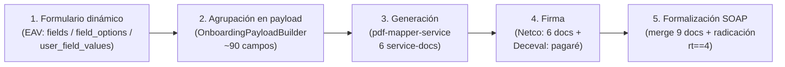

> Documento generado por validación multi-agente (5 lectores + 8 verificaciones adversariales) contra legacy-backend y pdf-mapper-service, con consultas read-only a la BD de develop. Fecha base: 2026-07-06.
> Las afirmaciones marcadas CONFIRMADO/REFUTADO/PARCIAL fueron verificadas adversarialmente; donde un veredicto corrigió una suposición, prevalece la corrección (ver §9).

# Flujo de documentos de Credifamilia (lender 24) — de punta a punta

## 1. Resumen ejecutivo

Credifamilia (lender_id **24**, response_type **4** "external managed") es el único lender del monolito con un flujo de documentos greenfield completo: los datos que el cliente/asesor cargan en un **formulario dinámico EAV** se **agrupan en un payload de ~90 campos** (`OnboardingPayloadBuilder`), que alimenta al microservicio **pdf-mapper-service** para **generar 6 documentos** estampando un payload JSON sobre plantillas PDF guardadas en S3. Esos 6 se **firman electrónicamente por Netco** (`generated → signed`, re-generando los bytes al firmar), mientras el **pagaré se firma aparte por Deceval** con su propio OTP. Al desembolsar, si el lender es rt==4, se dispara la **formalización SOAP**: se reúnen **9 documentos** en orden oficial, se unen en un solo PDF base64 (`/api/merge-urls`) y se radica en Credifamilia por SOAP (`transaccionConsumo` sin PDF → `guardarDocumentoOpenKm` con PDF), en modo *best-effort*.

---

## 2. Etapa 1 — Formulario dinámico y modelo EAV

### 2.1 Modelo de datos (5 tablas EAV + una tabla-puente)

El formulario es un **modelo EAV puro**. Cinco tablas de definición más una tabla-puente:

- **`fields`** — definición de cada campo: `id, field_category_id, parent_id, related_field_id, parent_value, name, description, help_message, field_group, field_appearance, type, validation, data_source, status` (`database/migrations/2023_04_20_225944_create_fields_table.php:14`).
- **`field_options`** — opciones (key/name) de un select/radio/checkbox: `field_id, key, name, sort, status` (`database/migrations/2023_04_20_230159_create_field_options_table.php:14`).
- **`field_categories`** — agrupador (una "pantalla"/sección) (`database/migrations/2023_04_20_225653_create_field_categories_table.php:14`).
- **`form_types`** — un formulario lógico; puede tener `lender_id` (formularios por lender, ej. Credifamilia = form_type 6) (`app/Models/FormType.php:33`).
- **`forms`** — **tabla-puente** many-to-many entre `form_type` y `field`: cada fila = `(form_type_id, field_id, hidden, editable, sort, status)` (`database/migrations/2023_04_20_230613_create_forms_table.php:14`). ⚠ El nombre engaña: `forms` **no** es la definición de un formulario; un formulario es el conjunto de filas de `forms` con el mismo `form_type_id`.
- **`user_field_values`** — el **valor EAV** que llenó el usuario: `field_id, user_id, user_request_id, form_id, value, file, file_name, status` (`database/migrations/2023_04_20_230901_create_user_field_values_table.php:14`).

**Conteos verificados en dev:** fields=209, field_options=139, field_categories=19, form_types=6, forms(puente)=143, user_field_values=936.463 (935.754 con `form_id=1`).

Relaciones Eloquent: `Field hasMany FieldOption ('options')` y `belongsTo FieldCategory` (`app/Models/Field.php:38`); `FormType hasMany Form ('formFields')` y `belongsTo Lender` (`app/Models/FormType.php:28`). **No hay** relación Eloquent `Field->parent`: la jerarquía padre-hijo se resuelve por consulta manual sobre `parent_id/parent_value`.

### 2.2 Cómo se captura y cómo se lee

**Escritura** (toda hard-coded por field_id, no hay writer genérico que recorra `forms`):

- `OnboardingService::storeLaboralInformation()` / `storeSocialStratum()` hacen `UserFieldValue::updateOrCreate(['field_id'=>N,'user_id'=>..,'user_request_id'=>..],['form_id'=>1,'value'=>..])` (`Modules/Onboarding/App/Services/OnboardingService.php:939,984`). Campos duros: 29=situación laboral, 87=ingresos, 90=egresos, 30=estrato, 44=dirección, 160=risk_central, 161=continuidad.
- `DynamicFormsService::storePayloadDataAsUserFieldValues()` mapea claves del payload JSON externo (Motai/Alta) a fields 162-172 y hace `createOrUpdate` con `form_id=1` (`Modules/Onboarding/App/Services/DynamicFormsService.php:546,559`). Serializa: arrays→`json_encode`, bool→`'1'/'0'`, escalar→`trim` (`:773`). El spec del formulario **no** viene de la BD sino de `onboarding-forms-service`.
- `CreditopXFormController::store()` upsertea fields 25/158/70 con `form_id=5` (`app/Http/Controllers/Customer/CreditopXFormController.php:38`) — path con poco/ningún dato en dev.

**Lectura:**
- `Loans\UserFieldValueRepository::getLatestValueByUserAndField(userId,fieldId)` = `where user_id + field_id`, `orderByDesc(created_at)->first()` — **ignora `user_request_id`**, devuelve el valor más reciente cruzando solicitudes (`Modules/Loans/App/Repositories/UserFieldValueRepository.php:63`).
- Render: `FormCollection::getFieldValue` hace `where field_id + user_id`, `orderBy id DESC` (`app/Http/Resources/Customer/FormCollection.php:159`).
- `UserFieldValue::getFieldValue(field_id, user_request_id)` sí filtra por solicitud (`app/Models/UserFieldValue.php:65`).

Todas usan "última fila" porque **no hay unicidad garantizada** en la tabla.

### 2.3 Key-vs-name en radios (⚠ CORREGIDO — ver §9)

Aunque la exploración inicial sostuvo que radio/select guardan el **NAME** (label), **la verificación REFUTÓ la afirmación tal como estaba planteada**. La versión correcta:

> El `value` almacenado en `user_field_values` es la **etiqueta/valor seleccionado tal cual llega del payload** (equivale al `name` cuando difiere de la key). **No existe en legacy-backend ningún código que resuelva la key** antes de escribir: `serializeUserFieldValue` hace `trim` del valor crudo (`DynamicFormsService.php:773-793`) y la validación de opciones se hace contra el array `options` del spec externo (onboarding-forms-service), **no** contra la tabla `field_options`.

Matiz clave: el **render** de campos condicionales **sí** compara contra la KEY del padre (`FormCollection.php:122`, `stripos(son.parent_value, option->key)`), pero la **escritura** guarda el texto seleccionado. Un consumidor de reglas que compare contra la `key` fallará donde key≠name.

### 2.4 Campos condicionales: `parent_id` + `parent_value`

Un field con `parent_id != 0` es un hijo que solo aparece cuando en el field padre se eligió una opción cuya **KEY** coincide con el `parent_value` del hijo (`FormCollection::getOptions()`, `app/Http/Resources/Customer/FormCollection.php:115,122,126`).

Ejemplos verificados:
- **field 197** (`parent_id=29, parent_value='Independiente'`) — hijo de field 29 (Situación laboral); solo se muestra si 29='Independiente'.
- **Cadenas de 2 niveles**: field 222 (`parent_id=29, parent_value='Pensionado'`, "¿Eres persona públicamente expuesta?") → field 223 (`parent_id=222, parent_value='Sí'`, "¿En qué clasificación?").
- **Bloque PEP triplicado por ocupación** (una copia por rama, cada par en su propia `field_category`): 222/223 (Pensionado, cat 18), 224/225 (Independiente, cat 19), 226/227 (Empleado, cat 20). Los hijos 223/225/227 tienen `field_options` con `key='cargo_politico'` (name "Ejerce un cargo político") y `key='representante_legal_organizaciones_internacionales'`.

---

## 3. Etapa 2 — Agrupación en el payload (`OnboardingPayloadBuilder`)

`OnboardingPayloadBuilder::build($userRequest)` arma un payload de **~90 campos** para el pdf-mapper-service (`Modules/Loans/App/Services/DocumentGeneration/Payload/OnboardingPayloadBuilder.php:77-307`). Constante `LENDER_CREDIFAMILIA = 24` (`:21`).

### 3.1 Las 3 fuentes

1. **Columnas/relaciones directas de User/UserRequest**: `first_name/middle_name` vía `splitGivenNames(user.first_name)` (`:107,110`), `last_name/second_last_name` vía `splitSurname(user.surname)` (`:112`), `document_number` (`:115`), `gender` vía `mapEnum` (`:130`), `advisor_name = userRequest.corporateUser.full_name` (`:150`), `filing_city = userRequest.alliedBranch.city.name` (`:145`, usa la relación `alliedBranch` belongsTo, **NO** `allied->branch` que está rota), `signature_city = userRequest.allied.branch.city.name || 'BOGOTÁ'` (`:243`), `loan_number = userRequest.request_number` (`:235`).
2. **EAV (cascadas de field_ids)** — ver §3.2.
3. **Cálculos derivados**: fechas partidas vía `fmt->dateSplit` (`:82`); `due_date = selectedPaymentDate + (feeNumber-1) meses` (`:232`); financials del motor de amortización (§3.4).

Campos **GAP duro** (constantes, el monolito no captura el dato): `phone=''`, `funds_source_other=''`, `has_proxy=['no']`, `funds_in_colombia=['colombia']`, varios `*_other=''` y `codebtor_*` (`:133,180,204-210,264-279`). `work_phone` nunca queda vacío: default `'3000000000'` (`:167`).

### 3.2 Cascadas de field_ids

Patrón "primer valor no vacío entre varios field_ids de distintos lenders/versiones": `firstEav($userId, $fieldIds)` recorre la lista **en orden** y devuelve el primer valor no-null/no-vacío (`:309-319`); `eavWithDefault` (`:321`) y `eavArrayWithDefault` (`:326`) envuelven con default. La lectura subyacente toma el registro más reciente por `created_at DESC` (`UserFieldValueRepository.php:63`).

Ejemplos de cascadas (cada field_id es una versión del mismo dato en distinto formulario/lender):
- `address = [186,175,44]`, `city = [185,174,10,162,93]`, `department = [184,173,9,92]` (`:135-137`).
- `company_name = [199,191,72]`, `job_position = [193,200,71]`, `work_address = [203,196,75]`, `work_city = [202,195,74]`, `work_department = [201,194,73]`, `work_phone = [192,76]` default `'3000000000'` (`:153-167`).

### 3.3 Mapeos de enums (`mapEnum`) — CONFIRMADO

`mapEnum(rawValue, catalog, label)` normaliza (minúsculas + sin tildes vía `normalizeForMatch`) valor y keys, y devuelve `[enumValue]` (opción de checkbox del pdf-mapper) o `[]` con warning `onboarding_payload_enum_mapping_unknown` si no matchea (`:525-555`). Catálogos:

- `MAPPING_GENDER`: M/F→male/female (`:23`).
- `MAPPING_OCCUPATION`: Empleado/Independiente/Pensionado→employee/independent/retired. **Desempleado NO se mapea a propósito** porque el mapper.json no declara `unemployed` (`:28-34`).
- `MAPPING_YES_NO` (`:36`), usado por `mapYesNo` con default.
- `MAPPING_REQUEST_TYPE`: resuelto en `resolveRequestType` desde `lender.responseType.name` slugificado, fallback `['credit_line']` (`:557-573`).

**`pep_classification` (CONFIRMADO en código + BD):** `firstEav($userId,[223,225,227])` (un field por ocupación: 223=Pensionado, 225=Independiente, 227=Empleado) pasado por `MAPPING_PEP_CLASSIFICATION` (`:52-63,195-199`). El catálogo mapea **tanto la KEY del field_option como el NAME/label** (`'cargo_politico'→'political_position'`, `'representante_legal_organizaciones_internacionales'→'international_representative'`) porque el form-engine puede persistir cualquiera de los dos. Los fields antiguos 33/34/82/91/108/109 **no** son la clasificación (son "¿Es PEP?"/datos del familiar), por eso el checkbox nunca se marcaba antes (ver §8).

### 3.4 Financials del voucher (motor de amortización)

`resolveCredifamiliaVoucherFinancials` toma del motor `CredifamiliaPaymentPlanSummaryService::handle(userRequestId)`; si es null o `success===false` cae al fallback genérico (`:361-419`, `:421-461`).

Camino motor (`:386-418`):
- `interest_rate` (TEA) = `annual_effective_rate*100` (`:396`).
- `nominal_monthly_rate` (M.V.) = `monthly_rate` del motor = `(1+TEA)^(1/12)-1` (`:398`).
- `first_quota_amount = first_installment`, `capital_interest_quota = base_installment`, `insurance_quota = life_insurance`, `fee_value = monthly_installment` (`:399-402`).
- `four_per_thousand_amount = credit.four_per_thousand` — se muestra **siempre** (Mensual y Anticipada), no se gatea (`:405`).
- `fianza_amount` = **MONTO** (`bond_base+bond_iva`) **solo si `$isAnticipada`** (`bond_fee<=0 && total_bond>0`), sino `currency(0)` (`:392-415`).

Fallback sin motor: tasas derivadas de `user_request.rate`, cuotas del `$breakdown` genérico, `four_per_thousand` y `bond_*` quedan vacíos (`:365-384`).

`buildPaymentPlanCells` arma la tabla plan-de-pagos como celdas `{col,row,value}` (8 celdas por installment) desde el mismo `handle()` (`:479-523`).

### 3.5 Log de trazabilidad

Tras armar `$payload`, inserta una fila en la tabla **`logs`** con `name='credifamilia.onboarding.form_payload'`, `request=json_encode($payload)` — la evidencia de qué se envía al pdf-mapper. **Best-effort**: envuelto en try/catch; si falla loguea warning `onboarding_payload_log_failed` pero **nunca** rompe la generación (`:282-304`).

---

## 4. Etapa 3 — Generación vía pdf-mapper-service

### 4.1 Los 6 service-docs (`CredifamiliaDocumentsBuilder`)

`const SERVICE_DOCS` define 6 pares `{file, doc_type}` (`Modules/Loans/App/Services/Signing/Credifamilia/CredifamiliaDocumentsBuilder.php:33-40`):

| # | file (slug español) | doc_type (interno inglés) |
|---|---------------------|---------------------------|
| 1 | `vinculacion` | `consent` |
| 2 | `fondo-garantias-confe` | `guarantee` |
| 3 | `plan-de-pagos` | `payment_schedule` |
| 4 | `reglamento` | `regulation` |
| 5 | `terminos-y-condiciones` | `terms_conditions` |
| 6 | `autorizacion-desembolso` | `disbursement_authorization` |

El **`file` (slug español)** es a la vez: (a) el `documentType` enviado al microservicio, (b) el `{doc}` del path S3, (c) parte del nombre de archivo. El **`doc_type` (inglés)** es la identidad interna hacia la firma/tracking Netco. `RESPONSE_KEY_BY_SERVICE_DOC` (`:42`) traduce entre ambos.

`build()` (`:73`) arma el payload una vez con `OnboardingPayloadBuilder->build()`, envuelve el `PdfMapperGenerator` en un `TracedDocumentGenerator` con driver `'microservice'` (`:76`) e itera los 6 creando `DocumentRequest(documentType: $serviceDoc, lenderId: 24, payload, requestId: 'phase-{id}-{serviceDoc}')`. `file_name = '{id}_{serviceDoc}_{time()}.pdf'` (`:84,:93`). `buildSignables()` descarta los de `doc_type===null` (hoy los 6 tienen doc_type → firmables == generados, `:116`).

### 4.2 El doble nombre: `plan-de-pagos` vs `payment_schedule` (⚠ PARCIAL — ver §7 y §9)

`PdfMapperClient::pathFor()` construye `/api/projects/{projectSlug}/documents/{serviceDocName}/generate` (`app/Services/PdfMapperClient.php:41`). El `projectSlug` sale de `lenders.pdf_mapper_project_slug` vía `EloquentLenderProjectSlugResolver::resolveFor(lenderId)` — **lender 24 = `credifamilia`** (`EloquentLenderProjectSlugResolver.php:17`, confirmado en test `:59`). Si es null, lanza `LenderDocumentSettingsMissingException`.

`serviceDocName` aplica override `config('documents.service_document_name_by_lender.{lender}.{docType}')` o el `documentType` literal (`:57-65`). El único override del lender 24 es `'voucher-disbursement'→'voucher'` (otro flujo), así que los 6 slugs españoles pasan **literales**.

**Para el flujo de firma de Credifamilia (`CredifamiliaDocumentsBuilder`), la URL del plan de pagos es correcta:**
`POST /api/projects/credifamilia/documents/plan-de-pagos/generate`

Matiz que la verificación marcó como PARCIAL: `'plan-de-pagos'` **no es un nombre global del sistema**; es el `file` de este builder. `'payment_schedule'` (con guion bajo) **sí se usa**, pero como doc_type interno / response key / clave del map `titles` (`config/documents.php:146 'payment_schedule' => 'Plan de pagos'`), **no** como nombre en la URL. Y existe **otro camino distinto**: `PromissoryNoteService` usa el doc-type `'payment-schedule'` (con **guion**), que para lender 24 no tiene override → URL `/api/projects/credifamilia/documents/payment-schedule/generate`. Es decir, el nombre del documento en la URL **depende del flujo que lo dispare**.

### 4.3 Template + mapper.json en S3 — CONFIRMADO

`PdfMapperGenerator` rechaza `OUT_OF_SCOPE_TYPES = ['payment-schedule-fee-change','statement-of-account']` con `UnsupportedDocumentTypeException`; ninguno de los 6 cae ahí (`PdfMapperGenerator.php:12,21`). Cliente HTTP: `Accept: application/pdf`, `X-Request-Id`, **SIN Authorization** (aislamiento por red), **CERO reintentos** por diseño; `base_url=env('PDF_MAPPER_BASE_URL', 'http://pdf-mapper-service.inertia-production:8080')`, timeout 50s (`PdfMapperClient.php:343`, `config/services.php:336`).

En el microservicio, `handleGenerate` (`internal/handlers/api.go:264`) bindea el body a `map[string]any` y llama `MapperService.Generate(Project=project, ID=doc, Values=inputValues)`. `Generate` baja de S3 el mapper **`{project}/{doc}.json`** y el template **`{project}/{doc}.pdf`** y llama `BuildPDF(templateBytes, mapperBytes, Values)` (`internal/services/mapper_service.go:55-68`). Estas keys son consistentes en Upload/Download/ProjectStatus/DeleteDocument (`internal/infra/storage/s3.go`).

`BuildPDF` deserializa el mapper a `openapi.FullMapping`, lee dimensiones reales del template con `api.PageDims`, itera `AdditionalProperties` (key = número de página → `PageData`), dibuja un overlay fpdf por página vía `processPage` y lo estampa sobre el template con `api.AddWatermarksMap` (`internal/infra/pdfgen/generator.go:49-102`). **Solo se pinta lo que viene en el payload**: `renderField` no dibuja nada si `inputData[field.Id]` no existe (`:376-381`). Coordenadas `x/y/w` son normalizadas 0-1 (se multiplican por las dims de la página); `fontSize` sigue la cascada `field→config.globalFontSize→12` y se aplica `/1.5`.

### 4.4 Cómo un checkbox marca según el valor

`drawCheckbox` (`generator.go:553`) normaliza el valor de entrada a una lista `selected` (string único, o cada string de un `[]any`). Recorre `field.Options` (cada `FieldOption` tiene `Id, X, Y`); por cada opción cuyo `*opt.Id` **coincida exactamente** con algún string en `selected`, dibuja una `'X'` centrada en `(opt.X*width, opt.Y*height)`. O sea: **el payload manda el/los id(s) de opción marcada(s); el mapper define dónde va la X de cada opción**. Por eso `mapEnum` (§3.3) debe devolver exactamente los ids que el mapper declara (ej. `political_position`).

Una tabla recibe en el payload solo `{row,col,value}`; la geometría (`x,y,w,fontSize`) vive en el mapper (`field.value`); el `_grid` es metadata del editor y se ignora al generar.

**El pagaré NO pasa por el microservicio** (ver §5): comentario del builder (`:23`), `PromissoryNoteController.php:418`.

### 4.5 Cómo agregar un campo a un documento (y el caso `credit_amount`)

Para que un campo aparezca en un PDF hacen falta **dos cosas** que viven en capas distintas:
1. **En el mapper del documento** (editor pdf-mapper): colocar el field por su `id`. El catálogo global de fields placeables está en `GET /api/fields` (`internal/handlers/api.go:30`) — ahí figura su `defaultValue`, que es lo que se ve en el preview/editor.
2. **En el payload del backend**: que `OnboardingPayloadBuilder::build()` incluya esa `key`. El microservicio **solo pinta lo que viene en el payload** (`generator.go:376` — si `inputData[field.Id]` no existe, no dibuja nada). El `defaultValue` del catálogo **NO** se usa en la generación real; solo en el editor.

Como el payload es **el mismo para los 6 service-docs**, cualquier key que ya esté en el payload puede colocarse en el mapper de cualquiera de los 6 y renderizará.

**Caso `credit_amount` (validado):** es un id válido del catálogo (`label "Valor del crédito"`) y el backend **sí lo envía** en el payload (`OnboardingPayloadBuilder.php:221`). Resuelve a **`currency($userRequest->amount)`** — ⚠ ojo: sale de **`amount`, NO de `final_amount`**, porque en Credifamilia `final_amount` recién se puebla en la autorización y saldría vacío en docs previos (`:87-89`). Por eso, agregar `credit_amount` al mapper de `autorizacion-desembolso` es **correcto**: renderiza el valor del crédito en el "monto de ___". (Si en cambio se buscara el neto desembolsado o el total financiado, esos son otros ids: `total_financed_amount` = `breakdown.total_amount`, `:245`.)

---

## 5. Etapa 4 — Firma (Netco + Deceval)

Dos caminos paralelos disparados por el mismo botón: (1) los 6 service-docs por **Netco**, rastreados en `netco_signing_documents`; (2) el **pagaré por Deceval** con OTP propio, que **nunca** toca esa tabla.

### 5.1 Ciclo `generated → signed` — CONFIRMADO

Estados declarados: `generated, pending_sign, signed, failed` (`app/Models/NetcoSigningDocument.php:13-16`). En runtime el flujo va **directo `generated → signed` (o `→ failed`)**; `pending_sign` es un **estado zombie**: se declara y se lee como firmable en los `whereIn`, pero **ningún update lo escribe** (solo aparece en tests).

- **Fase A / preview** crea las filas `generated`: el GET del preview (`PromissoryNoteController::show`) enruta a `generateCredifamiliaDocumentsWithSigning()` solo si `(int)lender_id===24` y el factory devuelve el provider netco (`PromissoryNoteController.php:94,98`). Llama `provider->prepare($commands)` → `NetcoSignerProvider::prepare` hace `firstOrCreate` de una fila por `(user_request_id, document_type)` con `STATUS_GENERATED` (`NetcoSignerProvider.php:142-151`). **No hay llamada a Netco en prepare** ("UIDs are minted by signFiles in Phase C", `:165`). `prepare()` también revive filas `failed → generated` (`:129`).
- **Fase C / disburse** pasa `generated → signed`: `LoanAuthorizationService::authorize → generateAllDocuments` → `DocumentSigningService::generateAllDocuments` → (no-SmartPay) `generateDefaultPathDocuments` pide el provider netco vía factory y llama `signNetcoDocuments` (`DocumentSigningService.php:47,69,102`). `NetcoSignerProvider::sign()` es la **única** transición a `signed`: `$row->update([...STATUS_SIGNED, netco_uid, signed_pdf_url, signed_at, response_data, otp_id])` (`NetcoSignerProvider.php:381-388`).

### 5.2 Re-generación de bytes al firmar — CONFIRMADO

Como `prepare()` nunca sube bytes a Netco, `signNetcoDocuments` **re-corre `credifamiliaBuilder->buildSignables($userRequest)`** para reconstruir los bytes (re-consultando el pdf-mapper), los mete en la `SigningSession` vía `->withPdfBytes($pdfBytesByType, $fileNamesByType)`, y `sign()` falla duro con `NetcoSignException` si `pdfBytesByType` está vacío (`DocumentSigningService.php:193,216`; `NetcoSignerProvider.php:215`). **Consecuencia**: el PDF que se firma no es necesariamente byte-idéntico al del preview; si el payload cambió entre preview y disburse, se firma la versión nueva.

### 5.3 Emisión del certificado y sesión del deudor

- **Cert del deudor** (admin-only): `createUserAndUserCertNetcoPKI` usa la sesión ADMIN (`netco_signer.admin.*`) con 1 replay ante sesión expirada (`NetcoSignerProvider.php:271-289`). El DN es **institucional de Credifamilia** salvo `CN=fullName` y `userID=document_number` del deudor (`buildCertificatePayload:480` + `config/netco_signer.php:22-38`).
- **Sesión del deudor**: username `'credifamilia_'.document_number` validado por `/^credifamilia_[0-9]{5,20}$/`. El password **no se almacena**: se deriva con **HKDF-SHA256** sobre `user->id` (15 bytes → 20 chars base64url para caber en `passMaxLength=20` del sandbox) (`NetcoCredentialDeriver.php:21`).
- **signFiles**: por cada documentType, `client->signFiles(pdfBytes, fileName, debtorSession, {signatureType:3, returnBase64File:true, save:true})` → `POST /SignService/signFiles`; ante sesión expirada, 1 replay con `withRefresh`. Se lee `filesInfo.uid` (⚠ `filesInfo` es **objeto único**, NO array), se sube el PDF firmado a S3 y se marca `SIGNED` (`NetcoSignerProvider.php:296-405`). Si el put a S3 falla **después** de firmar, guarda el base64 en `signed_base64` con `last_error_code='S3_FAILED'` pero **igual deja status SIGNED** (`:405-415`).

`SUPPORTED_TYPES` (7: los 6 + `promissory_note`) vs `SERVICE_DOCS` (6, sin pagaré) vs `NETCO_DOC_TYPES` (6, sin pagaré): el pagaré está en `SUPPORTED_TYPES` porque Netco puede firmarlo genéricamente, pero `buildSignables()` nunca lo emite (`NetcoSignerProvider.php:31`, `CredifamiliaDocumentsBuilder.php:33`, `CredifamiliaLegalizationDocumentService.php:53`).

### 5.4 El pagaré aparte por Deceval

`PromissoryNoteSigningFactory` enruta por `lender->promissoryType->name`: `'deceval'→DecevalPromissoryNoteService` (`PromissoryNoteSigningFactory.php:15`). `generatePromissoryNote` arma `codigoPagare = pn.id.'-'.str_pad(pn.id,6,'0')` enviado como `pagare.numPagareEntidad` a `DecevalSoap::createPromisoryNote` (`DecevalPromissoryNoteService.php:67`). En el disburse, `DocumentSigningService::signPromissoryNote` desencripta el OTP del deudor (`Crypt::decryptString(otp->otp)`) y llama `DecevalSoap::signPromisoryNote` (`DocumentSigningService.php:360,391`; `DecevalSoap.php:142`). Es **idempotente**: si el `PromissoryNote` ya tiene `otp_id`, lo devuelve sin re-firmar. El pagaré **nunca entra a `netco_signing_documents`**.

Locks anti-doble-click: `netco-prep:{id}`, `netco-sign:{id}`, `deceval-sign:{id}`.

---

## 6. Etapa 5 — Formalización (radicación SOAP)

### 6.1 Disparo (gate rt==4) — CONFIRMADO

`LoanAuthorizationService::authorize` corre la autorización dentro de una `DB::transaction` que comitea, y **después del commit** llama `formalizeExternalManagedIfApplicable($userRequest)` (`:148`). Éste hace early-return si `(int)($userRequest->lender?->response_type ?? 0) !== EXTERNAL_MANAGED_RESPONSE_TYPE` (constante = **4**, `:43,196`). Si aplica, abre su **propia** `DB::beginTransaction` y llama `CredifamiliaFormalizationService::formalize($userRequest)` (`:218,220`). Captura `FormalizationException → LoanAuthorizationException(422)`. ⚠ El docblock `:184` dice "response_type 5" pero es **stale**; el código usa 4 (ver §9). El pre-check de idempotencia `getLatestByUserRequestAndLender` está **comentado** (`:205-216`); la idempotencia real recae en `CredifamiliaConsumo::findExistingTransaction`.

### 6.2 `collect()` — 9 documentos, plan de pagos en posición 9 — CONFIRMADO

`CredifamiliaLegalizationDocumentService::collect()` construye `$slots` (`:100-110`), fuente de verdad del **orden + obligatoriedad**. Orden oficial (todos `required=true`):

1. `consent` (Formulario/vinculación)
2. `terms_conditions` (Tratamiento de datos)
3. `disbursement_authorization` (Autorización de desembolso a terceros)
4. `regulation` (Reglamento)
5. `guarantee` (FGA)
6. Pagaré (`promissoryNoteUrl`)
7. `front_url` (Cédula frontal)
8. `back_url` (Cédula reverso)
9. **`payment_schedule` (Plan de pagos, al FINAL)**

Los 5 primeros + payment_schedule salen de `signedNetcoUrls()` (filtra `status=STATUS_SIGNED`, `orderByDesc('signed_at')`, dedup por primer visto → toma la fila firmada más reciente por doc_type); el pagaré de `promissory_notes`; la cédula de `users.front_url/back_url` (`:137,161`).

⚠ Precisión: **`collect()` NO lanza** — solo reporta `missing`. Quien lanza `FormalizationException` por documento obligatorio faltante es la **fachada** `CredifamiliaFormalizationService::formalize()` (`:71-80`), tras invocar `collect()`. El efecto neto sí es que un obligatorio faltante **aborta la radicación antes de radicar**.

**Fix reciente (2026-07-06, commit 1f6c513b):** `payment_schedule` fue **agregado** en posición 9 (`DOC_TYPE_PAYMENT_SCHEDULE:35`, en `NETCO_DOC_TYPES:59`, y slot `:109`). Solicitudes antiguas sin `disbursement_authorization` firmado reportarán `missing` y abortarán (requieren backfill/re-firma).

### 6.3 Merge y radicación SOAP

**Fachada `CredifamiliaFormalizationService::formalize`** (`app/Services/Pdf/CredifamiliaFormalizationService.php:51`) orquesta 4 piezas:
1. `collect()` → si hay `missing`, lanza `FormalizationException` y **no radica** (`:65,71`).
2. `resolveFinalizationService()` **antes** del merge (fail-fast) — exige `LenderFinalizationServiceInterface` (`:85`).
3. `pdfMergeService->mergeUrlsToBase64($documents['urls'])` (`:95`) — el merge es **obligatorio**: si falla, su excepción se **propaga** y aborta sin radicar.
4. `finalizationService->finalize($userRequest, ['signed_pdf_base64' => $signedPdfBase64])` (`:107`).

**Merge** (`PdfMergeService::mergeUrlsToBase64`, `:25`): llama `PdfMapperServiceClient::mergeUrls($urls)` que hace `POST {baseUrl}/api/merge-urls` con `{urls:[...]}` y devuelve **bytes crudos**; el `base64_encode` vive en la capa de servicio, no en el cliente (`PdfMapperServiceClient.php:68`). En el microservicio, `MergeFromURLs` descarga cada URL (Fetcher UA-navegador, 30s, 50MiB), incluye PDFs tal cual, **envuelve imágenes JPEG/PNG/GIF en página A4** (las cédulas), y fusiona con `api.MergeRaw + optimize` (`mapper_service.go:78`). ⚠ **Dos clientes distintos y no intercambiables**: `PdfMapperClient` (para `/generate` de los service-docs, resuelve slug por lender) vs `PdfMapperServiceClient` (para `/merge-urls`).

**`CredifamiliaConsumoService::finalize`** (`Modules/Onboarding/App/Services/lenders/CredifamiliaConsumo/CredifamiliaConsumoService.php:82`) encadena:
- `register($request)` = SOAP **`transaccionConsumo` SIN PDF** — radica solo datos del cliente/crédito (`:97`).
- Si `signed_pdf_base64 !== null`: `submitDocument($transaction, $signedPdfBase64)` = SOAP **`guardarDocumentoOpenKm` CON el PDF base64** en `archivoProcesoLegalizacion` (`:117`).

**Acción `CredifamiliaConsumo`** (`app/Actions/Lenders/CredifamiliaConsumo/CredifamiliaConsumo.php`): idempotencia vía `findExistingTransaction` (reusa REGISTERED/DUPLICATED/COMPLETED, `:385`) + `updateOrCreate` por clave única `(lender_id, order_id)`. Estados: `CREDIT_REGISTERED` (200 transaccionConsumo) → `CREDIT_COMPLETED` (200/409 guardarDocumentoOpenKm); INVALID=400, ERROR=500/SoapFault (`:322,346,62-66`). El `SoapClient` propio firma el envelope con **WS-Security X.509 RSA-SHA256** y mTLS; un `soapenv:Fault` (HTTP 500 en Axis2) y un 400 **no lanzan excepción** — se mapean a statusCode controlado (`SoapClient.php:139`).

**Best-effort — CONFIRMADO:** tras `finalize`, la fachada chequea `$transaction->status?->name`: si `=== STATUS_COMPLETED` loguea `credifamilia.formalize.done`; si **no**, loguea `credifamilia.formalize.error` (reason `terminal_status_not_completed`) pero **NO lanza** — el flujo del crédito continúa (`CredifamiliaFormalizationService.php:119-141`). Este chequeo explícito es **imprescindible** porque ni un 400 ni un `soapenv:Fault` lanzan.

---

## 7. Tabla "los dos nombres": `plan-de-pagos` vs `payment_schedule`

| Contexto / capa | Nombre usado | Dónde | Nota |
|---|---|---|---|
| `documentType` hacia el pdf-mapper (flujo firma Credifamilia) | **`plan-de-pagos`** | `CredifamiliaDocumentsBuilder.php:36` (`file`) | Va literal en la URL: `/api/projects/credifamilia/documents/plan-de-pagos/generate` |
| Key/path S3 (mapper + template) | **`plan-de-pagos`** | `credifamilia/plan-de-pagos.json` y `.pdf` | Derivado del `file` |
| doc_type interno / firma Netco / tracking | **`payment_schedule`** | `CredifamiliaDocumentsBuilder.php:36`, `NetcoSignerProvider.php:31`, `netco_signing_documents.document_type` | Identidad interna |
| Response key de la API pública | **`payment_schedule`** | `RESPONSE_KEY_BY_SERVICE_DOC:42` | Vocabulario consistente |
| Título / label | "Plan de pagos" | `config/documents.php:146 'payment_schedule' => 'Plan de pagos'` | — |
| Merge de formalización (slot 9) | **`payment_schedule`** (DOC_TYPE) | `CredifamiliaLegalizationDocumentService.php:35,59,109` | Trae la URL firmada por doc_type |
| ⚠ Otro flujo distinto (`PromissoryNoteService`) | **`payment-schedule`** (con guion) | `PromissoryNoteService.php:576,581` | Sin override → URL `.../documents/payment-schedule/generate`, NO `plan-de-pagos` |

**Regla mental:** `plan-de-pagos` = identidad **hacia el microservicio/S3** en el flujo de firma; `payment_schedule` = identidad **interna** (firma, tracking, merge, títulos). Y ojo con `payment-schedule` (guion) que es un **tercer** nombre de un flujo distinto.

---

## 8. Gotchas y hallazgos

**Fixes recientes:**
- **`pep_classification`**: ahora lee fields 223/225/227 (una por ocupación) y mapea **tanto la key como el label**; antes se leían fields antiguos (33/34/82/91/108/109) que **no** son la clasificación, por eso el checkbox nunca se marcaba (`OnboardingPayloadBuilder.php:52-63,190-202`).
- **`fianza_amount` = MONTO**: vale `bond_base+bond_iva` en pesos **solo si la fianza es Anticipada** (`isAnticipada = bond_fee<=0 && total_bond>0`); en Mensual/Vencida es `currency(0)` (`OnboardingPayloadBuilder.php:392-415`).
- **Plan de pagos agregado al merge**: `payment_schedule` incorporado como slot 9 del PDF unificado de legalización el 2026-07-06 (commit 1f6c513b).
- **Tasa mensual del motor (CORE-127)**: `nominal_monthly_rate` (M.V.) ahora viene del motor `(1+TEA)^(1/12)-1` para cuadrar con la TEA, en vez de `user_request.rate` que divergía (`OnboardingPayloadBuilder.php:396-398`).

**Otros gotchas relevantes:**
- `four_per_thousand_amount` se muestra **siempre**, no se gatea por tipo de fianza (`:405`).
- `planSummary->handle()` se invoca **dos veces** por `build()` (financials + `buildPaymentPlanCells`), sin memoización.
- **`user_field_values` sin índice UNIQUE**: hay filas duplicadas históricas (hasta 149 por tripleta en un caso), porque varios paths usan `create()` en vez de `updateOrCreate`; las lecturas deben ordenar por `id/created_at DESC`.
- `getLatestValueByUserAndField` **ignora `user_request_id`**: devuelve el valor de la solicitud más reciente del usuario aunque el consumidor esperara el de la solicitud en curso.
- **`pending_sign` es estado zombie** (declarado y leído, nunca escrito en runtime).
- **`filesInfo` de signFiles es objeto único** (`.uid`), no array — leerlo como lista fallaría (`NetcoSignerProvider.php:361`).
- **S3 falla post-firma**: la fila queda `SIGNED` con `signed_pdf_url` vacío + `signed_base64` + `last_error_code='S3_FAILED'`; la legalización la descartará por URL vacía. Requiere un job posterior (prometido pero no localizado).
- **Acoplamiento a lender 24** vive en el controller del **preview** (`PromissoryNoteController.php:94`), no en el disburse (que enruta por `signingProvider->name==='netco'`). Otro lender con provider netco firmaría en disburse pero no recibiría la generación Credifamilia del preview.
- **MOCKS/hardcodes en `TransactionRequest`** que no pasarán validación de prod: `fechaIngreso='01/02/2018'`, `verticalComercio='salud'`, `codigoPaisResidencia='169'`.
- **Seguridad**: `makeClient` loguea `certPassword` en texto plano en el trace 'info' (`CredifamiliaConsumo.php:426`).
- **UNIQUE `(user_request_id, document_type)`** en `netco_signing_documents` vs `signedNetcoUrls` que asume varias filas por par y hace `orderByDesc(signed_at)` — supuesto inconsistente con el UNIQUE actual.
- **Migraciones con `T07 DBA approval pending`** — esquema posiblemente no aprobado para prod.
- `service_document_name_by_lender` está keado por **doc_type inglés**, pero el builder pasa el **slug español** → el override nunca aplica a los 6 (acople frágil pero intencional).

---

## 9. Correcciones (donde un veredicto refutó/matizó)

1. **Key-vs-name en radios/select — REFUTADO.** Versión correcta: el `value` en `user_field_values` es el **texto/valor seleccionado tal cual del payload** (equivale al `name`), **no la `key`**. No existe código en legacy-backend que resuelva la key antes de escribir; la validación de opciones es contra el spec de `onboarding-forms-service`, no contra `field_options`. Además la unicidad efectiva es por **3 claves** (`field_id+user_id+user_request_id`), no 4 — `form_id` es una constante del payload (casi siempre 1), no forma parte del match; y ni esa unicidad se cumple (duplicados, sin índice UNIQUE). (El render **sí** usa la key del padre para campos condicionales — eso no cambia.)

2. **Nombre del documento en la URL — PARCIAL.** La afirmación "usa `plan-de-pagos`, NO `payment_schedule`" es correcta **solo para el flujo de firma de Credifamilia** (`CredifamiliaDocumentsBuilder` → URL `/api/projects/credifamilia/documents/plan-de-pagos/generate`). Matices: `plan-de-pagos` no es un nombre global sino el `file` de ese builder; `payment_schedule` (guion bajo) sí se usa, pero como doc_type interno / response key / clave de títulos, no en la URL; y existe un segundo camino (`PromissoryNoteService`) que usa `payment-schedule` (con guion) → URL distinta. Ver tabla §7.

3. **`collect()` no lanza — precisión.** La afirmación atribuía el aborto a `collect()`; en realidad `collect()` **solo reporta** `missing` y quien lanza `FormalizationException` es la **fachada** `CredifamiliaFormalizationService::formalize()` (`:71-80`). El resto (9 docs en orden, payment_schedule en posición 9, obligatorio faltante aborta la radicación) es correcto.

4. **Gate de formalización — docblock stale.** El código usa `response_type == 4` (constante `EXTERNAL_MANAGED_RESPONSE_TYPE = 4`, `LoanAuthorizationService.php:43,196`). El docblock `:184` que dice "response_type 5" está **desactualizado**; prevalece el comportamiento **rt==4**. (Esto resuelve, del lado del código, la ambigüedad histórica rt 2 vs 4: la **firma Netco** no chequea response_type y se enruta por el provider del lender + el literal 24 del preview; la **formalización SOAP** sí exige rt==4.)

5. **`@todo` obsoleto en `finalize()`.** El comentario de `CredifamiliaConsumoService::finalize()` que dice "este método NO tiene invocador" está obsoleto: hoy **sí** lo invoca `CredifamiliaFormalizationService::formalize()` bajo el gate rt==4. `finalize()` es agnóstico del PDF unificado (solo reenvía `context['signed_pdf_base64']`); quien lo arma es la fachada.

**Afirmaciones CONFIRMADAS sin cambios:** cascadas de field_ids + `mapEnum` + `pep_classification` (223/225/227 → political_position); template+mapper.json en S3 (`{project}/{doc}.pdf` y `.json`); 6 service-docs por Netco + pagaré por Deceval + los 6 en `SUPPORTED_TYPES`; ciclo `generated→signed` con re-generación de bytes; 9 docs en orden con payment_schedule al final + aborto por obligatorio faltante; gate rt==4 + encadenamiento `register()`+`submitDocument()` best-effort.