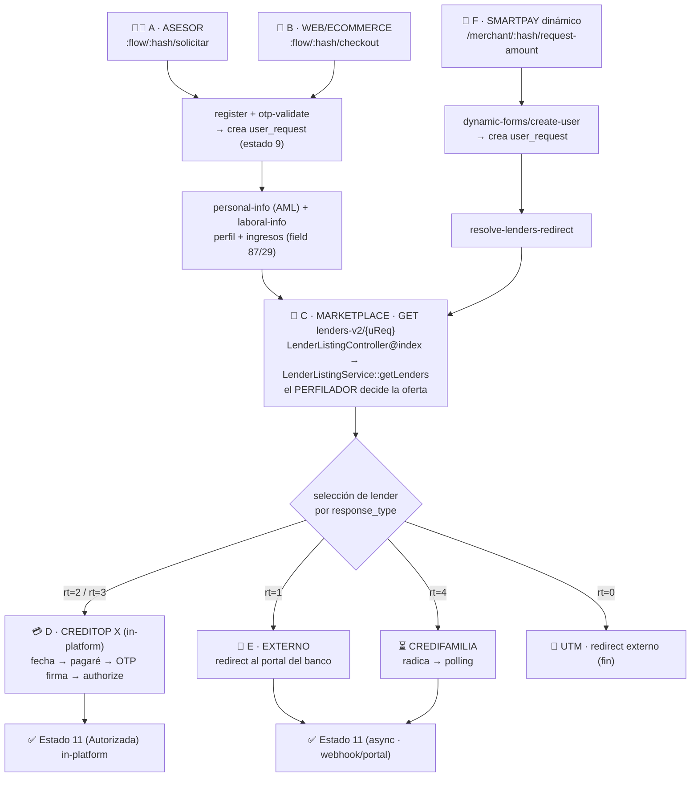
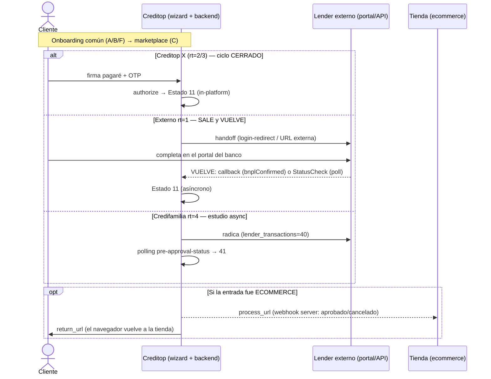

# MAPA DE FLUJOS — encadenamiento Frontend ↔ Backend (con archivos clave)

> **Dueño del encadenamiento.** Este doc es la fuente única del recorrido
> `URL → archivo frontend → endpoint → controller/service backend → tablas → prueba E2E`: el grafo de pasos,
> la cadena navegable y qué prueba cubre cada flujo. Es un **mapa de cableado**, no de negocio.
>
> - **Por qué difiere cada flujo / qué hace distinto** (mecanismo, citas `archivo:línea`, mocks) → [`./REFERENCIA-FLUJOS.md`](./REFERENCIA-FLUJOS.md).
> - **Negocio**: `response_type` 0–4 y ciclo de vida de estados → [`./CREDITOP.md`](../CREDITOP.md).
> - **Tablas / columnas / relaciones** → [`./MODELO-DATOS.md`](./MODELO-DATOS.md).
> - **Hardcodes** (IDs, hashes, montos, status, magic numbers) → [`./LOGICA-QUEMADA.md`](./LOGICA-QUEMADA.md).
> - **Prueba E2E**: el comando exacto y su estado → [`../backend-e2e/VALIDATION.md`](../../backend-e2e/VALIDATION.md) y [`../backend-e2e/SUITE.md`](../../backend-e2e/SUITE.md) (CLI); UI → [`../frontend-e2e/VALIDATION.md`](../../frontend-e2e/VALIDATION.md).
>
> Frontend: `github/frontend-monorepo` (React Router v7). Backend: `github/legacy-backend` (Laravel).

## Cómo leer este doc
- **IDs de paso** `A.1`, `D.2`, … = `<flujo>.<paso>`. Referencian un punto exacto del recorrido.
- **baseURL backend**: env `VITE_API_URL` (FE: `app/utils/env.server.ts`) → rutas `/api/onboarding/…`,
  `/api/bancolombia/…`, `/api/partners/…`. En la suite Go la conexión está hardcodeada (`http://127.0.0.1:80/api`,
  usuario `creditop`); ver [`./LOGICA-QUEMADA.md`](./LOGICA-QUEMADA.md).
- **Ruta base de los repos del FE.** Los `*.repository.ts` NO están bajo `apps/.../app/modules/`; viven en los
  paquetes workspace `modules/loan-request-wizard/<paquete>/src/lib/infrastructure/…`:
  - `loan-application-form/…` → `phone-number`, `phone-otp`, `personal-info`, `employment-info`
  - `lenders-marketplace/…/repositories/loan-options.repository.ts`
  - `loan-origination/…` → `first-payment-date`, `promissory-note`
  - `identity-validation/…/identity-validation.repository.ts`
  - Excepción: `device-imei.repository.ts` sí está bajo `apps/loan-request-wizard/app/modules/imei`.
- **Paso de estado** entre pantallas: URL params (`partner_hash`, `loan_request_id`), cookie SSR (ecommerce),
  sesión Redis (SmartPay) — ver §"Paso de estado".
- **Alcance "mirror local".** El estado *in-platform* descrito aquí es el comportamiento del **backend real**.
  En el mirror local el **cierre Creditop X por UI está bloqueado** por la config de lender del mirror; está
  validado solo por la suite backend. Detalle y salvedad → [§ Alcance mirror](#alcance-mirror-local-qué-cierra-y-qué-no).
- ⚠️ `packages/form-engine` **NO se usa** (planteado, nunca cableado; solo lo importa el archivo huérfano
  `app/routes/dynamic/dynamic.tsx`, fuera de `app/routes.ts`). El flujo SmartPay usa código propio del wizard
  (`DynamicFormContext` + Redis). Omitido aquí hasta que se elimine del repo.

## Grafo de flujos

> `response_type` (0=UTM, 1=Integración externa, 2=Creditop X in-platform, 3=Cupo Rotativo, 4=Credifamilia async)
> y el ciclo de vida de estados están en [`./CREDITOP.md`](../CREDITOP.md).

---

## Tabla maestra (vistazo rápido: entrada → cierre → retorno → prueba)

Cada flujo de negocio = **[canal de entrada] × [comercio] × [lender/cierre]**. Esta tabla integra URL, archivos eje
y desenlace para entender de un vistazo cómo se conectan; el detalle paso a paso está en las secciones siguientes.
La columna **Prueba E2E** nombra el comando; el estado/salvedades de cada uno están en
[`../backend-e2e/VALIDATION.md`](../../backend-e2e/VALIDATION.md).

| Flujo | Entrada (URL front) | Cómo finaliza · retorno | Archivos eje (FE · BE) | Prueba E2E |
|-------|---------------------|--------------------------|------------------------|------------|
| **Creditop X — vía Pullman** (rt=2) | `:flow/:hash/solicitar` | **in-platform** → Estado 11 (`authorize`); no sale. Backend auto-inyecta el laboral (Quanto) | `loan-application-form/*`, `sign-documents.tsx` · `OnboardingService::storePersonalInfo`, `CreditopXRequestHistoryService` | `asesor 3e67eade 77` |
| **Revolving** (rt=3) | `:flow/:hash/solicitar` | in-platform; 1ª=Pagaré Maestro, 2ª reusa cupo (sin pagaré) | `loan-confirmation.tsx`, `RevolvingCreditIntro.tsx` · `RevolvingCreditsService` | `asesor 3e67eade 71` |
| **Motai** (rt=2 · IMEI) | `:flow/:hash/solicitar` (`isMotaiRenting`) | device-lock (no pagaré): IMEI + Abaco → `device/disburse` → 11 | `imei.tsx`, `abaco/*` · `AlliedProductService::enroll`, `device_locks` | `asesor f0548728 158` |
| **SmartPay** (rt dinámico · RD/CO) | `/merchant/:hash/request-amount` | submit `create-user` → `resolve-lenders-redirect` → marketplace. CO (#152) cierra por `CreditopXClose` estándar (no IMEI) | `app/routes/dynamic/*` · `DynamicFormsController@userCreate` | `smartpay 3e67eade` |
| **Bancolombia** (rt=1) | `/bancolombia/self-service/:hash/solicitar` | **motor PLS** decide BNPL/Consumo → handoff portal → **vuelve** y finaliza async | `bancolombia/{bnpl,loan}/*` · `BancolombiaBnplController`, `BancolombiaController@validatePreApprovedAndRedirect` | `asesor <hash> 68/100` |
| **Welli / Meddipay / BdB** (rt=1) | `:flow/:hash/solicitar` → marketplace | pre-aprobación en `GET lenders/{uReq}`; cierre en portal; **vuelve** por `StatusCheck`/webhook | `available-lenders.tsx` · `app/Jobs/Lenders/*/StatusCheck.php` | `asesor <hash> 23` / `<hash> 39` |
| **Credifamilia** (rt=4) | `:flow/:hash/solicitar` → marketplace | radica (40) → **polling** `pre-approval-status` → 41 (no sale a portal) | `waiting-validation.tsx` · `Credifamilia::register/show` | `asesor <hash> 24` |
| **Ecommerce** (canal) | `:flow/:hash/checkout` | igual a su lender + **notifica a la tienda** (`process_url` + `return_url`) | `ecommerce/checkout.tsx` · `EcommerceRequestService`, `ApprovedConfirmationController` | `web 17f7b360 77` |
| **Marketplace / Perfilador** | `:flow/:hash/:lr/lenders` | decide oferta por reglas+categorías (no cierra) | `available-lenders.tsx` (`loan-options.repository.ts:25`) · `LenderListingController@index` → `LenderListingService::getLenders`, `profiling_reviews` | `perfilador 3e67eade 77` |

> **Notas sobre la tabla:**
> - `3e67eade` = comercio **Amoblando Pullman** (allied 94); lender **77 = CrediPullman** (rt=2). Es el
>   "Creditop X cerrable" de referencia: el lender **37 ("Creditop X" genérico, rt=2) NO cierra** en el mirror
>   (ver [§ Alcance mirror](#alcance-mirror-local-qué-cierra-y-qué-no)), por eso la suite usa el 77.
> - **Corbeta no es un comercio ni un lender**: es un **feature** activado por el setting `corbeta_allieds`
>   (`[24, 209, 210, 211]`). El hash `a1c0b15d` = **Alkosto** (allied 209), que está en esa lista; el lender sigue
>   siendo 77 (CrediPullman). El delta de pantallas está en [§ PC](#pc--pullman-laboral-auto-inyectado--corbeta-feature).
> - Los hashes de los comercios y la lista `corbeta_allieds` son hardcodes → [`./LOGICA-QUEMADA.md`](./LOGICA-QUEMADA.md).
>
> **Lectura rápida:** los rt=2/3 (incl. Pullman/Motai/SmartPay CO) **cierran dentro de Creditop**; los rt=1
> (Bancolombia/Welli/…) **salen al portal del banco y vuelven** (callback o `StatusCheck`); rt=4 (Credifamilia)
> **no sale** pero el estudio es async (polling); ecommerce añade la **notificación a la tienda** al final.

## A · Entrada ASESOR (originación en tienda)
Asesor del comercio acompaña la solicitud. **Prueba E2E:** `go run . asesor <hash> <lender>`
([`../backend-e2e/SUITE.md`](../../backend-e2e/SUITE.md)).

| ID | Paso | Front (URL · archivo) | API | Backend (controller → service → tablas) |
|----|------|------------------------|-----|------------------------------------------|
| A.1 | Registro celular + políticas | `:flow/:hash/solicitar` · `loan-application-form/phone-number.tsx` (`phone-number.repository.ts:44`) | `POST /onboarding/phone/register` | `RegisterCellPhoneController@store` (`routes/api.php:18-23`) → crea/upsert `users` por celular |
| A.2 | OTP de identidad | `:flow/:hash/:phone_number/otp` · `otp-verification.tsx` (`phone-otp.repository.ts:14`) | `POST /onboarding/loan-application/otp-validate/{hash}` | `OnboardingController@validateOtpCodeAndRedirect` (`api.php:43`) → **crea `user_requests` (estado 9 "Formulario de perfil")**, devuelve `user_request_id`. Flag `isMotaiRenting` se lee aquí (`phone-otp.repository.ts:26`) |
| A.3 | Datos personales (AML) | `:flow/:hash/:lr/personal-info` · `loan-request-form.tsx` (`personal-info.repository.ts`) | `POST /onboarding/loan-application/personal-info/{hash}/{uReq}` | `OnboardingController@validateAndStorePersonalInfo` (`OnboardingController.php:434`) → `OnboardingService::storePersonalInfo` (`OnboardingService.php:106`) → AML (TusDatos). **Pullman (allied 94): Experian Acierta + Quanto auto-inyecta el ingreso** (`OnboardingService.php:491,96`); guard `ONB005` si doc duplicado (`loan-request-form.tsx:101`) |
| A.4 | Laboral / ingresos | `:flow/:hash/:lr/employment-info` · `employment-info.tsx` (`employment-info.repository.ts`) | `POST /onboarding/loan-application/laboral-info/{hash}/{uReq}` | guarda `user_field_values` (field 87 "Ingresos mensuales", field 29 "Situación laboral"). Pullman/Corbeta lo auto-inyectan → la pantalla se omite |

> El significado de las pantallas y por qué Pullman salta el laboral → [`./REFERENCIA-FLUJOS.md`](./REFERENCIA-FLUJOS.md).

---

## B · Entrada WEB / ECOMMERCE (headless)
La tienda (WooCommerce/VTEX) hace handshake; luego es igual a A. **Prueba E2E:** `go run . web <hash> <lender>`.

| ID | Paso | Front (URL · archivo) | API | Backend |
|----|------|------------------------|-----|---------|
| B.1 | Handshake (contrato base64) | `:flow/:hash/checkout?o=&p=&t=&u=&ps=` · `ecommerce/checkout.tsx` | `POST /onboarding/ecommerce-request/create/{hash}` | `EcommerceRequestController@createEcommerceRequest` (`api.php:170-171`): decodifica el contrato → crea `ecommerce_requests`, devuelve `ecommerceRequestId` + `amount` + prefill. Se guarda en **cookie SSR** |
| B.2–B.4 | register → OTP → personal → laboral | igual a A.1–A.4 | — | En A.2 el front añade `ecommerce_request_id` (de la cookie) → el backend ancla `user_request` ↔ `ecommerce_request` en `user_requests_by_ecommerce_request` (modelo `UserRequestsByEcommerceRequest.php`) |

---

## C · MARKETPLACE (el Perfilador decide la oferta)
Pantalla de entidades: lista de lenders ofrecidos + selección. **Prueba E2E:** `go run . perfilador <hash> <lender>`
(decisión) · `go run . offer <hash>` (oferta).

> **Split de endpoints (origen de confusión recurrente).** Coexisten DOS versiones del marketplace y el
> path VIVO es **v2** (verificado contra código):
> - `GET lenders-v2/{uReq}` → **`LenderListingController@index`** (`api.php:49`) → **`LenderListingService::getLenders`** — **es el que llama el FE** (`loan-options.repository.ts:25`). Es el recorrido vivo.
> - `GET lenders/{uReq}` → `ListLenderController@index` (`api.php:48`) → `LenderRetrievalService` — path **VIEJO**, el FE **ya no lo usa**. No documentamos su cadena porque está fuera del recorrido vivo.

| ID | Paso | Front (URL · archivo) | API | Backend (la pieza clave) |
|----|------|------------------------|-----|---------------------------|
| C.1 | Lista de entidades | `:flow/:hash/:lr/lenders` · `lenders-marketplace/available-lenders.tsx` (`loan-options.repository.ts:25`) | `GET /onboarding/loan-application/lenders-v2/{uReq}` | `LenderListingController@index` (`api.php:49`) → **`LenderListingService::getLenders()`**, que invoca el **PERFILADOR**: evalúa `lender_rules` + `lender_datacredito_rules` + categorías (`lender_users_categories`/`lender_users_category_rules`) y registra la decisión vía `ProfilingReviewController::store` en **`profiling_reviews`** + `users_category_log`. Los rt=1 externos pegan a su host aquí (pre-aprobación). *(El path viejo `lenders/{uReq}` → `ListLenderController` → `LenderRetrievalService` ya no lo usa el FE.)* |
| C.2 | Selección de entidad | (mismo archivo, action; `user-request.repository.ts:16`) | `POST /onboarding/loan-application/update-user-request/{uReq}` · `POST .../soft-update-user-request/{uReq}` | `update-user-request` → `ListLenderController@updateUserRequest` (`api.php:49`) fija `lender_id`/`amount`/`fee_number`/`rate` en `user_requests`. `soft-update-user-request` → `UserRequestController@softUpdateUserRequest` (`api.php:51`). Luego ramifica por `response_type` |

> La oferta efectiva pasa por `lenders_by_allieds` (+ credencial). `have_ctopx` (columna de `allieds`, no a nivel
> branch) **sí se lee y ramifica** la lógica de listado (`LenderListingService.php:352`, `LenderValidationService.php:320`)
> — no es solo cast/fillable —, aunque **no es el gate duro** de la oferta rt=2 (el allied 94 con `have_ctopx=0` igual
> ofrece CrediPullman #77). La estructura de estas tablas → [`./MODELO-DATOS.md`](./MODELO-DATOS.md); el perfilador
> (qué hace y por qué) → [`./REFERENCIA-FLUJOS.md`](./REFERENCIA-FLUJOS.md).

---

## D · Cierre CREDITOP X (rt=2/3 · in-platform)
CreditOp opera el crédito in-platform (capital del comercio) y cierra hasta Estado 11. **Prueba E2E:** parte de `go run . asesor 3e67eade 77`
(`CreditopXClose`, `lender/lender.go:89`).

| ID | Paso | Front (URL · archivo) | API (módulo `@creditop/loan-origination`) | Backend → tablas |
|----|------|------------------------|--------------------------------------------|-------------------|
| D.1 | Fecha 1er pago + plazo | `:flow/:hash/:lr/first-payment-date` · `first-payment-date.tsx` (`first-payment-date.repository.ts:22,74`) | `select-payment-date` / `confirm-payment-date` (→ estado 10 "Pendiente de autorización") | `PaymentScheduleService.php:33` fija estado 10; `CreditopXRequestHistoryService` |
| D.2 | Pagaré + envío OTP firma | `:flow/:hash/:lr/sign-documents` · `sign-documents.tsx` (`promissory-note.repository.ts:117,191`) | `GET promissory-note/{uReq}` (preview) → `send-otp` | genera PDF vía **PdfMapper** (fake en stash, requiere `PDF_MAPPER_FAKE=true`); escribe `promissory_notes`, `creditop_x_consents` |
| D.3 | OTP firma → autoriza | `:flow/:hash/:lr/otp-validation` · `otp-validation.tsx` (`promissory-note.repository.ts:35`) | `verify-otp` → `authorize` | `verify-otp` pasa a "Autorizado pendiente desembolso"; **`authorize` genera docs → `user_request_status_id=11` (Autorizada)** + asigna categoría (`lender_users_categories`) |
| D.→ | Aprobado | `/loan-approved` | — | Estado 11 (Autorizada). rt=3 además crea/reusa `creditop_x_revolving_credits` (Pagaré Maestro) |

---

## E · Externos (rt=1 → portal del banco)
Creditop es bróker: pre-aprueba y hace handoff; el cierre y el Estado 11 ocurren **fuera** (portal del tercero, async).
**Prueba E2E:** Welli (lender 23, rt=1), Meddipay (39, rt=1), Bancolombia PLS — comandos en
[`../backend-e2e/VALIDATION.md`](../../backend-e2e/VALIDATION.md).

| ID | Paso | Front (URL · archivo) | API | Backend |
|----|------|------------------------|-----|---------|
| E.1 | Pre-aprobación | (en C.1, `GET lenders/{uReq}`) | — | cada `Action` (Welli `consult()`/`run_risk`, Meddipay `auth`+`CreateOrder`, CeroPay `authorizations`+`KYC`) pega a su host (mock en stash) → `lender_transactions` |
| E.2 | Redirect / handoff | `available-lenders.tsx` → `routeHelpers.redirectExternal(url)` o rutas `bancolombia/*` | Bancolombia: `GET /bancolombia/bnpl/login-redirect/{uReq}`, `POST /bancolombia/loan/login-redirect/{uReq}`; PLS: `POST /bancolombia/validate-preapproved/{uReq}` | el cierre (OAuth + firma) es el **portal del banco**; el Estado 11 llega async por webhook/`StatusCheck` |

---

## F · SMARTPAY (formulario dinámico · RD/CO)
Entrada alterna (lender 153 RD rt=1 / 152 CO rt=2): el front recoge un formulario dinámico y la sesión vive en
**Redis** hasta el submit. "SmartPay" en BD = lenders 152 y 153; **no existe el lender 160** (es un hardcode solo en
código → [`./LOGICA-QUEMADA.md`](./LOGICA-QUEMADA.md)). **Pruebas E2E:** backend `go run . smartpay <branch>`
(default `3e67eade`, replica la cadena sin micro); **UI completa** `frontend-e2e/merchant/smartpay-dynamic.spec.ts`.
El cierre del #152 CO usa `CreditopXClose` estándar (NO IMEI; el IMEI es de Motai #158).

| ID | Paso | Front (URL · archivo) | API | Backend |
|----|------|------------------------|-----|---------|
| F.1 | Monto | `/merchant/:hash/request-amount` · `dynamic/request-amount.tsx` | `POST /partners/dynamic-form/session/{txId}` | crea `transactionId`, guarda monto en sesión Redis (estado en `app/context/DynamicFormContext.tsx`) |
| F.2 | Celular → send-otp | `/merchant/:hash/request-phone` · `dynamic/request-phone.tsx` | `POST {VITE_ONBOARDING_FORM_SERVICE}/…/send-otp` | el microservicio proxya `backdoor/create-temporary-user` (→ BDUS002) en legacy-backend |
| F.3 | OTP → validate | `/merchant/:hash/request-otp` · `dynamic/request-otp.tsx` | `POST {…}/validate-otp` | proxya `backdoor/check-user-exists` (BDUS003) + `backdoor/accept-terms` (políticas SmartPay 14/15) |
| F.4 | Personal + financiero | `/merchant/:hash/request-personal-info`, `request-financial-info` · `dynamic/*.tsx` | `POST /partners/dynamic-form/session/{txId}` (Redis) | campos dinámicos (`field_id` 162–172) acumulados en sesión |
| F.5 | Submit (originación) | (fin del wizard) | `POST /onboarding/dynamic-forms/create-user` → `backdoor/resolve-lenders-redirect` | **`DynamicFormsController@userCreate`** (`api.php:189`) → `userCreateFacade` (DYFS1001): crea `users` + `user_requests` + `user_field_values`; valida `data` contra el esquema del form. Luego BDUS005 → redirect al marketplace |

> **Auth backdoor:** los endpoints `backdoor/*` exigen `X-Api-Key = BACKDOOR_API_KEY` del `.env` del backend; la suite
> Go lo lleva hardcodeado (`pkg/config/config.go:18`) y debe coincidir → [`./LOGICA-QUEMADA.md`](./LOGICA-QUEMADA.md).
>
> **UI E2E (local, sin microservicio):** el WIZARD llama al forms-service DIRECTO (`VITE_ONBOARDING_FORM_SERVICE`,
> server-side). Como no se levanta el micro, legacy-backend lo **FAKEA** inbound:
> `AppServiceProvider::fakeFormsServiceRoutesForLocal` → `/api/forms-fake/dynamic/{schema,send-otp,validate-otp,
> full/find-user-by-{email,document-number},upload,submit}` (en stash). El `submit` delega al origination real
> (`userCreateFacade` → DYFS1001) → **userRequestId real**. Las rutas `/merchant/*` exigen **Cognito**
> (`default-layout`) y atan la URL al comercio del usuario (`default-layout.tsx:63` redirige si el hash ≠ el del
> usuario); el spec re-apunta la cuenta de prueba a `bb534d6a` (Creditop, allied 24) y la restaura a Motai, con
> mutex `pkg/account-lock.ts`. Detalle SmartPay/mutex/Cognito → [`../frontend-e2e/VALIDATION.md`](../../frontend-e2e/VALIDATION.md);
> setup → [`../frontend-e2e/README.md`](../../frontend-e2e/README.md).

---

## Flujos DIFERENCIADOS — el delta del encadenamiento FE↔BE

> Los flujos comparten el esqueleto A→C→cierre. Aquí está **solo el delta de cableado** de cada flujo "especial":
> qué pantallas/endpoints PROPIOS añade y dónde se ramifica. **Por qué difiere a nivel mecanismo/negocio** →
> [`./REFERENCIA-FLUJOS.md`](./REFERENCIA-FLUJOS.md).

### Gate compartido: validación de identidad (AML + ADO)
Tras `personal-info`, los flujos in-platform pasan por una **pantalla de espera** que hace *polling* hasta que
AML (TusDatos) y ADO (selfie/cédula) terminan. Ramifica el recorrido.

| ID | Paso | Front (URL · archivo) | API | Backend |
|----|------|------------------------|-----|---------|
| ID.1 | Espera validación | `:flow/:hash/:lr/waiting-validation/:rcuid` · `waiting-validation.tsx` (`identity-validation.repository.ts:298`) | `POST /identity/validation-status` (poll; **máx 15 intentos, 36 si Abaco**) | TusDatos AML + ADO; resultado: `tusdatos_aml.has_findings`, `ado.validated` |
| ID.2 | Ramifica por resultado | (loader `waiting-validation.tsx:106-127`) | callback ADO: `POST /identity/ado/enroll/callback/{lr}` (línea 254) | hallazgos AML → `/request-canceled`; ADO inválido → `/retry-validation`; OK → `/first-payment-date` (o `/request-sent` si Abaco) |

> Constantes de polling: `WAITING_VALIDATION_NON_ABACO_MAX_POLL_ATTEMPTS=15`,
> `ABACO_VALIDATION_MAX_POLL_ATTEMPTS=36` (`modules/loan-request-wizard/identity-validation/src/lib/polling/validation-polling.constants.ts`).

### M · MOTAI (IMEI + Abaco) — `go run . asesor f0548728 158`
**Delta:** flag `isMotaiRenting=true` desde el registro (`phone-otp.repository.ts:26`); añade captura de **IMEI** y
**Abaco** (scraping de ingresos gig-economy); el cierre es **device-lock**, no pagaré.

| ID | Paso | Front (URL · archivo) | API | Backend → tablas |
|----|------|------------------------|-----|-------------------|
| M.1 | ¿Requiere Abaco? | `:flow/:hash/:lr/abaco/` · `abaco/index.tsx` (`abaco.repository.ts:30`) | `POST /onboarding/motai/check-abaco-requirement` | decide si exige scraping |
| M.2 | Scraping gig-economy | `/abaco/platforms` · `abaco/platforms.tsx` (`abaco.repository.ts:74`) | `POST /onboarding/scraping/init/gig-economy` → `login/step-1` → `login/step-2` (OTP) → `results` | verifica ingresos del repartidor (Rappi/Uber…) |
| M.3 | Captura IMEI | `/merchant/:hash/:lr/imei` (+ `/imei/scan`) · `imei.tsx`, `imei-scan.tsx` (`device-imei.repository.ts:43`) | `POST /loans/requests/device/register` | enrola el IMEI en MDM (`AlliedProductService::enroll`, línea 28 → `merchant_gateways`/Trustonic; **bypass MDM en stash**, `AlliedProductService.php:32`); `user_request_products.imei`, `device_locks` |
| M.4 | Desembolso device | `imei-scan-success.tsx` (`promissory-note.repository.ts:67`) | `POST /loans/requests/device/{lr}/disburse` | **Estado 11** con garantía=dispositivo |

> Jobs IMEI (lock 04:00, unlock 05:00, unroll 06:00) y `testIMEI` → [`./LOGICA-QUEMADA.md`](./LOGICA-QUEMADA.md).

### BC · BANCOLOMBIA (motor PLS: BNPL vs Consumo) — `go run . asesor <hash> 68/100`
**Delta:** onboarding propio (`/bancolombia/self-service/...`); tras OTP, el **motor PLS** decide el producto y el
front se ramifica; el cierre es el **portal del banco** (OAuth, ~8 pasos), no in-platform.

| ID | Paso | Front (URL · archivo) | API | Backend |
|----|------|------------------------|-----|---------|
| BC.1 | OTP → decide producto | `/bancolombia/self-service/:hash/:phone_number/otp` · `bancolombia/onboarding/otp.tsx:149-163` | `POST /onboarding/bancolombia/validate-preapproved/{lr}` | `BancolombiaController@validatePreApprovedAndRedirect` (`BancolombiaController.php:23`) — **motor PLS**: evalúa BNPL(#68) y Consumo(#100); devuelve `flowType` = bnpl \| consumo \| no_preapproved |
| BC.2a | BNPL | `/bancolombia/bnpl/start/:code` → `redirect`/`signature` · `bnpl/*.tsx` (`bnpl.repository.ts:48`) | `POST /onboarding/bancolombia-bnpl/login-redirect/{lr}` | `BancolombiaBnplController` (`api.php:62`): handoff al portal BNPL |
| BC.2b | Consumo | `/bancolombia/consumo/terms/:code` → `loan-offer-evaluation` · `loan/*.tsx` (`loan.repository.ts:54`) | `POST /onboarding/bancolombia-consumer-loan/login-redirect/{lr}` | `BancolombiaLoanController` (`api.php:73`): handoff al portal Consumo |

### CF · CREDIFAMILIA (rt=4 · estudio asíncrono) — `go run . asesor <hash> 24`
**Delta:** además del gate AML/ADO, el **estudio de crédito** del banco es asíncrono: radica y se hace *polling* del
estado del `lender_transaction` hasta finalizar. Credifamilia es rt=4 (NO tiene fila en `response_types`). Polling
backend `MAX_ATTEMPTS=8`.

| ID | Paso | Front | API | Backend → tablas |
|----|------|-------|-----|-------------------|
| CF.1 | Radicación | (al pintar marketplace, C.1) | `GET /onboarding/loan-application/lenders/{lr}` | `Credifamilia::register()` (**bypass local en stash**) → `lender_transactions.status_id=40` (`CREDIT_IN_PROCESS`) |
| CF.2 | Polling estado | pantalla de espera (reusa el patrón de `waiting-validation`) | `GET /onboarding/loan-application/lenders/{lr}/24/pre-approval-status` | `ListLenderController@getPreApprovalStatus` (`api.php:50`) → `Credifamilia::show()` (**bypass**) → `status_id=41` (`CREDIT_APPROVED`) |

> Nota: 40/41 son `lender_transaction_statuses` (`CREDIT_IN_PROCESS`/`CREDIT_APPROVED`), **NO** `user_request_statuses`
> ni etiquetas en español. Las cifras de deuda y por qué "falla el random" → [`./CASOS-ESPECIALES.md`](./CASOS-ESPECIALES.md).

### PC · PULLMAN (laboral auto-inyectado) + CORBETA (feature) — `asesor 3e67eade 77` · `asesor a1c0b15d 68`
**Delta:** NO hay pantalla `employment-info`; el backend inyecta el laboral y el FRONT **se ramifica por `error_code`** (genérico = qué paso del flujo; ver [`REFERENCIA-FLUJOS.md`](./REFERENCIA-FLUJOS.md) §13 para la convención code/sufijo).
**Corbeta** es un *feature* (setting `corbeta_allieds`), no un comercio: `a1c0b15d` = **Alkosto** (allied 209), que
está en `corbeta_allieds=[24,209,210,211]`; el lender sigue siendo 77.

| Caso | Qué hace el front | Backend |
|------|-------------------|---------|
| **Pullman** | `personal-info` corre Experian Acierta+Quanto → inyecta el ingreso; el front salta laboral | `OnboardingService::storePersonalInfo` (allied 94) |
| **Corbeta (feature)** | OTP devuelve `corbeta_onboarding=true` + **`ONB006`** → `handleCorbetaFlow()` redirige a **Bancolombia** `validate-preapproved` | inyecta laboral dummy (1.5M) y deriva a Bancolombia |
| **códigos error** | `ONB002` (data laboral faltante → vuelve a personal-info), `ONB004` (forzar employment-info), `ONB006` (Corbeta→Bancolombia) | `ONB006`+`corbeta_onboarding`+`handleCorbetaFlow` viven en `bancolombia/onboarding/otp.tsx:161-163`. `ONB002`/`ONB004` en `otp-verification.tsx:82,86`; `ONB004`/`ONB005` en `loan-request-form.tsx:124,101`; `ONB002` en `employment-info.tsx:78` |

### RV · REVOLVING / CUPO ROTATIVO (rt=3) — `go run . asesor 3e67eade 71`
**Delta:** el cierre es Creditop X (D) pero con **pantalla intro de cupo** y dedup de pagaré en la 2ª compra.

| ID | Paso | Front (URL · archivo) | API | Backend |
|----|------|------------------------|-----|---------|
| RV.1 | Intro cupo rotativo | `/confirmation` · `loan-confirmation.tsx:120` + `RevolvingCreditIntro.tsx` (cuando `credit_type=revolving`) | (detalles del préstamo) | 1ª compra: **Pagaré Maestro** + `creditop_x_revolving_credits` |
| RV.2 | 2ª compra | (mismo cierre, sin pantalla nueva) | — | reusa el cupo; **NO** genera pagaré nuevo (dedup en backend) |

## Ciclo E2E: ¿quién cierra el crédito y dónde? (in-platform vs salida-y-retorno)

La diferencia de cableado más importante del recorrido E2E es **dónde se finaliza el crédito**:

- **Creditop X (rt=2/3) — ciclo CERRADO dentro de Creditop.** Perfil, firma del pagaré con OTP, autorización y
  desembolso ocurren **in-platform**; llega a **Estado 11 (Autorizada)** sin salir.
- **Externos rt=1 — SALEN y VUELVEN.** Creditop hace onboarding y pre-aprobación; el cierre real ocurre en el
  **portal del tercero**. Cuando el banco resuelve, el proceso **vuelve** y se finaliza async (Estado 11) por:
  - **callback** del banco (ej. Bancolombia `bnplConfirmed` / `consumoConfirmed`), o
  - **polling propio**: job `StatusCheck` auto-reprogramado (Welli, Banco de Bogotá) que consulta el estado del
    `lender_transaction` hasta `approved`/`rejected` (`app/Jobs/Lenders/*/StatusCheck.php`).
- **Credifamilia (rt=4) — estudio asíncrono.** No sale a un portal: radica (40) y hace *polling* hasta 41.
- **UTM (rt=0) — solo redirige.** El cliente sale a una URL del prestamista y la responsabilidad de Creditop termina.

### Mecanismo de "retorno" por tipo de lender
| Tipo | Cómo VUELVE el resultado a Creditop | Ruta(s) · archivo backend |
|------|-------------------------------------|----------------------------|
| Creditop X (rt=2/3) | no sale — `authorize` cierra in-platform; confirmación en | `GET /api/loan-application/{uReq}/approved-confirmation` → `ApprovedConfirmationController@show`; `CreditopXRequestHistoryService` |
| Bancolombia (rt=1) | secuencia proxy in-platform: arranca en `validate-preapproved` y `login-redirect`, termina en `origination` (+ callback `*Confirmed`) | `POST /api/onboarding/bancolombia/validate-preapproved/{uReq}`, `…/bancolombia-bnpl/login-redirect…origination/{uReq}` → `BancolombiaBnplController`; `BancolombiaBnpl::bnplConfirmed()` / `BancolombiaConsumerLoan::consumoConfirmed()` |
| Welli / Banco de Bogotá (rt=1) | **job `StatusCheck`** auto-reprogramado que *poll*ea el estado del `lender_transaction` | `app/Jobs/Lenders/{Welli,BancoDeBogota}/StatusCheck.php` (lenders genéricos exponen además `webhook()`: `Api/PayvalidaController`, `Api/ApprobeController`) |
| Credifamilia (rt=4) | **polling** desde Creditop (no hay portal) | `GET /api/onboarding/lenders/{uReq}/{lender_id}/pre-approval-status` → `ListLenderController@getPreApprovalStatus`; `Credifamilia::show()` |

### Notificación a la tienda (solo entrada ECOMMERCE)
La orden de la tienda se ancló en B.1 con dos URLs. Al finalizar (aprobado/cancelado), Creditop cierra el ciclo con
la tienda por **dos canales**:

| Canal | Qué es | Cuándo | Archivo |
|-------|--------|--------|---------|
| **`process_url`** | **webhook server-a-server**: Creditop notifica al backend de la tienda el resultado | al aprobar/cancelar el crédito | `EcommerceRequestService`, `ValidateOtpPromissoryNoteController`, `ValidateOtpController` (campo `process_url`; lo expone `CreditStatusService.php:36`) |
| **`return_url`** | **redirect del navegador**: el cliente vuelve a la pantalla de la tienda | en la pantalla de aprobación | `ApprovedConfirmationController::show()` (devuelve `ecommerce_data.return_url`, líneas 55,66) |

> Así el ciclo ecommerce es completo: tienda → (handshake B.1) → Creditop origina → (webhook `process_url` +
> redirect `return_url`) → la tienda procesa el pedido. El estado del crédito mapea el del pedido
> (Estado 11 = aprobado/completed; 8 = cancelado).

## Paso de estado (qué transporta qué)
| Dato | Origen | Cómo viaja | Lo consume |
|------|--------|------------|------------|
| `partner_hash` | URL del comercio | URL params (todas las rutas) | resuelve `allied_branches` |
| `loan_request_id` (`user_request_id`) | respuesta de A.2 (`otp-validate`) | URL params en pasos siguientes | personal-info, laboral, lenders, cierre |
| `ecommerceRequestId` | B.1 (`ecommerce-request/create`) | **cookie SSR** → reenviado en A.2 | ancla `user_request` ↔ orden de la tienda |
| `transactionId` (SmartPay) | F.1 (`request-amount`) | URL query + key de **Redis** | toda la cadena dinámica hasta el submit |

## Alcance mirror local: qué cierra y qué no

> El estado *in-platform* descrito en este mapa es el **comportamiento del backend real**. En el **mirror local** hay
> salvedades de config que cambian qué se puede cerrar por UI vs por backend:
>
> - **Cierre Creditop X por UI BLOQUEADO** por la config de lender del mirror: el #77 apunta a **Wompi hosted** y el
>   #37 a `/continue?url=null` (→ 404). El bloqueador **no es falta de testids** (el stash ya cubre
>   amount/phone/otp/personal/employment/initial-fee + `lender-action-{id}` genérico + `sp-*`).
> - **El cierre Creditop X SÍ está validado por backend**: `asesor 3e67eade 77` deja la solicitud en **Estado 11**.
> - El lender **37 ("Creditop X" genérico) NO es cerrable** en el mirror (deceval-sin-cred); por eso la referencia de
>   "Creditop X cerrable" es el **77 (CrediPullman, vía comercio Pullman `3e67eade`)**.
>
> Estado UI y su salvedad → [`../frontend-e2e/VALIDATION.md`](../../frontend-e2e/VALIDATION.md); estado backend →
> [`../backend-e2e/VALIDATION.md`](../../backend-e2e/VALIDATION.md). Slugs `motai001`/`smartpay001`/`qu4nt0001` son
> placeholders muertos: usar hashes reales (Motai `f0548728`, SmartPay/allied24 `bb534d6a`, Pullman `3e67eade`,
> Corbeta/Alkosto209 `a1c0b15d`).

## Notas / deuda detectada
- 🗑️ **Código muerto — se eliminará del repo:** `packages/form-engine` se planteó pero **nunca se usó**; lo único que
  lo importa es el route huérfano `app/routes/dynamic/dynamic.tsx` (`import { FormRenderer }`), que **no está cableado
  en `app/routes.ts`** (confirmado). El SmartPay real usa código propio del wizard (`DynamicFormContext` + Redis).
  Ambos pendientes de borrar; **omitidos en este mapa**.
- 🗑️ **Mecanismos OBSOLETOS:** `DEV_SESSION`/`X-Dev-Session` y el `mock-server :4000`/validation-driven fueron
  **eliminados**; no se reintroduzcan en este mapa.
- El backend mezcla rutas bajo `/api/onboarding/…`, `/api/partners/dynamic-form/…` (SmartPay) y `/api/bancolombia/…`
  (externo) — refleja los subdominios *Onboarding* / *Lenders Marketplace* / *Loan Origination* (ver
  [`./CREDITOP.md`](../CREDITOP.md) §9).

---
### Relación con los otros docs
- [`./CREDITOP.md`](../CREDITOP.md) — `response_type` 0–4 (taxonomía) y ciclo de vida de `user_request_statuses`.
- [`./REFERENCIA-FLUJOS.md`](./REFERENCIA-FLUJOS.md) — qué hace DISTINTO cada flujo (mecanismo, citas `archivo:línea`, mocks).
- [`./MODELO-DATOS.md`](./MODELO-DATOS.md) — estructura de tablas (incluido el Perfilador y device-locking).
- [`./LOGICA-QUEMADA.md`](./LOGICA-QUEMADA.md) — todos los hardcodes (IDs, hashes, montos, status, magic numbers, PII).
- [`./CASOS-ESPECIALES.md`](./CASOS-ESPECIALES.md) — por qué "falla el random", clasificación de fallos y cifras de deuda rt=2.
- [`../backend-e2e/SUITE.md`](../../backend-e2e/SUITE.md) — CLI del harness Go (subcomandos/defaults).
- [`../backend-e2e/VALIDATION.md`](../../backend-e2e/VALIDATION.md) — qué está validado E2E por backend.
- [`../frontend-e2e/VALIDATION.md`](../../frontend-e2e/VALIDATION.md) / [`../frontend-e2e/README.md`](../../frontend-e2e/README.md) — estado UI + detalle SmartPay/mutex/Cognito; setup/quickstart.
