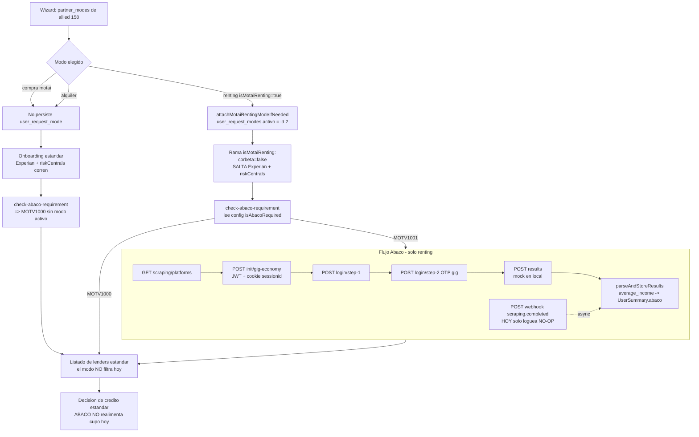

# Motai — modos (compra / renting / alquiler) y validación Ábaco

> Documento de contexto para arrancar tareas sobre **Motai** (allied_id **158**). Síntesis de lectura del código real de `legacy-backend` (Módulo Onboarding + `app/Actions/RiskCentrals/Abaco.php`) y comparación con los docs del equipo (`CREDITOP.md`, `ONBOARDING-DATOS-DECISION-ANALISIS.md`, `CONTINUACION-CREDITO-ANALISIS.md`) y con el flujo hermano de `CREDIFAMILIA-FLUJO-ANALISIS.md`.
>
> Convención: se cita `archivo:línea` en todo el documento. Identificadores (clases, métodos, constantes, endpoints, códigos) se dejan **verbatim**; la prosa va en español. Donde algo es frágil, contradice otro doc o es un bug latente, se dice **explícitamente**.
>
> **Aviso de eje conceptual (leer primero):** Motai NO es un lender ni un `response_type`. Es un **comercio** (allied 158) que expone **varios modos/productos** sobre el mismo wizard. El backbone `response_type` (rt=0 redirección / rt=1 agregador-integración / rt=2-3 CreditopX in-platform / rt=4 híbrido Credifamilia) razona sobre el **lender**; Motai introduce un **eje ortogonal**: el **modo del comercio** (compra / renting / alquiler), que es una variante de **producto y de underwriting**, independiente del rt del lender que finalmente financie.
>
> **Dónde encaja:** esta ficha cubre solo lo **distintivo** de Motai (modos del comercio 158). El **tronco común** que da por sabido (entrada → OTP → datos personales/laborales → marketplace) es dueño de [REFERENCIA-FLUJOS.md §1](./REFERENCIA-FLUJOS.md); el **encadenamiento FE↔BE**, de [MAPA-FLUJOS.md](./MAPA-FLUJOS.md); y la **comparación transversal por entidad** (quién decide/financia/cobra/cierra/simulable), de [lenders/README.md](../lenders/README.md).

---

## 1. Resumen ejecutivo

**Motai** es un comercio colombiano (`allied_id = 158`) que ofrece **varios modos de producto** sobre un único wizard de originación:

> **Colisión de namespace `158` (allied vs lender):** el número `158` es **ambos** — el **allied 158** (Motai, el comercio, del que trata este doc) **y** el **lender 158** (Motai Renting, `response_type=2`). Son entidades distintas en tablas distintas que comparten el id. Cuando este doc dice "allied 158" se refiere al comercio; no confundir con el lender 158.

| Modo (code) | Producto de negocio | ¿Exige Ábaco? |
|---|---|---|
| `motai` | **Compra financiada** (crédito estándar para adquirir el bien) | No |
| `motai-renting` | **Renting** = arrendamiento del bien (con opción de compra al final) | **Sí** (`isAbacoRequired:true`) |
| `alquiler` | **Alquiler puro** = arrendamiento sin transferencia | No |

> Los `code` `motai` / `motai-renting` / `alquiler` son los esperables por convención (§2.1); los ids reales en la tabla `allied_modes` **no están seedeados en el repo** y son la pregunta abierta #1.

El **modo elegido** se persiste en la tabla `user_request_modes` y decide dos cosas:

1. **Si se intercala un paso de underwriting externo (Ábaco).** Solo `motai-renting` (por su `config['isAbacoRequired'] === true`) mete un paso de scraping de ingresos en plataformas gig-economy (Uber / DiDi / Yango / inDrive / Rappi / DiDiFood) que el usuario autoriza logueándose (con OTP) en esas apps. Compra y alquiler NO lo disparan.
2. **Si se salta el underwriting crediticio estándar.** La rama `isMotaiRenting` en el orquestador de OTP fuerza `corbetaOnboarding=false` y **omite `userViability`/Experian y `validateRiskCentrals`** (`OnboardingController.php:1216-1223`, docblock `:1005-1011`). Es decir, el renting **sustituye** el score de buró / CreditopX por la prueba de ingresos gig de Ábaco.

**Hallazgo transversal crítico (frágil):** en **legacy hoy** el resultado de Ábaco se **captura pero no se cablea** a ninguna decisión de crédito. El ingreso promedio (`average_income`) se computa de forma transitoria y se persiste un resumen por plataforma en `UserSummary.abaco`, pero **ningún path de decisión (cupo/listado de lenders) lo lee** (grep de consumidores vacío fuera de los archivos `Abaco*`). Además, el modo **NO filtra el catálogo de lenders** hoy (`AlliedModeLenderFilterService` es NO-OP salvo que el `config` traiga una lista `lenders`, que los modos Motai no traen). Ver §3, §8.

**Flujo punta a punta (1 párrafo):** el wizard obtiene los modos del comercio (`RegisterCellPhoneService::getRegistrationData` → `partner_modes`, `RegisterCellPhoneService.php:50`); el usuario elige un modo; al validar el OTP, si el front manda `isMotaiRenting=true`, `attachMotaiRentingModeIfNeeded` (`OnboardingController.php:1577`) fija el modo `motai-renting` en `user_request_modes` (con la constante **hardcodeada `MOTAI_RENTING_ALLIED_MODE_ID = 2`**, `:36`) y la rama renting salta el underwriting crediticio estándar. El front consulta `POST motai/check-abaco-requirement` (`MotaiValidationService.php:70`), que lee `AlliedMode.config['isAbacoRequired']` del modo **activo**: `MOTV1001` (requiere Ábaco) o `MOTV1000` (no). Con `MOTV1001`, el front corre el flujo Ábaco (`platforms` → `init/gig-economy` → `login/step-1` → `login/step-2` OTP → `results`, con un `webhook` defensivo asíncrono), que scrapea ingresos gig, los promedia y guarda en `UserSummary.abaco` + `user_request_additional_information` (`AbacoParserService.php`). Compra y alquiler saltan todo el bloque Ábaco y siguen el onboarding estándar. En **todos** los modos, el listado de lenders y la decisión de crédito corren por la maquinaria estándar del wizard (el modo no la altera hoy).

---

## 2. Flujo end-to-end por MODO

### 2.1 Selección y persistencia del modo (común a los 3)

- **Catálogo de modos del comercio.** `RegisterCellPhoneService::getRegistrationData` incluye `'partner_modes' => $alliedBranch->allied->alliedModes()->where('is_enabled', 1)->get()` (`RegisterCellPhoneService.php:50`). Cada fila es un `AlliedMode` (`app/Models/AlliedMode.php:8-37`) sobre la tabla `allied_modes` con `allied_id`, `code`, `name`, `order`, `is_enabled` (bool) y `config` (**casteado a `array`**, `AlliedMode.php:22-25`). En `config` viven flags como `isAbacoRequired` y, opcionalmente, `lenders`.
- **Persistencia del modo elegido.** Al validar OTP, `validateOtpCodeAndRedirectOrchestrator` llama `attachMotaiRentingModeIfNeeded($request, $userRequest)` (`OnboardingController.php:1204`). El helper (`:1577-1599`) **solo actúa si `request.boolean('isMotaiRenting') === true`** (`:1579`); en ese caso, dentro de `DB::transaction`, desactiva los modos activos previos (`user_request_modes.is_active=false`, `:1589-1595`) y hace `upsertActiveMode($userRequest->id, MOTAI_RENTING_ALLIED_MODE_ID)` (`:1597`). Para **compra y alquiler NO se crea ningún `user_request_mode`** aquí (no-op silencioso).
  - `upsertActiveMode` usa `updateOrCreate` keyed por `(user_request_id, allied_mode_id)` y setea `is_active=true` (`UserRequestModeRepository.php:18-30`).
  - `findLatestActiveByUserRequestId` = **el último por `id`** con `is_active=true` (`UserRequestModeRepository.php:10-16`, `->latest('id')->first()`).

> **Consecuencia:** hoy el sistema **solo persiste explícitamente el modo `motai-renting`**. Compra y alquiler quedan sin fila en `user_request_modes` (a menos que otro path los escriba). Por eso `check-abaco-requirement` para compra/alquiler suele resolver por la rama "sin modo activo" → `MOTV1000` (§2.3).

### 2.2 Modo COMPRA (`motai`) — financiación estándar

1. Usuario elige "compra"; el front **no** manda `isMotaiRenting` → no se persiste modo.
2. Onboarding estándar: NO se fuerza `corbeta=false`, NO se salta `userViability`/Experian ni `validateRiskCentrals` (las guardas `!isMotaiRenting` de `OnboardingController.php:1216-1223`, docblock `:1010-1011` no aplican).
3. `check-abaco-requirement` (si el front lo consulta) → sin modo activo → `MOTV1000` (`MotaiValidationService.php:88-98`, razón `active_mode_not_found`). **No hay paso Ábaco.**
4. Listado de lenders + decisión de crédito: maquinaria estándar del wizard (rt del lender que corresponda; el modo NO filtra, §3).

### 2.3 Modo RENTING (`motai-renting`) — arrendamiento con gate Ábaco

1. Usuario elige "renting"; el front manda `isMotaiRenting=true` en el `validate-otp`.
2. `attachMotaiRentingModeIfNeeded` fija `user_request_modes` activo = modo id `2` (constante hardcodeada, §8 gotcha #1).
3. `$isMotaiRenting = isMotaiRenting===true || merchant_mode==='motai_renting'` (`OnboardingController.php:1216`) dispara los efectos:
   - `corbetaOnboarding = false` (`:1217-1223`).
   - Se **salta** `userViability`/Experian por la guarda `(!hadPreApproveLender && !isMotaiRenting)` (docblock `:1010-1011`).
   - Se **salta** `validateRiskCentrals` por la guarda `(!isValidated && hasCreditopX && !isMotaiRenting)`.
4. **Gate Ábaco (backend decide, front ejecuta):** `POST api/onboarding/motai/check-abaco-requirement` (`routes/api.php:197`) → `MotaiValidationController@checkAbacoRequirement` → `MotaiValidationService::checkAbacoRequirementOrchestrator` (`:70-137`):
   - `findById(userRequestId)` (MOTV1002 si null).
   - `findLatestActiveByUserRequestId` → si hay modo → `alliedModeRepository->findById(allied_mode_id)` → `isAbacoRequired(config) = (config['isAbacoRequired'] ?? false) === true` (`:110`, `:183-190`).
   - Devuelve `MOTV1001` (requiere) o `MOTV1000` (no). **Ambos HTTP 200** (`getHttpCode`, `:139-148`).
5. **Flujo Ábaco** (endpoints `prefix scraping`, `routes/api.php:202-210`):
   - **5a. `GET scraping/platforms`** → `AbacoService::getPlatforms` (`:213-273`). Si `!isEnabled` → `ABAC1003`. Con `platforms_check_enabled=false` (default) devuelve las plataformas del setting local con sus hashes (`:224-233`); con `true` consulta Ábaco real y filtra las `online:true` que existan en el setting (`:235-264`). `ABAC1005` si vacío/inalcanzable.
   - **5b. `POST scraping/init/gig-economy`** → `AbacoService::initGigEconomy` (`:278-366`). Resuelve `alliedBranch` por hash (`partnerBranchId`) y `userRequest` por `creditProcessId`; valida `userRequest->allied_branch_id === alliedBranch->id` (`ABAC2005` "Branch mismatch", `:307-310`). Arma `customerData` desde el `User` (nombre, documento, `gender 'M'→'Hombre' / else 'Mujer'` `:317`, teléfono limpiado por `cleanPhoneNumber`, email, **`city='Bogota'`, `country/nationality='CO'` hardcodeados** `:321-324`, `platform_name` default `'rappi'` `:325`). Llama `abacoClient->initGigEconomy`. Del `redirect_url` hace un `GET withoutRedirecting` para **capturar la cookie `sessionid`** (`:340-347`). Devuelve `ABAC2001` con `{customerId, token(JWT), sessionId}`.
   - **5c. LOGIN 2 PASOS.** `POST scraping/login/step-1` → `loginStep1` (`:371-447`) y `POST scraping/login/step-2` → `loginStep2` (`:452-526`). Ambos validan unicidad de `sessionId` entre plataformas vía `abacoParser->isSessionIdUnique` (`ABAC3003`/`ABAC4003` CONFLICT). Llaman `abacoClient->login(token, platform, credentials, 'login'|'step-2', customerId, sessionId)` (`Abaco.php:163-206`: el JWT va en `Authorization: Bearer`, la sesión en `Cookie: session=…`, las credentials se **aplanan** a `username`/`password`/`code`). Persisten estatus incremental vía `updateLoginStatus`/`updateAuthStatus` en `user_request_additional_information` (`type_data='Abaco results'`). **step-2 es el OTP** de la plataforma gig.
   - **5d. `POST scraping/results`** → `AbacoService::results` (`:531-594`). Llama `abacoClient->results(customerId, requestPlatforms, mockPass)` (`Abaco.php:211-223`: **en env `local` devuelve `AbacoFixture::generateDynamicMock`** en vez de pegarle a Ábaco). Parsea y guarda vía `abacoParser->parseAndStoreResults` (`AbacoParserService.php:28-63`). Devuelve `ABAC5001` con `{completed:bool}` **plano** (`:585`, `flatten=true`).
6. **Webhook (asíncrono, defensivo).** `POST scraping/webhook` → `AbacoService::webhook` (`:599-628`). `AbacoWebhookRequest::validate` **loguea el payload crudo SIEMPRE** (`AbacoWebhookRequest.php:31-34`), valida firma `X-Webhook-Secret` con `hash_equals` (solo si hay secret configurado; `ABAC6002` si no coincide) y exige `event`+`data.token` (`:38-60`). Si `webhook_enabled=false` (default) → `ABAC6003`. El único `event` manejado, `'scraping.completed'`, **HOY SOLO LOGUEA** (el dispatch a job/evento `AbacoScrapingCompletedEvent` está **comentado**, `:610-615`) → NO-OP funcional más allá del log.
7. **Continuación.** Con `results.completed=true` el front sigue el onboarding de renting (el orquestador ya saltó Experian/riskCentrals). Si Ábaco falla, los endpoints devuelven `ABAC*004/005` (INTERNAL / SERVICE_UNAVAILABLE) **sin bloquear duramente** el `UserRequest`. El listado de lenders y la decisión final corren por la maquinaria estándar (el modo no filtra hoy).

### 2.4 Modo ALQUILER (`alquiler`) — arrendamiento puro

Operativamente idéntico a **compra** desde la óptica del código legacy: no manda `isMotaiRenting` (no persiste modo), no fuerza `corbeta=false`, no salta Experian/riskCentrals, y `check-abaco-requirement` resuelve `MOTV1000`. La diferencia frente a compra es **contractual/de negocio** (arrendamiento puro sin transferencia del bien, vs compra que sí transfiere), pero el código legacy **no distingue alquiler de compra** por ninguna rama (solo distingue `isAbacoRequired`). Es la pregunta abierta #3.

### 2.5 Diagrama

---

## 3. Lo DISTINTIVO de Motai

1. **Modos/productos sobre un mismo comercio (eje ortogonal al `response_type`).** Motai (allied 158) no es un lender ni un rt; es un comercio que expone varios **modos** vía `allied_modes`, y el modo se persiste en `user_request_modes`. El baseline (CreditopX/agregador) razona por `response_type` del **lender**; aquí el eje nuevo es el **modo del comercio** (producto/underwriting), **independiente del rt**.
2. **Producto de ARRENDAMIENTO, no préstamo para poseer.** `renting` (con opción de compra al final) y `alquiler` (puro) son **arrendamiento** del bien; el crédito estándar CreditopX/agregador financia una **compra**. El bien no se transfiere (o solo al final, en renting). Es la diferencia de negocio clave frente a todos los demás flujos.
3. **Ábaco = underwriting alternativo por ingresos gig, y SOLO en renting.** El modo `motai-renting` (`isAbacoRequired:true`) mete un paso extra de scraping de ingresos en plataformas gig (Uber/DiDi/Rappi…) vía login+OTP del usuario en esas apps; compra y alquiler NO lo disparan. **Ningún otro flujo del sistema usa Ábaco** (grep de `Abaco` fuera del módulo vacío; el `application` viejo solo tiene **scaffolding de esquema** — migraciones `2026_03_06_..._add_abaco_settings_to_settings_table` + `2026_03_09_..._add_abaco_column_to_user_summaries_table` + rama `origin/feature/LEN-260-integrar-abaco-para-motai` — pero **CERO lógica** de Ábaco ni consumidores).
4. **La rama `isMotaiRenting` SALTA el underwriting crediticio estándar.** Fuerza `corbeta=false` y omite `userViability`/Experian y `validateRiskCentrals` (`OnboardingController.php:1216-1223`, docblock `:1010-1011`): el renting **sustituye** el score de buró/CreditopX por la prueba de ingresos gig de Ábaco.
   - **Por qué (contexto de negocio):** el renting apunta a **población gig / migrante** — trabajadores de plataformas (Rappi/DiDi/Uber) y **migrantes con PEP = Permiso Especial de Permanencia** — que **no tienen historial en el buró colombiano** (datacrédito vacío/thin-file). Por eso el score de buró es inútil y se lo **reemplaza** por la prueba de ingresos gig de Ábaco como underwriting alternativo. *(El código de Motai/Ábaco no referencia el tipo de documento ni el estatus migratorio: es el racional del producto, no un gate codificado.)*
   - ⚠️ **Desambiguación "PEP" (dos significados en el dominio):** acá **PEP = Permiso Especial de Permanencia** (documento migratorio venezolano). **NO** confundir con **PEP = Persona Expuesta Políticamente** (el término AML/compliance, `pep_classification`/`pep_public_funds` en la vinculación de Credifamilia y en `ONBOARDING-DATOS-DECISION-ANALISIS.md`). Comparten la sigla pero son cosas distintas.
5. **El "requisito Ábaco" es data-driven por `config` del modo, no hardcodeado por comercio.** `MotaiValidationService` lee `AlliedMode.config['isAbacoRequired']` del modo **activo** (fail-safe: sin modo activo ⇒ no requiere Ábaco). Cualquier modo de cualquier comercio podría exigir Ábaco poniendo ese flag.
6. **El MODO no filtra el catálogo de lenders hoy (NO-OP).** `AlliedModeLenderFilterService::filterAvailableLenderIds` (`:16-42`) solo intersecta si `config['lenders']` es un array no vacío; los modos Motai no lo traen → devuelve la lista intacta. Lo invocan `LenderRetrievalService.php:211` y `LenderListingService.php:127`, pero es inocuo. Contrasta con la idea de que "un modo = un sub-marketplace".

---

## 4. Sistemas externos

| Sistema | Para qué | Dónde se configura |
|---|---|---|
| **Ábaco** (scraping/scoring gig-economy) | API externa que, con las **credenciales del usuario**, scrapea sus ganancias en plataformas gig (`uber`, `didi`, `yango`, `indrive`, `rappi`, `didifood`) y devuelve earnings históricos. CreditOp los **promedia** (`average_income`) como prueba de ingresos alternativa para el underwriting del modo renting. Integración: `init/gig-economy` (JWT + cookie `sessionid`), `login/step-1` y `login/step-2` (OTP de la plataforma), `results` (**mockeado en local**), `webhook scraping.completed` (firma `X-Webhook-Secret`). | Cliente en `app/Actions/RiskCentrals/Abaco.php`; toggles/plataformas en el setting `abaco_config`; credenciales/URLs en `config('onboarding.abaco')` = `ABACO_HOST` / `ABACO_SCRAPING_PREFIX` / `ABACO_TOKEN` / `ABACO_WEBHOOK_SECRET` (`Modules/Onboarding/config/config.php:14-19`). |
| **Setting `abaco_config`** (tabla `settings`, code=`setting`, key=`abaco_config`) | Toggles globales del flujo: `enabled`, `platforms_check_enabled`, `webhook_enabled`, `mock_pass`, y el mapa `platforms` con login-type/`code` length por plataforma. | Seed en `database/migrations/2026_03_06_003223_add_abaco_settings_to_settings_table.php`: `enabled=true, platforms_check_enabled=false, webhook_enabled=false, mock_pass=true`; plataformas `didi/yango/didifood`(code 6), `indrive/rappi/uber`(code 4). Cargado en `AbacoService::loadSettings` (`:64-84`). |

> No hay otros sistemas externos propios de Motai: el listado/decisión de lenders usa la misma infraestructura estándar (pre-approvals MS, datacrédito, etc.) documentada en los otros docs.

---

## 5. Estados y códigos

### 5.1 Modo del request (`user_request_modes.is_active` boolean)
Al fijar `motai-renting` se desactivan los modos activos previos (`is_active=false`) y se upsertea el nuevo activo (`OnboardingController.php:1588-1597`). `findLatestActiveByUserRequestId` toma el de **id mayor** entre los activos.

### 5.2 `check-abaco-requirement` (`MotaiValidationService.php:139-159`)
| Código | Significado | HTTP |
|---|---|---|
| `MOTV1000` | "La solicitud no requiere Ábaco." (también `active_mode_not_found`) | 200 |
| `MOTV1001` | "La solicitud requiere Ábaco." | 200 |
| `MOTV1002` | "Error interno del servidor." (userRequest null / alliedMode null / validación) | 500 |

### 5.3 Códigos Ábaco por endpoint (`AbacoService.php:86-177`)
| Endpoint | Códigos | Notas |
|---|---|---|
| platforms | `ABAC1001`-`1005` | `1003` integración off, `1004` platforms-check off, `1005` vacío/inalcanzable |
| init | `ABAC2001`-`2005` | `2005` branch/user not found o **branch mismatch**; `2004` client error |
| login step 1 | `ABAC3001`-`3005` | `3003` **sessionId conflict** (CONFLICT) |
| login step 2 (OTP) | `ABAC4001`-`4005` | `4003` sessionId conflict |
| results | `ABAC5001`-`5004` | `5001` con `{completed:bool}` plano |
| webhook | `ABAC6001`-`6004` | `6002` firma inválida (UNAUTHORIZED), `6003` webhook disabled (NOT_FOUND) |

Regla general: si `isEnabled=false`, cada endpoint responde su `*003/*004` (SERVICE_UNAVAILABLE).

### 5.4 Estatus incrementales de login por plataforma
En `user_request_additional_information` `type_data='Abaco results'`, bajo `request.platforms[PLATFORM].login`/`.auth`: `'200 - OK'`, `'200 - OK (Session Updated)'`, `'200 - OK (Auth Session Updated)'`, `'Error: <status>'` (`AbacoService.php:401`, `:424`, `:504`; escritos por `AbacoParserService::updateLoginStatus`/`updateAuthStatus`, `:280-338`).

### 5.5 `completed` del scraping (`AbacoParserService::checkPlatformsCompletion:388-415`)
- `false` si 0 auth `'200 - OK'`.
- Con **1** plataforma: requiere `resultsCount >= 1` (≥1 resultado no-error).
- Con **N** plataformas: requiere `resultsCount >= N-1` (basta N-1 no-error). Tolerante a un fallo.

### 5.6 Persistencia del resultado Ábaco
- `UserSummary.abaco` (columna JSON, migration `2026_03_09_000000_add_abaco_column_to_user_summaries_table.php`): `updateUserSummary` escribe `{platforms:{PLATFORM:{name,email,latest_income,laborInformation.months,…}}}` (`AbacoParserService.php:194-240`). **Ojo:** `average_income` **NO** va a `UserSummary.abaco`; sí se **persiste** en `user_request_additional_information` (`AbacoParserService.php:47`), pero **ningún path de decisión lo lee** → queda huérfano (se computa en `calculateFinalLaboralInformation` `:168-190`).

---

## 6. Diferencias compra vs renting vs alquiler

| Dimensión | **Compra** (`motai`) | **Renting** (`motai-renting`) | **Alquiler** (`alquiler`) |
|---|---|---|---|
| Producto de negocio | Crédito para **adquirir** el bien | **Arrendamiento** con opción de compra al final | **Arrendamiento puro** (sin transferencia) |
| ¿Persiste `user_request_mode`? | No (no-op) | **Sí** (id `2` hardcodeado) | No (no-op) |
| Flag del front | — | `isMotaiRenting=true` (o `merchant_mode='motai_renting'`) | — |
| `corbetaOnboarding` | normal | **forzado `false`** (`:1217-1223`) | normal |
| Experian / `userViability` | **corre** | **SALTA** (`!isMotaiRenting`) | **corre** |
| `validateRiskCentrals` | **corre** | **SALTA** (`!isMotaiRenting`) | **corre** |
| `check-abaco-requirement` | `MOTV1000` (sin modo) | `MOTV1001` (config `isAbacoRequired`) | `MOTV1000` (sin modo) |
| Paso Ábaco (scraping gig) | No | **Sí** (platforms→init→login×2→results) | No |
| Underwriting efectivo | Buró/CreditopX estándar | **Ingresos gig de Ábaco** (informativo hoy) | Buró/CreditopX estándar |
| Filtro de lenders por modo | NO-OP | NO-OP | NO-OP |
| Distinción en código legacy | Igual que alquiler | Rama propia (`isMotaiRenting`) | Igual que compra |

> **Fragilidad clave:** compra y alquiler son **indistinguibles en el código legacy**; toda la lógica de modo gira alrededor de `isAbacoRequired`/`isMotaiRenting`. Y aun en renting, el resultado de Ábaco es **informativo/no-cableado** a la decisión (§8).

---

## 7. Implicancias para el harness (pruebas E2E / sintéticas)

- **Eje de prueba nuevo = el modo del comercio**, ortogonal al `response_type`. Para cubrir Motai hay que testear las **3 variantes de modo** sobre allied 158, no un lender concreto.
- **Renting es inyectable sin buró.** Como la rama `isMotaiRenting` **salta Experian y riskCentrals**, un usuario sintético para renting **no necesita datacrédito/KYC real** para pasar ese tramo. Esto lo hace más barato de sintetizar que rt=2/CreditopX (que sí sella por getLenders) — coherente con la frontera de `synth-lender-type-boundary`, pero por otra razón (aquí el skip es por modo, no por rt).
- **Ábaco es 100% mockeable en local.** `Abaco::results` devuelve `AbacoFixture::generateDynamicMock` en env `local` (`Abaco.php:213-221`), y `platforms_check_enabled=false` sirve las plataformas del setting local sin pegarle a Ábaco. Se puede correr todo el sub-flujo renting sin la API externa (`init`/`login` sí pegan al cliente HTTP; ver gotcha del método `GET init`).
- **Toggles para gates del harness:** `abaco_config.enabled/platforms_check_enabled/webhook_enabled/mock_pass` controlan el comportamiento; para el happy-path de resultados alcanza `enabled=true` + local + `mock_pass=true` (defaults del seed).
- **Verificación de persistencia, no de decisión.** Como Ábaco NO realimenta el cupo/listado hoy, el harness debe **assertar la captura** (fila `user_request_modes` activa, `UserSummary.abaco`, `type_data='Abaco results'`, `completed`), NO un cambio en la oferta de lenders.
- **Cuidado con el disparador dual del renting** (gotcha #2): mandar solo `merchant_mode='motai_renting'` (sin el booleano) salta el underwriting pero **no persiste el modo**, y luego `check-abaco-requirement` da `MOTV1000`. Para un E2E de renting fiel, mandar `isMotaiRenting=true`.

---

## 8. Gotchas + preguntas abiertas

### 8.1 Gotchas (bugs latentes / fragilidades verificadas en código)

1. **`MOTAI_RENTING_ALLIED_MODE_ID` HARDCODEADO = `2`** (`OnboardingController.php:36`), mientras `MotaiValidationService` lee el `allied_mode_id` guardado en `user_request_modes` (`:100`). Si el id real del modo `motai-renting` en `allied_modes` **no es 2** en un entorno dado, `attachMotaiRentingModeIfNeeded` fija el modo equivocado, o lanza `RuntimeException` si `findById(2)` es null (`:1583-1585`). **No hay seeder de `allied_modes` en el repo** → no verificable en código.
2. **Dos disparadores de "renting" no siempre coherentes.** `attachMotaiRentingModeIfNeeded` SOLO mira `request.boolean('isMotaiRenting')` (`:1579`), pero la lógica que salta Experian/corbeta usa `isMotaiRenting = isMotaiRenting===true || merchant_mode==='motai_renting'` (`:1216`). Si el front manda **solo** `merchant_mode='motai_renting'`, se salta el underwriting **pero NO se persiste el modo** → `check-abaco-requirement` devolverá `MOTV1000` (`active_mode_not_found`), y no habrá paso Ábaco pese a ser renting.
3. **`GET api/onboarding/scraping/init/gig-economy` está roto.** La ruta (`routes/api.php:205`) apunta a `AbacoController::initGigEconomyFromToken` (`AbacoController.php:42-51`), que llama `$this->abacoService->initGigEconomyFromToken($token)` — **método que NO existe en `AbacoService`** (el cliente tiene `Abaco::initByTokenGet`, `Abaco.php:155`, pero el servicio no lo envuelve). Ese endpoint **revienta con Error (método indefinido)**. Solo el `POST init/gig-economy` funciona.
4. **El webhook `scraping.completed` es NO-OP funcional.** Solo escribe un `Log`; el dispatch a job/evento está **comentado** (`AbacoService.php:610-615`). Además `webhook_enabled=false` por defecto → el webhook responde `ABAC6003` y ni siquiera loguea el "processed".
5. **Ningún path de decisión de crédito lee `UserSummary.abaco` ni `average_income`** (grep de consumidores vacío fuera de los archivos `Abaco*`). El ingreso estimado por Ábaco se persiste pero **no realimenta cupo/listado de lenders en legacy**: el "decide Ábaco" es, en legacy, **informativo/no-cableado**.
6. **`results()` usa mock en env local** (`Abaco.php:213-221`: `AbacoFixture::generateDynamicMock` con `mock_pass` del setting) sin pegarle a Ábaco; en local, `results` además relee las plataformas pedidas de `user_request_additional_information` (`AbacoService.php:547-552`). No confundir el `completed` de local con una decisión real.
7. **`init` mapea `gender` binariamente** (`'M'→'Hombre'`, cualquier otro → `'Mujer'`, `:317`) y **hardcodea `city='Bogota'`, `country/nationality='CO'`** (`:321-324`).
8. **`findLatestActiveByUserRequestId` toma el ÚLTIMO por id** (`UserRequestModeRepository.php:10-16`); si por un bug quedaran dos `is_active=true` simultáneos, gana el de id mayor.

### 8.2 Preguntas abiertas

1. **Ids reales de `allied_modes` para allied 158** (`motai`/`motai-renting`/`alquiler`), y en particular: ¿coincide `motai-renting` con `id=2` que asume la constante hardcodeada? Sin seeder en el repo (se inserta manual/prod), no verificable en código.
2. **¿Quién consume `average_income`/`UserSummary.abaco` aguas abajo?** En legacy no hay lector; posiblemente lo lee el **frontend del wizard renting** — el `application` viejo solo tiene las **migraciones portadas** (settings + columna `abaco`) + la rama `feature/LEN-260`, **sin lógica** que lo consuma, lo que refuerza que hoy es dato huérfano. Falta confirmar dónde se convierte el ingreso Ábaco en una decisión/cupo del arrendamiento.
3. **Diferencia contractual/operativa exacta renting vs alquiler** (opción de compra, plazos, quién es el "arrendador", si Motai mismo financia o hay un lender detrás): el código solo distingue por `isAbacoRequired`; el resto es interpretación de negocio a confirmar.
4. **`motai/update-status`** (`routes/api.php:198` → `BackDoorUserController@motaiUpdateStatus`, request `MotaiUpdateStatusRequest`): ¿qué estado del arrendamiento/crédito Motai actualiza y quién lo llama (callback de Motai)? No trazado en detalle en este análisis.
5. **¿Cómo decide Ábaco realmente aprobar/rechazar?** El sistema solo consume earnings y calcula un promedio; no se ve un veredicto binario de Ábaco. Falta saber si Ábaco devuelve un score/decision o solo datos crudos que CreditOp/Motai interpretan.

---

## 9. Diferencias vs los otros flujos (CreditopX, Credifamilia y el set Motai/agregador)

| Eje | **Motai** (este doc) | **CreditopX** (rt=2/3 in-platform) | **Credifamilia** (rt=4 híbrido) | **Agregador/integración** (rt=1) |
|---|---|---|---|---|
| Unidad de variación | **Modo del comercio** (allied 158) | `response_type` del lender | `response_type` del lender | `response_type` del lender |
| Naturaleza del producto | **Arrendamiento** (renting/alquiler) o compra | Crédito de consumo in-platform | Libranza privada de consumo | Crédito según el agregador |
| Quién hace el underwriting | Renting → **Ábaco (ingresos gig)**; compra/alquiler → estándar | **CreditOp** (buró + reglas internas) | Identidad V2 (Evidente/CrossCore) + buró; radica por SOAP | **API externa** del agregador |
| Underwriting estándar (Experian/riskCentrals) | **Se SALTA en renting** | Corre | Corre | Corre (pero decide la API externa) |
| Sistema externo distintivo | **Ábaco** (scraping gig, único usuario del sistema) | — (todo interno) | Evidente + CrossCore + Jumio + SOAP Consumo | API del agregador (p.ej. BancolombiaBnpl) |
| Paso de identidad extra | No (Ábaco es de ingresos, no KYC) | Según lender | Sí (biometría/OTP/cuestionario) | Según agregador |
| ¿Realimenta la decisión hoy? | **No** (Ábaco captura pero no cablea) | Sí | Sí (radica el crédito real) | Sí (la API externa) |
| Inyectabilidad para harness | Alta (Ábaco mockeable + skip de buró) | Alta (rt=2 sella en getLenders) | Media (V2 greenfield, múltiples externos) | **Baja** (decide API externa, no inyectable) |
| Filtro de catálogo propio | `AlliedModeLenderFilterService` (**NO-OP hoy**) | getLenders sella rt=2 | getLenders | getLenders + cupo por API |

**Resumen de la diferencia esencial:** los otros flujos varían por el **lender** y su `response_type`; **Motai** varía por el **modo del comercio** (producto de arrendamiento vs compra), un eje ortogonal. Su rareza específica es (a) ofrecer **arrendamiento** en vez de crédito para poseer, (b) usar **Ábaco** (scraping de ingresos gig) como underwriting alternativo **solo en renting**, saltándose el buró, y (c) que ese underwriting alternativo **todavía no está cableado** a la decisión de crédito en legacy.

---

## 10. Anclas de código (índice rápido)

| Pieza | Archivo:línea |
|---|---|
| Catálogo de modos del comercio (`partner_modes`) | `Modules/Onboarding/App/Services/RegisterCellPhoneService.php:50` |
| Modelo `AlliedMode` (`config` cast a array) | `app/Models/AlliedMode.php:8-37` |
| Constante hardcodeada modo renting = 2 | `Modules/Onboarding/App/Http/Controllers/OnboardingController.php:36` |
| Rama `isMotaiRenting` (corbeta=false; skip Experian/riskCentrals) | `OnboardingController.php:1216-1223`, docblock `:1005-1011` |
| `attachMotaiRentingModeIfNeeded` (persiste modo renting) | `OnboardingController.php:1204`, def `:1577-1599` |
| Repo modo activo (`findLatestActiveByUserRequestId`/`upsertActiveMode`) | `Modules/Onboarding/App/Repositories/UserRequestModeRepository.php:10-30` |
| `check-abaco-requirement` (controller) | `Modules/Onboarding/App/Http/Controllers/MotaiValidationController.php` |
| Orquestador requisito Ábaco (`isAbacoRequired`, MOTV1000/1/2) | `Modules/Onboarding/App/Services/MotaiValidationService.php:70-190` |
| Request de requisito Ábaco (valida `userRequestId`) | `Modules/Onboarding/App/Http/Requests/MotaiAbacoRequirementRequest.php` |
| Rutas `motai` + `scraping` | `Modules/Onboarding/routes/api.php:196-210` |
| Controller Ábaco (6 endpoints) | `Modules/Onboarding/App/Http/Controllers/AbacoController.php` |
| Servicio Ábaco (toggles, init/login/results/webhook, códigos ABAC*) | `Modules/Onboarding/App/Services/AbacoService.php` |
| Cliente HTTP Ábaco (login JWT+cookie, results mock en local) | `app/Actions/RiskCentrals/Abaco.php:163-223` |
| Parser Ábaco (`average_income`, `UserSummary.abaco`, `completed`, sessionId único) | `Modules/Onboarding/App/Services/AbacoParserService.php` |
| Request login (plataformas permitidas, OTP `code`) | `Modules/Onboarding/App/Http/Requests/Abaco/AbacoLoginRequest.php:43-45` |
| Request init | `Modules/Onboarding/App/Http/Requests/Abaco/InitRequest.php` |
| Request results | `Modules/Onboarding/App/Http/Requests/Abaco/ResultsRequest.php` |
| Request webhook (log crudo + firma) | `Modules/Onboarding/App/Http/Requests/Abaco/AbacoWebhookRequest.php:28-60` |
| Filtro lenders por modo (NO-OP) | `Modules/Onboarding/App/Services/lenders/AlliedModeLenderFilterService.php:16-42` |
| Callers del filtro | `LenderRetrievalService.php:211`, `LenderListingService.php:127` |
| Seed setting `abaco_config` | `database/migrations/2026_03_06_003223_add_abaco_settings_to_settings_table.php:14-24` |
| Columna `abaco` en `user_summaries` | `database/migrations/2026_03_09_000000_add_abaco_column_to_user_summaries_table.php` |
| Config `onboarding.abaco` (env ABACO_*) | `Modules/Onboarding/config/config.php:14-19` |
| Migration `allied_modes` (create) | `database/migrations/2026_03_09_204622_create_merchant_modes_table.php:14-32` |
