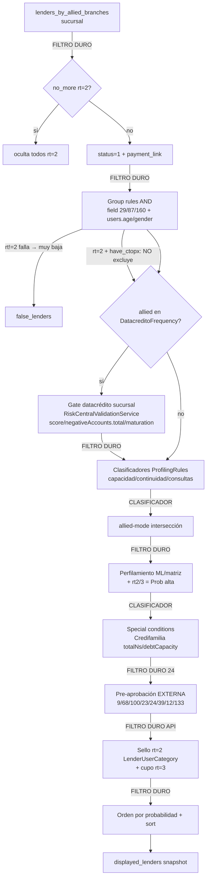

# Onboarding → Datos de Riesgo → Decisión de Crédito (CreditOp legacy-backend)

> Documento de contexto para **fabricar usuarios sintéticos con certeza**: qué datos inyectan los proveedores de riesgo, dónde aterrizan, y cómo gatean/ordenan la oferta de crédito **por lender**. Síntesis de 9 lectores paralelos del código real. Todas las citas son `archivo:línea`. Prosa en español; identificadores `verbatim`.
>
> Repos: `legacy-backend` = `/Users/miguelochoa/Desktop/CREDITOP/github/legacy-backend`; `pre-approvals-service` = `…/github/pre-approvals-service`; `frontend-monorepo` = `…/github/frontend-monorepo`; `backend-e2e` = `…/playground/backend-e2e`; `backend-mcp` = `…/playground/backend-mcp`.
>
> **Verificación:** un crítico verificó adversarialmente contra el código las afirmaciones load-bearing (cascada, motores de datacrédito, frontera rt=2/rt=1, gate de edad CrediPullman, receta por lender) → **confianza ALTA, todo se sostiene**. Sus correcciones ya están **incorporadas**: el filtro de exclusión `[12,23,141,142,166]` (§4.11), la reatribución del gate de entrada a `ProfilingRulesService` (§4.6/§5), el código muerto `>100%` (§4.7), el rechazo-por-field-faltante de `LenderRuleEvaluator` (§4 cupo/§9) y la aclaración del ID `160` en el path CrediPullman (§8: `160` NO es un CrediPullman en local/dev — es el `smartpay_lender_id` de PRODUCCIÓN; el branch legacy solo está mal nombrado).

---

## 1. Resumen ejecutivo

Que se dé o no un crédito se decide en **tres niveles encadenados**, cada uno con su propio motor: **(a) el LISTADO/visibilidad** (`getLenders` en `Modules/Onboarding/.../LenderRetrievalService.php` v1 o `LenderListingService.php` v2) — filtros duros por sucursal/status/group-rules/datacrédito-por-sucursal y, encima, clasificadores que solo reordenan probabilidad; **(b) la PRE-APROBACIÓN** de lenders de integración `rt≠0`, que la decide una **API externa** del prestamista (vía `PreApprovedLenderService.php` in-process o el MS Go `pre-approvals-service`); y **(c) el CUPO/sello rt=2** (CreditopX in-platform), decidido 100% en legacy por `CreditopXQuotaController::getAvailableQuota` encadenando `ActiveCreditRuleEvaluator → LenderRuleEvaluator → DatacreditoRuleEvaluator → LenderUserCategoryService`. La **frontera de inyectabilidad** es la clave operativa: **`rt=2`/`rt=3` (CreditopX, CrediPullman) se sella enteramente en legacy con datos locales → 100% inyectable** fabricando `users`, `user_field_values`, `user_summaries` y la fila Experian en `risk_central_user_data`; **`rt=1` (Bancolombia BNPL/Consumo, Welli, Meddipay, Prami, Sistecrédito, BdB CeroPay) y `rt=4` (Credifamilia SOAP) NO son inyectables por BD** porque el veredicto lo toma la API externa del proveedor — solo se pueden mockear a nivel HTTP.

---

## 2. Proveedores de datos

| Proveedor | Qué consulta | Qué retorna (campos clave) | Dónde se guarda | Fixture sintético por defecto |
|---|---|---|---|---|
| **Experian / Datacrédito** (Acierta=score, Quanto=ingreso, Acierta+Quanto) | `OAuth2 /spla/oauth2/v1/token` + `POST /cs/credit-history/v1/hdcplus` (HDCplus). `Experian.php:223,503-521` | `models[].scoreValue` (→ avg=score), `agregatedInfo.overview.principals.{negativeHistoricalLast12Months, consultedLast6Months, currentNegativeCredits, maturationSince}`, `balances.{valueMonthlyPayment, totalValueBalanceOverdue}`, `liabilities[]/creditCard[]`; Quanto `productValueList[0]` `productCode==62` (pos 0/1/2 = promedio/inferior/superior) | `risk_central_user_data`: `score` (col plana), `data`=`ReportHDCplus` (**encriptado** `Experian.php:523,545`), `additional_info`={negativeAccounts, maturationSince} **no encriptado** `Experian.php:532-538`. Espejo: `user_summaries.datacredito`/`.quanto`, EAV `87/90/29/160` | `ExperianFixture.reportHdcplus` score **654**; `aciertaQuantoReport` score **707**; quanto productCode62=`[2320,1624,3016]`×1000. `HttpFake.aciertaGoodScore` score 720/0 neg; `aciertaPoorScore` 380/3 neg. `backend-mcp/db.go:251` `datacreditoData()` = perfil limpio (0 neg, 1 consulta, maturationSince 2015-01-01) |
| **TusDatos** | Identidad: `POST /api/v1/identity/validations` (CC), `/api/launch/verify/ce` (CE). AML: `POST /api/launch` + poll `/api/results/{jobid}`. `Tusdatos.php`, `TusDatosService.php:42,456` | Identidad: `findings.{...}.match_code` (0=no coincide, 2=parcial, null=no provisto); CE `data.estado` (VIGENTE/CANCELADA/FALLECIDA). AML: `hallazgo`(bool), `hallazgos`('alto') | `risk_central_user_data.data` (**encriptado**). Identidad = RiskCentral `'TusDatos - Validación de Identidad'`; AML = `'TusDatos - AML'` (id 4, `uuid`=jobid) | `TusDatosFixture` todos `match_code 1` (Coincide), estado Vigente; AML `backgroundResultClean` `hallazgo=false`. **El synth de backend-mcp NO inyecta AML/identidad** |
| **Mareigua** (PILA / seguridad social) | `OAuth2 /token` + `POST /consultas`. `Mareigua.php:31`, `MareiguaService.php:135` | `respuesta_id`(==4 obligatorio), `aportantes[].tipo_cotizante_persona_natural` (1 empleado/2 indep/3 pensionado), `resultado_pagos[].ingresos` → calcula vía `FN_Mareigua_*` | `risk_central_user_data.data` (id 6, **encriptado**) → espejo `user_summaries.mareigua{approximate_real_salary, continuity_3/6/12_months, employed/self_employed/retired, last/lowest_payment_value}` + EAV `29/87/160/161` | `MareiguaFixture` ingreso ~5.8M, `respuesta_id 4`, `tipo_cotizante 1`, 12m continuidad; `HttpFake.employedSuccess(monthlyIncome=5889081)` |
| **Agildata** (Asofondos) | `GET /agildata-services/rest/afiliado/historicoDetalladoEmpleo/{type}/{number}`, Basic Auth + **mTLS** (cert `.cer` de S3). `Agildata.php:79` | `codRespuesta` ('01' empleado/indep, '21' pensionado), `detalladoEmpleos[].pagos[].ibc/periodo/fechaPago`, `datosBasicos.{edad, genero}` → calcula vía `FN_AgilData_*` | `risk_central_user_data.additional_info` (id 3, **NO encriptado**, `Agildata.php:134`) → espejo `user_summaries.agildata{approximate_real_salary, continuity_*, employed/self_employed/retired}` + EAV `29/87/160/161` | `AgildataFixture` 2 empleadores, `codRespuesta '01'`, IBC ~2.9M, edad 25; `HttpFake.employeeSuccess(ibc=2910715)` |
| **Ado** | `GET /api/{project}/Validation/{id}` con `data['TransactionId']` previo. `Ado.php:39,60` | Validación **biométrica / liveness** de identidad (Jumio-like). **No aporta capacidad de pago ni gatea crédito** | `risk_central_user_data.data['TransactionId']` (RiskCentral `'Ado'`) | El synth no lo inyecta; en local se short-circuita |
| **Abaco** (gig economy, Yango/Rappi) | Ingresos de plataformas | `gig-economy[platform].earnings` | `user_summaries.abaco` (encriptado) | Fuera del set principal; columna existe pero servicio de extracción no trazado |

**Mapa de relaciones `User`** (`User.php:233-276`, **verificado**): `datacredito()` = `hasOne` por **nombre** `IN ('Experian - Acierta','Experian - Acierta+Quanto')` + `latest('created_at')` (NO por id fijo); `tusDatos()`=id 2, `agildata()`=id 3, `aml()`=id 4, `mareigua()`=id 6, `ado()`=lookup por nombre `'Ado'`.

---

## 3. Modelo de datos de decisión — TABLA MAESTRA

| Campo | Proveedor/origen | Tabla.columna / EAV field_id | Para qué (gatea / clasifica) | ¿Encriptado? | Cita |
|---|---|---|---|---|---|
| `score` | Experian Acierta = avg(`models[].scoreValue`) | `risk_central_user_data.score` (col plana) + espejo `user_summaries.datacredito.score` | **GATE DURO**: rt=2 `score>=rule.score` o (`allow_0_score && score==0`); rt!=2 `score<rule.score`→excluye; bandas de cupo | NO (col score) | `Experian.php:545`; `DatacreditoRuleEvaluator.php:80`; `RiskCentralValidationService.php:42` |
| `negativeHistoricalLast12Months` | Experian | `risk_central_user_data.data.agregatedInfo.overview.principals` | **GATE rt=2**: `<= rule.negative_historical_last_12_months` (def 1) | **SÍ** | `DatacreditoRuleEvaluator.php:85` |
| `consultedLast6Months` | Experian | idem `data...principals` | **GATE rt=2** `<= rule.consulted_last_6_months` (def 10); clasificador: `>Setting(def 10)`→baja 1 nivel | **SÍ** | `DatacreditoRuleEvaluator.php:89`; `ProfilingRulesService.php:212` |
| `currentNegativeCredits` | Experian | `data...principals` + `additional_info.negativeAccounts.total` | **GATE legacy rt!=2** `additional_info.negativeAccounts.total > rule.current_dues`→excluye; gate categoría `current_delinquencies` | data SÍ / additional_info NO | `RiskCentralValidationService.php:46`; `LenderUserCategoryService.php:446` (Loans) |
| `maturationSince` | Experian | `risk_central_user_data.additional_info.maturationSince` | **GATE**: rt=2 `meses >= rule.time_finance_sector` (`<` estricto); legacy rt!=2 `meses <= rule.time_finance_sector`→excluye. **Operadores invertidos entre engines** | NO | `DatacreditoRuleEvaluator.php:93-96`; `RiskCentralValidationService.php:56` |
| `valueMonthlyPayment` (×1000) | Experian | `data...balances` → `user_summaries.datacredito.value_monthly_payment` + EAV **90** (egresos) | Capacidad de endeudamiento (clasifica) y `min_debt_capacity` (gate categoría rt=2) | data SÍ / EAV NO | `Experian.php:629,856-901`; `LenderUserCategoryService.php:651-664` (Loans) |
| `totalValueBalanceOverdue` (×1000) | Experian | `additional_info.negativeAccounts.amount` | Vector de mora (rechazo si mora últimas 2 cuotas Y total>50000) | NO | `LenderUserCategoryService.php:519-554` (Loans) |
| `liabilities[]/creditCard[] businessBehaviourVectorProduct` | Experian | `data.liabilities`/`data.creditCard` | `tc_vector_validation` (cuenta TC activa) y vectores de mora; **Credifamilia: 'N' consecutivas economicSector==1, totalNs>=12** | **SÍ** | `LenderUserCategoryService.php:588` (Loans); `SpecialConditionsController.php:224-234` |
| `productValueList[0] productCode==62` (Quanto) | Experian Quanto | `data` → EAV **87** (×1000) + `user_summaries.quanto` | Ingreso estimado cuando no hay PILA | SÍ | `Experian.php:706-799` |
| `approximate_real_salary` | Mareigua / Agildata | `user_summaries.{agildata\|mareigua}` | Base del cupo CreditopX; `min_income` de categoría. `getSalary()` prioriza **agildata > mareigua > EAV 87** | NO | `LenderUserCategoryService.php:384-391` (Loans); `LenderSpecialGrantingService.php:61-65` |
| `continuity_3/6/12_months`, `self_employed`, `employed`, `retired` | Mareigua / Agildata | `user_summaries.{agildata\|mareigua}` + EAV **161** | `employment_continuity` (gate categoría); clasificador de continuidad | NO | `LenderUserCategoryService.php:393-401,422` (Loans); `ProfilingRulesService.php:105-131` |
| `ingreso` | Quanto / Mareigua / Agildata / formulario | EAV `user_field_values` **field_id 87** (entero `ceil`) | Group rules `>=`; `min_income`; payment_capacity | NO | `UserFieldValue.php:29-66`; `LenderRuleEvaluator.php:82` |
| `egresos` | Experian / formulario | EAV **field_id 90** | `payment_capacity = (income-expenses)/income` | NO | `LenderUserCategoryService.php:336-345` (Loans) |
| `ocupación` | Mareigua/Agildata/Quanto/formulario | EAV **field_id 29** + `profile_data.employment_status` | Group rule `occupation` (=, pipe-OR); gate categoría | NO | `LenderUserCategoryService.php:408-410` (Loans) |
| `reportado en centrales` | derivado ('no') / formulario | EAV **field_id 160** | Group rule `reportado = no`; si 'sí'→excluye (verificado #77) | NO | `VALIDATION.md`; `LenderRuleManagementService.php:562-569` |
| `age` | KYC (Agildata.edad / Mareigua exp-18 / TusDatos) | `users.age` (col real, **no accessor**) | **GATE group rule** `users.age >=/<=`; gate categoría `min_age/max_age` | NO | `LenderValidationService.php:151-155`; `LenderUserCategoryService.php:413` (Loans); `PersonalInfoProcessingService.php:112,156,178` |
| `gender` | KYC o inferido del nombre | `users.gender` | Group rule `=` (pipe-OR); gate categoría `gender` | NO | `LenderValidationService.php:139-155`; `LenderUserCategoryService.php:419` (Loans) |
| `document_type` (CC/CE) | Formulario/KYC | `users.document_type` | **BYPASS Magnocell**: `CE && lender 84`→salta gate datacrédito + categoría 22 | NO | `DatacreditoRuleEvaluator.php:21` |
| `hallazgo` AML | TusDatos AML | `risk_central_user_data` (id 4) | Listas/PEP: `hasFindings = hallazgo===true && hallazgos==='alto'`. Salta si lender `isSmartPay` | SÍ | `TusDatosService.php:832-838` |
| `TransactionId` (Ado) | Ado | `data['TransactionId']` | Gate del **flujo de identidad**, no de oferta | SÍ | `Ado.php:39` |

---

## 4. La cascada de decisión (`getLenders`)

Pipeline de **visibilidad/listado** (v1 `LenderRetrievalService::getLenders`, v2 `LenderListingService`). `FILTRO DURO` = excluye u oculta; `CLASIFICADOR` = solo reordena.

1. **Base por sucursal** — `FILTRO DURO`: solo lenders en `lenders_by_allied_branches` de la `allied_branch_id`. `LenderRetrievalService.php:134-160`.
2. **`no_more` rt=2** — `FILTRO DURO`: si el user ya cerró (status 11) un crédito rt=2 con esa allied, se ocultan TODOS los `response_type=2`. `LenderRetrievalService.php:118-151`.
3. **status + payment_link** — `FILTRO DURO`: `Lender::where('status',1)`; con `payment_link_id` solo sobreviven `response_type=1`. `LenderRetrievalService.php:163-167`.
4. **Group rules** (`LenderValidationService::validateRulesByLender`) — `FILTRO DURO` para `rt!=2`: AND de reglas (`field_id` EAV o `specific_table.column`, operadores `=,>=,<=,!=`). Si falla → `false_lenders` ='Probabilidad muy baja'. **Para rt=2 con `allied.have_ctopx` NO excluye** (`LenderValidationService.php:319-334,382-384`). El bloque viejo de datacrédito rt=2 aquí está **COMENTADO** (`:179-296`).
5. **Excepción Magnocell (84)** — venezolano `CE` se inyecta saltándose reglas. `LenderValidationService.php:341-373`.
6. **Gate datacrédito por sucursal** (`RiskCentralValidationService`) — `FILTRO DURO`: la **condición de entrada** (allied ∈ `DatacreditoFrequency` y existe Experian-Acierta con `score != null`) está en `ProfilingRulesService.php:32-44`; si entra, `RiskCentralValidationService` aplica los umbrales y excluye por `score<rule.score` / `negativeAccounts.total>current_dues` / `maturationMonths<=time_finance_sector` (`RiskCentralValidationService.php:42-70`). `probability_levels` reordena.
7. **Clasificadores de probabilidad** (`ProfilingRulesService`) — `CLASIFICADOR`: `debtCapacity>75%`→-1 (**ojo: el `>100%`→-2 es CÓDIGO MUERTO** — el `if` evalúa `>75` antes que `>100`, así que 110 cae en `>75` y nunca llega a `>100`, `ProfilingRulesService.php:90-100`); `!self_employed && !continuity_3_months`→-1; `consulted6m>Setting`→-1. Nunca excluyen. `ProfilingRulesService.php:47-222`.
8. **allied-mode** — `FILTRO DURO`: intersecta con `AlliedMode.config['lenders']` si hay modo activo. `AlliedModeLenderFilterService.php:16-42`.
9. **Perfilamiento ML/matrices + demográfico** — `CLASIFICADOR`: `weighted_score`; rt 2/3 se fuerzan a 'Probabilidad alta'. `LenderRetrievalService.php:585-632`.
10. **Condiciones especiales** — `applySpecialConditions`; **Credifamilia (24)** `FILTRO DURO`: `0%` si `totalNs<12 || !debtCapacity`. `SpecialConditionsController.php:49-110`.
11. **Exclusión previa + Pre-aprobación externa** (`PreApprovedLenderService`). **⚠️ PRIMERO un `array_filter` saca `[12, 23, 141, 142, 166]` ANTES de pre-aprobar** (`LenderRetrievalService.php:248-256`, llamado en `:259`): en el path v1 actual **Welli (23/141/142) y Prami (12) ni siquiera llegan al listado** — no es que los rechace la pre-aprobación, es que se excluyen antes. Los que SÍ pasan a pre-aprobación externa (`FILTRO DURO` vía **API externa**, `unset` si no preaprueban): Sistecrédito(9), BNPL(68), Consumo(100), Credifamilia(24), Meddipay(39), BdB CeroPay(133). `PreApprovedLenderService.php:41-644`.
12. **Cupo rotativo rt=3 + sello CreditopX rt=2** — `FILTRO DURO`: rt=3 `approved_limit<=0`→`unset`; rt=2 si `LenderUserCategoryService::getLenderUserCategory` devuelve null→`unset`. `LenderRetrievalService.php:675-898`.
13. **Orden final** por grupo de probabilidad + `LendersByAllied.sort`. `LenderProbabilitySortingService.php:9-61`.

> **CUPO rt=2 — el segundo motor** (`CreditopXQuotaController::getAvailableQuota`, `POST /api/loans/lender/available-quota`, **lo llama también el MS Go**): `ActiveCreditRuleEvaluator` (no crédito vigente >1000) → `LenderRuleEvaluator` (lender_rules genéricas) → `DatacreditoRuleEvaluator` (regla **genérica** allied_branch_id NULL) → `LenderUserCategoryService` (categoría/cupo) → special granting DENTIX/DFS → topes de monto. `CreditopXQuotaController.php:189-619`.
>
> **⚠️ Gotcha para el synth — `LenderRuleEvaluator` RECHAZA si falta el field, no hace skip** (`LenderRuleEvaluator.php:46-53`): si una `lender_rule` referencia un `field_id` que el usuario NO tiene en `user_field_values`, devuelve `reject('missing_field_value_'.$fieldId)`. O sea, si un lender rt=2 tiene `lender_rules` sobre un EAV que el sintético no inyecta, el cupo se rechaza en este escalón **antes** de la categoría. Hay que inyectar TODOS los `field_id` que las `lender_rules` del lender referencien (distinto de `DatacreditoRuleEvaluator`, que sin regla hace skip→pass).

---

## 5. Reglas de datacrédito por lender

**Estructura de una regla** (`lender_datacredito_rules`, `LenderDatacreditoRule.php`): **NO es trio campo/operador/valor genérico**. Es UNA fila con columnas-umbral fijas y operadores **cableados en el evaluador**: `score`, `allow_0_score`(bool), `current_dues`, `time_finance_sector`, `negative_historical_last_12_months`, `consulted_last_6_months`, `probability_levels`(json), `allied_branch_id`, `lender_id`. `allied_branch_id NULL` = regla **genérica** del lender; con valor = regla por **sucursal**.

**Hay DOS evaluadores con campos y operadores DISTINTOS** (verificado leyendo ambos archivos):

| | `DatacreditoRuleEvaluator` (NUEVO, rt=2/cupo) | `RiskCentralValidationService` (LEGACY, rt!=2/listado) |
|---|---|---|
| Regla usada | `findGenericByLender` (`allied_branch_id IS NULL`) | por `allied_branch_id` específico |
| Score | `score >= rule.score` o `allow_0_score && score==0` | `score < rule.score` → quita |
| Negativos | `negativeHistoricalLast12Months <= rule` (def 1) | `additional_info.negativeAccounts.total > current_dues` → quita |
| Consultas | `consultedLast6Months <= rule` (def 10) | (no usa) |
| Maturación | `meses < rule.time_finance_sector` → reject (`<` **estricto**) | `meses <= rule.time_finance_sector` → quita (`<=`, **off-by-one**) |
| Fallo de datos | **fail-closed**: sin datacredito → `no_datacredito_data`; sin score/principals → `datacredito_data_incomplete` (score **real 0 SÍ pasa el guard**) | usa `(int) $user->datacredito->score` directo |
| Bypass | `CE && lender 84` → passed | — |
| `probability_levels` | no se consume aquí | reordena por rango de score |

Cita: `DatacreditoRuleEvaluator.php:19-100`; `RiskCentralValidationService.php:42-70`.

**Reglas concretas conocidas** (**CrediPullman #77**, rt=2, **VERIFICADAS en BD local 2026-06-30 corriendo `go run . perfilador amoblando-pullman 77`**): `reportado(160)='no'` → `ingreso(87) >= 1.300.000` + `edad∈[18,69]` (`group_rule 1153/1157`); el score se gatea **a 400 por DOS engines**: la regla `lender_datacredito_rules` genérica (score 400, `DatacreditoRuleEvaluator`) Y la categoría (`min_score 400`; tiers 400/600/700). ⚠️ **`VALIDATION.md` estaba desactualizado** (decía `ingreso>=1.000.000`, `edad<=82`). Dos verdades que cazó el `perfilador` ahora **oracle-driven** (lee umbrales de BD): (1) el umbral de ingreso real es **1.300.000** y el cupo corta la edad en **78**; (2) más importante — ese `ingreso>=1.300.000` es un **CLASIFICADOR de probabilidad para rt=2, NO un filtro duro**: ingreso **1.299.999 igual se ofrece** (los group rules no excluyen rt=2/have_ctopx, §4.4). El **gate DURO de score es la categoría** (`min_score 400`; verificado: 399 rechaza, 400 ofrece). El ingreso solo afecta rt=2 indirectamente (capacidad de endeudamiento de la categoría, dinámico → no boundary-testeable con un umbral fijo). **Defaults de columna en BD**: `score=0`, `current_dues=0`, `time_finance_sector=0`, `negative_historical_last_12_months=1`, `consulted_last_6_months=10` → **sin regla poblada el gate deja pasar todo**. **[CRÍTICO]** Los umbrales reales por lender viven en BD (dev/prod), **no en seeders del repo**: `SELECT lender_id, allied_branch_id, score, allow_0_score, current_dues, time_finance_sector, negative_historical_last_12_months, consulted_last_6_months FROM lender_datacredito_rules`.

---

## 6. Group rules + perfilamiento

**EXCLUYEN (group rules — filtro duro)**: una `GroupRule(allied_branch_id, rule_name)` con N `LenderRule` hijas. El molde canónico de 6 reglas (`LenderRuleManagementService::createLenderRules:532-609`): `ocupacion(field 29, '=')`, `reportado en centrales(160, '=')`, `ingresos(87, '>=')`, `genero(users.gender, '=')`, `edad minima(users.age, '>=')`, `edad maxima(users.age, '<=')`. Evaluación **AND**: una que falle manda el lender a `false_lenders` → 'Probabilidad muy baja'; **rt=2 con `have_ctopx` se `unset`** (desaparece). Operadores: `=`→`in_array(valor, explode('|', value))` (OR-de-lista, p.ej. `'M|F'`); `>=`/`<=` numérico; `!=`; default→`false`. **Opt-in por sucursal**: si no hay `GroupRule` para la allied, NINGUNA regla dura local se aplica (entran todos). `LenderValidationService.php:105-162`.

**SOLO ORDENA (perfilamiento — clasificador)**: `ProfilingRulesService` baja niveles de probabilidad por capacidad de endeudamiento, continuidad y consultas (no excluye); perfilamiento demográfico/matrices/ML (`weighted_score`). rt=2/3 se fuerzan a 'Probabilidad alta'. El ML externo (`ProfilerMLController::makePrediction`) **solo corre en producción**.

> **Matiz**: además de group rules, el **gate de datacrédito** (`RiskCentralValidationService`) y el **motor de categorías rt=2** (`LenderUserCategoryService`) también EXCLUYEN — no son "perfilamiento que ordena".

---

## 7. Pre-aprobación rt≠0 (externa) vs cupo rt=2 (interna)

**rt=2/rt=3 — decide ADENTRO (inyectable)**: `CreditopXQuotaController::getAvailableQuota` lee SOLO BD local (`risk_central_user_data`, `user_field_values`, `user_summaries`, `users`). El MS Go **delega CreditopX a legacy**: `creditop_x/client.go:62-110` solo hace `POST {user_id,lender_id,user_request_id}` al endpoint `available-quota` y `adapter.go:19-44` lee `data.has_quota + data.status=='approved' + data.quota_details.total_available`.

**rt=1/rt≠0 — decide AFUERA (NO inyectable por BD)**: la aprobación y el monto los fija la API del proveedor. `PreApprovedLenderService.php:79-627`: Sistecrédito `transaction['status']=='Approved'`; BNPL `data.validate`; Consumo `data.validate=='Success'`; Welli `monto_maximo_credito>=180000`; Credifamilia `status_id 41/42`; Meddipay `creditLimit.result != 'DEN'`; Prami `maxApprovedAmount>0`; BdB `Products.CeroPay.IsViable`.

**El patrón engañoso (Prami)**: legacy LEE datos locales (`FN_User_Income_Average`, `FN_User_Occupation`, `VW_Risk_Central_Experian`, `datacredito->score`) y los **empaqueta hacia afuera** (`Prami.php:307-456`), pero quien APRUEBA es la API de Prami (`Prami.php:473-476`). **Ver datos locales poblados NO implica control de la decisión.** Para el MS, `ExperianProfileService::buildFor` arma el `experian_profile` que se reenvía (`ExperianProfileService.php:28-147`).

### 7.1 Listado v1 vs v2, snapshot de perfilamiento y resolución progresiva (absorbido de HALLAZGOS-PERFILAMIENTO)

**Dos endpoints de listado, uno extiende al otro** (el `getLenders` de §4 tiene dos entradas): `GET /api/onboarding/loan-application/lenders/{id}` → `ListLenderController` → `LenderRetrievalService::getLenders` (**v1**, port completo, `api.php:48`); `GET .../lenders-v2/{id}` → `LenderListingController` → `LenderListingService::getLenders` (**v2**, recortado, `api.php:49`), donde `LenderListingService extends LenderRetrievalService` y **sobre-escribe** `getLenders`. **El wizard usa v2** (`frontend-monorepo/.../lenders-marketplace/.../loan-options.repository.ts:25`). Esto matiza §4.11: la exclusión `array_filter [12,23,141,142,166]` y el `PreApprovedLenderService` sincrónico son del path **v1**; v2 recorta esa parte y **NO** pre-aprueba sincrónicamente.

**La tabla de perfilamiento es una FOTO (snapshot), no un recálculo**: `UserProfilingService` lee `profiling_reviews.displayed_lenders`, escrito por el último `getLenders` que corrió vía `ProfilingReviewController::store` (v2 `LenderListingService.php:188`, v1 `ListLenderController.php:98`). Refleja EXACTAMENTE la lista computada en ese momento.

**La pre-aprobación de las integradas la resuelve el FRONT, uno-a-uno y progresivamente** contra el MS de pre-aprobaciones (hook `useProgressiveLenderResolution`, `AvailableLenders.tsx:171,192`; endpoints por-lender `GET .../lenders/{ur}/{lender}/pre-approval-status` `api.php:51` y `.../lenders/{lender}/preapproval-retry`). ⇒ En v2 el **cupo aparece DESPUÉS** del listado. **Divergencia por diseño**: el snapshot `displayed_lenders` se escribe a tiempo de LISTADO (pre-resolución → etiqueta genérica de perfilamiento, sin cupo), mientras el marketplace muestra el cupo **tras** la resolución del MS; por eso una integrada puede verse "Probabilidad media/sin cupo" en la tabla y "Pre aprobado con cupo" en el marketplace. (Un patch que reintroducía `validatePreApproveLender` dentro de `LenderListingService` v2 fue **revertido**: duplica lógica y choca con la arquitectura del MS externo.)

### 7.2 Lenders manuales sin link (Lagobo #35, Davivienda #36) — MERGEADO

Tres lenders comparten el **patrón manual sin link** en `UserRequestService` (el "seleccionar lender"): el front debe mostrar el modal de proceso y **NO** redirigir ni enviar link/WhatsApp. Se logra con `url=null` + `showModal=false` + `openProcessModal=true` (para caer en la rama "modal de proceso" y NO en la rama `showModal`+sin-url que redirige a `/continue` con el `qrUrl`):

- **Meddipay** (precedente): `UserRequestService.php:589-597`.
- **Lagobo #35** (también #21; `response_type=0`, ofrecido por Sonría; su `url_utm`/`lenders.url` apunta a una **imagen** `.jpg`, no a un link de continuación — por eso una regla de "validar url" no sirve): decisión de negocio 2026-06, trámite 100% manual. Fix **ya mergeado en `main`** (commit `19a10c00`), match por nombre `if ($lender->name === 'Lagobo')` en `UserRequestService.php:620-627`. **Corrección vs notas viejas**: usa `showModal=false` + `openProcessModal=true` (patrón Meddipay), **NO** `showModal=true`; no vive en rama local sin pushear.
- **Davivienda #36**: mismo tratamiento manual, mergeado (commit `f2d81dd4`), `UserRequestService.php:633-639`.

---

## 8. 🎯 RECETA DE USUARIO SINTÉTICO POR LENDER

> Para cada lender: condiciones para que **LISTE** y para que **APRUEBE/dé cupo**, qué es inyectable y por qué. Inyección base del synth: `users.age/gender/document_type` (`setSynthIdentity` `db.go:188`), EAV `87/29/160` (`injectIncomeFields` `db.go:215`), `user_summaries.agildata/datacredito` (`injectSummary` `db.go:198`), fila Experian encriptada (`injectDatacredito` `db.go:302`).

| Lender | LISTAR | APROBAR / CUPO | Inyectable | Por qué |
|---|---|---|---|---|
| **CrediPullman #77** (rt=2, allied 94, Experian Acierta+Quanto) | En `lenders_by_allied_branches`. Group rules (allied 94): `reportado(160)='no'`, `edad∈[18,69]`, `ingreso(87) >= 1.300.000` (`group_rule 1153`). ⚠️ **Para rt=2 estos group rules CLASIFICAN, no excluyen** (verificado con `go run . perfilador`: ingreso **1.299.999 igual se ofrece**) → el gate **DURO** del listado es la **categoría** (col. siguiente); el ingreso solo afecta de forma indirecta (capacidad de endeudamiento) | Score gateado **a 400 por DOS engines** (corrección: #77 SÍ tiene regla datacrédito): la regla `lender_datacredito_rules` **genérica** (`score>=400`, `DatacreditoRuleEvaluator`) **y** la **categoría** `lender_users_category_rules` (3 tiers: el más laxo `min_score 400`, edad≤**78**, ≤3 neg, ≤1 mora; los otros `>=600`/`>=700` Empleado/4+TC). Necesita fila Experian **encriptada presente** + `available_amount>0` | **SÍ 100%** | Decide entero en legacy. **Caveat**: en `register` NO mandar el documento (`needsPersonalInfo` `db.go:34`) para evitar ONB005 DUPLICATE antes de Quanto; cierre requiere `PDF_MAPPER_FAKE=true`. **Ojo edad**: el listado deja ver hasta 69 (group rule), pero el **cupo** corta en **78** (categoría). **Ojo ID**: tooling=#77. ⚠️ El branch legacy `$ctopx_lender_id==160` con variable `$category_credipullman` (`LenderRetrievalService.php:269-273,725-727`) está **mal nombrado**: `160` **NO existe** como lender en local/dev — es el `smartpay_lender_id` de **PRODUCCIÓN** (`config/lenders.php:24`, `APP_ENV==='production' ? 160 : 153`), y el código real compara vía `config('lenders.smartpay_lender_id')` / `Lender::isSmartpayChannel()` (`Lender.php:65-67`), no contra el literal 160. Ese path no es una variante de CrediPullman #77 |
| **CreditopX genérico** (rt=2/3) | Ofrecido en sucursal + fila Experian encriptada + pasar group/lender rules | 4 evaluadores + categoría `available_amount>0`. `deriveSynthReq` (`synthrules.go:49`) arma el perfil mínimo leyendo las reglas reales del lender (`score = maxMin+50`) | **SÍ 100%** | Blanco del synth. Sin reglas pobladas, datacrédito/lender-rules hacen skip→pass; gatea casi siempre la **categoría** (salario/ocupación/edad/score) |
| **Magnocell #84** | Si `document_type='CE'` se inyecta saltándose group rules | Bypass total del gate datacrédito → categoría fija 22 | **SÍ trivial** | `CE` basta; no requiere forjar Experian. `DatacreditoRuleEvaluator.php:21` |
| **Credifamilia #24** (rt=2/3 cupo vs **rt=4 SOAP**) | Gate local: `0%` si `totalNs<12 \|\| !debtCapacity`. **Requiere `liabilities/creditCard` con `economicSector==1` y >=12 'N' consecutivas, `currentNegativeCredits==0 && negativeHistoricalLast12Months==0`, y `valueMonthlyPayment×1000/agildata.approximate_real_salary <= 0.4`** | Vía `available-quota` (rt=2/3) decide local; **radicación SOAP rt=4 + CrossCore/Evidente/Jumio = externo** | **PARCIAL** | El gate local del listado SÍ inyectable; el fixture base tiene `economicSector 3/4` (no financiero) → `totalNs=0` → 0% **por defecto** (el punto más importante a inyectar). KYC V2 y formalización **NO inyectables**. **[CRÍTICO]** ambigüedad rt 2 vs 4 |
| **Bancolombia BNPL #68 / Consumo #100** (rt=1) | Group rules de inclusión sí aplican; con `payment_link` solo sobreviven rt=1 | `validateQuota → data.validate` / `validate=='Success'` (**API del banco**) | **NO** por BD | Decisión externa. Solo mock: `AppServiceProvider::fakeBancolombiaForLocal` + doc sandbox `1998228194` |
| **Welli #23/141/142** (rt=1, allied 74) | **⚠️ EXCLUIDO antes de pre-aprobación** por el `array_filter [12,23,141,142,166]` (`LenderRetrievalService.php:248-256`) → en el path v1 NO llega al listado, ni con credencial | `WelliService::consult run_risk → approved` (**API externa**) | **NO** por BD | Doble bloqueo: excluido en v1 + decisión externa. `fakeExternalLendersForLocal` mockea `run_risk→approved 5M`, pero primero hay que sortear la exclusión (v2/`LenderListingService` o quitar de la lista) |
| **Meddipay #39** (rt=1, allied 26) | Credencial + neutralizar corte horario (`available_until=NULL`) | `/CreateOrder result=APP` (**API externa**) | **NO** por BD | El MS nunca cachea Meddipay (re-consulta siempre); su 5xx oculta la card |
| **Prami #12** (rt≠0) | **⚠️ EXCLUIDO antes de pre-aprobación** por el `array_filter [12,23,141,142,166]` (`LenderRetrievalService.php:248-256`) → no llega al listado en v1 | `maxApprovedAmount>0` (**API externa**); exige Experian **real** server-side | **NO** (frontera synth pura) | Doble bloqueo: excluido en v1 + decisión externa. El MS devuelve 400 `experian_profile required`; inyectar Experian local solo cambia el payload, no la decisión |
| **BdB CeroPay #133** (rt≠0) | Falta seed `lender_allied_credentials` (allied 254) → no se ofrece | `Products.CeroPay.IsViable` (**API externa**) | **NO** por BD | Mock listo pero gap de config de credenciales |
| **Banco de Bogotá #5 / UMA 135/136/137** | Group rules + datacrédito por sucursal; si fallan → **'0% de probabilidad'** (siguen visibles, al fondo) | rt=0/rt=1: desembolso por su `LenderDatacreditoRule` y/o API | **PARCIAL** | El escalón de probabilidad/listado es inyectable (score Experian + group rules); decisión final puede ser externa |

**Receta de oro para aprobar un rt=2 sintético**: `users.age` dentro de `[min_age,max_age]` (col real, setear explícito), `users.gender` = valor permitido, EAV `29='Empleado'`, `87 >= umbral`, `160='no'`, `user_summaries.agildata.approximate_real_salary` alto (pisa al EAV 87), y la fila Experian (`risk_central_user_data` central Acierta+Quanto) con `score` por encima de `min_score`/`rule.score` + `data` **encriptada con el APP_KEY correcto** (0 negativos, 1 consulta, maturationSince viejo, vector TC válido, liabilities limpias).

---

## 9. Cómo lo inyecta el harness hoy + gaps

**DOS familias de inyección (no confundir)**:

- **(A) `backend-mcp synth`/`synth-fill` — BD DIRECTA** (rápido, sin huella). `opSynth` (`ops.go:690`): `register` + `validateOtp` reales (OTP = últimos 4 del tel `3131010101`, bypass `qa_otp_bypass_phones`) → inyección DB → marketplace real. Es **RULE-DRIVEN**: `resolveLender` (`synthrules.go:24`) restringe a la sucursal y devuelve `response_type`; `deriveSynthReq` (`synthrules.go:49`) lee group/lender rules y `min_score`/`score` reales para fabricar el perfil mínimo. Encripta `data` con `laravelEncrypt` (AES-256-CBC, `crypto.go:20`). `datacreditoData` (`db.go:251`) = perfil limpio ideal fijo.
- **(B) `backend-e2e` + HttpFakes — flujo REAL con respuestas canned**. `OnboardingDriverServiceProvider::boot` lee `ONBOARDING_DRIVER_<prov>=fake` y hace `Http::fake(stubs)` (`HttpFakeRegistrar.php`); escenario por `X-Fake-Scenario` o default `'success'`. Así Experian persiste el MISMO `risk_central_user_data` que el synth forja a mano. `backend-e2e/mocks.go` siembra vía `php artisan tinker` (porque `data` va encriptado). Bloqueado en `APP_ENV=production`.
- **(C) Tercer mecanismo para rt=1**: `AppServiceProvider::fakeExternalLendersForLocal` / `fakeBancolombiaForLocal` mockean las APIs de pre-aprobación (Welli/Meddipay/CeroPay/Bancolombia) — **la decisión rt=1 NO se inyecta por DB**.

**GAPS / qué falta poder inyectar**:
1. **AML (TusDatos) e identidad** no los inyecta el synth DB — solo el path HttpFakes. Si un lender gatea por `requires_restrictive_list_check`, queda fuera del KYC armado del synth.
2. **Ado** no se inyecta (el synth forja solo la central Experian).
3. **`synthrules.go:111` GAP**: para rt=2 deriva el score objetivo de `lender_users_category_rules.min_score`, pero el gate `DatacreditoRuleEvaluator` igual aplica la **regla genérica** de datacrédito — si su `score` es más alto que `min_score`, el sintético puede reprobar el gate datacrédito.
4. **`datacreditoData` es perfil limpio fijo**: para probar EXCLUSIÓN por negativos/mora/capacidad hay que usar `SeedRiskProfile` (backend-e2e vía tinker); el synth de backend-mcp solo expone `--income/--score`.
5. **rt=1/rt=4** no inyectables por BD por diseño (decisión externa).

---

## 10. Gotchas / fragilidades

- **Encriptación**: en `risk_central_user_data` SOLO `data` es `encrypted:collection` (AES-256-CBC con APP_KEY); `additional_info` y `request` son `collection` PLANO. Por eso Agildata (que escribe TODO en `additional_info`) NO encripta, y los derivados de Experian en `additional_info` (`negativeAccounts`, `maturationSince`) tampoco. `user_summaries` NO encripta nada. **Un INSERT de JSON plano en `data` rompe el descifrado → gate fail-closed.** `RiskCentralUserData.php:20-33`.
- **[CRÍTICO] APP_KEY**: si el APP_KEY del `.env.dev` no es el del entorno, Laravel no descifra `data` y el listado falla en silencio. `injectDatacredito` aborta sin APP_KEY (`db.go:303`); `laravelVerifyMAC` comprueba la llave contra una fila real.
- **Dos engines de datacrédito con semántica distinta** (verificado): el nuevo usa `negativeHistoricalLast12Months`/`consultedLast6Months` y maturation `<`; el legacy usa `negativeAccounts.total > current_dues` y maturation `<=`. **Inyectar pensando en uno puede no satisfacer al otro.**
- **`user->datacredito`** apunta SOLO a `'Experian - Acierta'`/`'Experian - Acierta+Quanto'` por **nombre** + latest (NO id fijo). Si solo se inyecta Quanto puro, `datacredito` queda null → fail-closed. `User.php:233-243` (verificado).
- **`users.age` es columna real**, no accessor de `date_of_birth` en el path de group rules. Hay que setearla explícita.
- **`getSalary()` cascada agildata > mareigua > EAV 87**: inyectar solo el EAV 87 puede ser pisado si existe `user_summaries.agildata.approximate_real_salary`.
- **Cache 1 mes**: Experian/Mareigua/Agildata reusan `risk_central_user_data < 1 mes` sin reconsultar; una fila inyectada se reusa. Para refrescar hay que borrar la fila.
- **`verifyCoincidence` (match de nombres) SIEMPRE true en local/development** (`AgildataService.php:345`, `MareiguaService.php:349`).
- **Magnocell bypass hardcoded en DOS sitios**: `DatacreditoRuleEvaluator.php:30-32` y `LenderUserCategoryService` (handleVenezuelanCase).
- **`LenderSpecialGrantingService` está en modo SOLO LECTURA**: la escritura de UserFieldValue 87/90 está comentada (`:116-142,505-518`).
- **`allow_0_score`**: el modelo lo castea a bool y el evaluador lo usa, pero `updateDatacreditoRule` NO lo actualiza y NO hay migración que cree la columna en legacy-backend. Viene de la app vieja.
- **`value_monthly_payment` ×1000**: se escala al guardarse; cuidado con el factor 1000 al fabricar y con que Credifamilia re-multiplica el valor CRUDO del payload.
- **CreditopX se auto-identifica** por NIT `50261` o nombre `'CREDITOP SAS'` para reemplazar cuotas por las del core (`CreditopXDatacreditoAdjustmentService`); un dataset sintético con ese acreedor altera la capacidad calculada.

## Preguntas abiertas / a verificar

- **[CRÍTICO]** Umbrales reales por lender en `lender_datacredito_rules` y `lender_users_category_rules` (score, negativos, consultas, time_finance_sector, ocupaciones, edad) — están en BD, **no en seeders**. Correr `backend-mcp grouprules/rules/dcrules` por lender.
- **[CRÍTICO]** Mapping exacto `id ↔ name` en `risk_centrals` del target (dev/local): `'Experian - Acierta'`=? ; `'TusDatos - Validación de Identidad'`=2 vs `'TusDatos - AML'`=4. Hay ≥3 nombres TusDatos distintos. Los ids 2/3/4/6 están hardcoded pero dependen del orden de inserción del entorno.
- **[CRÍTICO]** ¿Qué allieds están en `DatacreditoFrequency`? Solo ahí corre el gate de score Experian del LISTADO; fuera de esa lista el filtro recién aparece en el cupo.
- **[CRÍTICO]** ¿Existen las funciones SQL `FN_User_Income_Average`, `FN_User_Occupation`, `FN_Agildata_*`, `FN_Mareigua_*` y la vista `VW_Risk_Central_Experian` en el target? Si no, Prami/CredifamiliaConsumo y el cálculo de salario fallan aunque las columnas estén inyectadas.
- ¿Cuál de las dos rutas de gate datacrédito (legacy vs nuevo) corre por comercio bajo el strangler/parallel-run? Determina qué campos exactos gatean.
- ¿`hasFindings` de TusDatos AML BLOQUEA el listado de TODOS los lenders o solo el flujo Credifamilia? No se localizó un consumidor central que rechace por `aml()->data`.
- Credifamilia: ¿opera con rt=2 (decide en legacy, inyectable) o rt=4 (formalización SOAP externa)? La formalización SOAP solo corre con `rt==4`.
- Catálogo real de valores válidos por field (ocupación 29, reportado 160) que acepta cada lender en `rule.value` — leer `field_options` o las group rules reales en BD por sucursal.
- `min_credit_cards`/`tc_vector_validation` por lender: el `datacreditoData` del synth siembra solo 1 TC; algún lender podría exigir ≥2.

---

### Notas de procedencia
- `LenderUserCategoryService` existe en **DOS** ubicaciones (resuelve open-question de un lector): `Modules/Loans/App/Services/` (motor de cupo rt=2, eligibility `evaluateEligibility:403-488`) y `Modules/Onboarding/App/Services/lenders/` (path de listado). Verificado.
- Los dos engines de datacrédito, la relación `User::datacredito` por nombre, y la lógica de eligibility rt=2 fueron leídos directamente del código durante esta síntesis; el resto proviene de los 9 reportes estructurados deduplicados.
