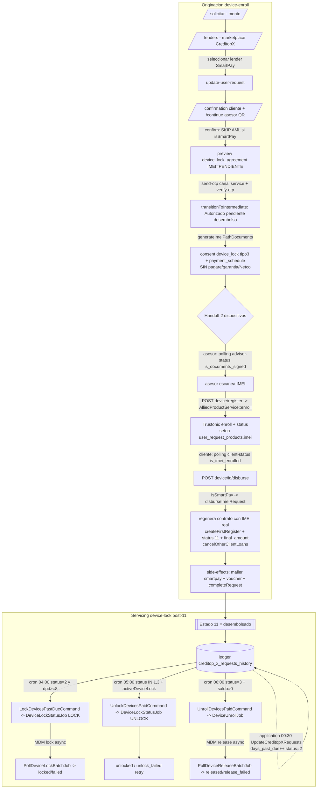

# SmartPay — financiación de celulares con bloqueo de dispositivo

> Documento de contexto para arrancar tareas sobre **SmartPay** (canal de financiación de celulares con el equipo como garantía ejecutable por hardware). Síntesis de dos reportes de lectura profunda (originación device-lock + servicing device-lock) verificados contra el código real de `legacy-backend`.
>
> Convención: se cita `archivo:línea` en todo el documento; identificadores de código (clases, métodos, constantes, endpoints, columnas) verbatim; prosa en español. Donde una afirmación es frágil o contradice otro doc/otro reporte, se dice explícitamente.
>
> **Estado de verificación:** todas las anclas load-bearing de este documento (discriminadores `isSmartPay`/`isSmartpayChannel`, skip-AML, desembolso diferido, ramas de documentos, crons y jobs de bloqueo, migraciones) fueron **leídas directamente del código** al escribirlo. Dos correcciones respecto de los reportes de origen están marcadas en §8 (el "mismatch modelo↔schema de `DeviceLock`" ya está **resuelto** por migración; los nombres de método post-commit se corrigen). Repos: `legacy-backend=/Users/miguelochoa/Desktop/CREDITOP/github/legacy-backend`, `application(viejo)=/Users/miguelochoa/Desktop/CREDITOP/bitbucket/application`.
>
> **Dónde encaja:** esta ficha cubre solo lo **distintivo** de SmartPay (canal sobre un lender IMEI). El **tronco común** que da por sabido (entrada → OTP → datos personales/laborales → marketplace) es dueño de [REFERENCIA-FLUJOS.md §1](./REFERENCIA-FLUJOS.md); el **encadenamiento FE↔BE**, de [MAPA-FLUJOS.md](./MAPA-FLUJOS.md); y la **comparación transversal por entidad** (quién decide/financia/cobra/cierra/simulable), de [lenders/README.md](../lenders/README.md).

---

## 1. Resumen ejecutivo

**SmartPay NO es un lender nuevo ni un `response_type` nuevo.** Es un **CANAL** (branding y mailer propios) montado **sobre un lender CreditopX in-platform** cuyo `path` es `'IMEI'`. Toda su lógica se activa por dos discriminadores de nivel-lender, no por `response_type`:

- `UserRequest::isImeiPath()` (`app/Models/UserRequest.php:184-187`) = el lender tiene `path.name === 'IMEI'`. Gatea **el ciclo de servicing** (crons/jobs de bloqueo).
- `UserRequest::isSmartPay()` (`app/Models/UserRequest.php:189-192`) = `isImeiPath() && lender->id === 160` (**hardcode del id 160**). Gatea **la originación distintiva** (skip AML, contrato de bloqueo, desembolso diferido).
- `Lender::isSmartpayChannel()` (`app/Models/Lender.php:65-68`) = `id === config('lenders.smartpay_lender_id')` (dev=153 / prod=160, `config/lenders.php:24`). Gatea **el branding del mailer**.

El producto financiado es **un celular, y el celular ES la garantía**: en vez de firmar un pagaré Deceval + garantía + Netco como un CreditopX estándar, el cliente firma **un solo "Acuerdo de bloqueo de dispositivo"** (contrato Pro Consumidor, `CreditopXConsent` tipo 3). Post-desembolso, el equipo queda **inscrito en un MDM (Trustonic vía merchant-gateway)** que permite **bloquearlo remotamente por mora y desbloquearlo al pagar** — convirtiendo la cobranza en un enforcement por hardware. Es de **lo poco de servicing ya migrado a `legacy-backend`** (el resto de la cartera CreditopX sigue en `application`).

**Diferencias de un vistazo vs un CreditopX normal:** (a) **salta el AML de Tusdatos**; (b) documentos = solo *contrato de bloqueo* + *plan de pagos* (sin pagaré/garantía/Netco); (c) **desembolso diferido** en dos fases con handoff de 2 dispositivos (el asesor escanea el IMEI antes de que se libere el Estado 11); (d) **crons diarios de lock/unlock/unroll** que ejercen la garantía; (e) mailer y remitente propios (`noreply@tusmartpay.com`).

**Frontera de simulación (harness):** el ciclo device-lock es de los pocos trozos de servicing en legacy, pero **NO es autónomo** — depende del ledger de mora que escribe `application`. Se simula "punta a punta" solo mockeando el MDM y sembrando el ledger `creditop_x_requests_history` a mano.

---

## 2. Mapa de repos y archivos clave

| Subsistema | Archivos principales (legacy-backend salvo nota) |
|---|---|
| **Discriminadores de canal** | `app/Models/UserRequest.php` (`isImeiPath:184`, `isSmartPay:189`); `app/Models/Lender.php` (`isSmartpayChannel:65`); `config/lenders.php:24` (`smartpay_lender_id`) |
| **Skip AML + ruteo front** | `Modules/Loans/App/Http/Controllers/Customer/ContinueUserFlowController.php` (`confirm:68`, skip `:91`); `Modules/Loans/App/Http/Middleware/AddOriginationFlowType.php` (`lender_path:54`, `credit_type:59`) |
| **Contrato de bloqueo** | `Modules/Loans/App/Services/DeviceLockAgreementService.php` (`isSmartPay:48`, `generatePreviewPdf:57`, `generatePdf:74`, `regenerateSignedPdf:113`, `PRO_CONSUMIDOR_NUMBER:28`) |
| **Preview del contrato (firma)** | `Modules/Loans/App/Http/Controllers/Customer/PromissoryNoteController.php` (`show`, rama IMEI `:73-88`) |
| **Firma por OTP + estado intermedio** | `Modules/Loans/App/Http/Controllers/Customer/ValidateOtpPromissoryNoteController.php` (canal `service` `:182`, `transitionToIntermediate` `:289`) |
| **Generación de documentos IMEI** | `Modules/Loans/App/Services/DocumentSigningService.php` (`generateAllDocuments:47`, `generateImeiPathDocuments:58`) |
| **Registro/enrolamiento IMEI** | `Modules/Loans/App/Http/Controllers/Customer/DeviceController.php` (`registerDevice:30`, `disburse:82`); `Modules/Partner/App/Services/AlliedProductService.php` (`enroll:28`) |
| **Validación de formato IMEI** | `Modules/Loans/App/Services/ImeiValidationService.php` (`validateFormat:11` Luhn, `associate:34`, `requiresImei:49`) |
| **Handoff 2 dispositivos (polling)** | `Modules/Loans/App/Http/Controllers/Customer/AdvisorStatusController.php` (`checkSigningStatus:26`, `checkEnrollmentStatus:71`) |
| **Desembolso diferido** | `Modules/Loans/App/Services/LoanAuthorizationService.php` (`disburseImeiRequest:252`, `transitionToIntermediate:416`, `resolveAuthorizationStatusId:463`, `handlePostDisbursementSideEffects:314`, `handlePostCommitSideEffects:468`) |
| **Cliente MDM (servicing)** | `app/Services/DeviceLockingApiClient.php` (lock/unlock/release/batch) |
| **Jobs de bloqueo** | `app/Jobs/DeviceLockStatusJob.php`; `app/Jobs/PollDeviceLockBatchJob.php`; `app/Jobs/DeviceUnrollJob.php`; `app/Jobs/PollDeviceReleaseBatchJob.php` |
| **Crons de bloqueo** | `app/Console/Kernel.php:15-17`; `app/Console/Commands/{LockDevicesPastDueCommand,UnlockDevicesPaidCommand,UnrollDevicesPaidCommand}.php` |
| **Modelo/relaciones de lock** | `app/Models/DeviceLock.php`; `app/Models/UserRequestProduct.php` (`deviceLocks:53`, `activeDeviceLock:58`) |
| **Notificaciones del canal** | `Modules/Loans/App/Services/NotificationService.php` (`sendClientImeiRegisteredNotification:128`, `sendImeiContractNotification:140`, mailer smartpay `:55/:148`); `config/mail.php:90-103` |
| **Causación de mora (productor del dato)** | `bitbucket/application/app/Console/Commands/UpdateCreditopXRequestsCommand.php` (agendado en `application/Kernel.php:30`; existe copia muerta en legacy no agendada) |
| **Datos de prueba** | `database/seeders/SmartPayTestSeeder.php` |
| **Migraciones** | `database/migrations/2026_02_19_100001_add_imei_to_user_request_products_table.php`; `..._100002_create_user_request_device_info_table.php`; `2026_02_20_110000_add_authorized_pending_disbursement_status.php`; `2026_03_09_050000_create_device_locks_table.php`; `2026_03_09_060000_change_device_locks_fk_to_user_request_product.php`; `2026_03_11_..._add_unlock_failed...`; `2026_03_18_122548_add_release_statuses...` |

---

## 3. Flujo end-to-end

SmartPay tiene **dos máquinas** que se encadenan: la de **originación** (idéntica a CreditopX hasta `/confirmation`, luego se bifurca) y la de **servicing device-lock** (post-desembolso, dirigida por crons). El pivote entre ambas es el **Estado 11** que fija `disburseImeiRequest`.

### 3.1 Originación (device-enroll)

1. **Arranque = onboarding CreditopX rt=2**. Monto → `/lenders` → selección del lender SmartPay → `update-user-request` → `/confirmation` (cliente) + `/continue` (asesor con QR de autogestión). **Idéntico a un CreditopX normal hasta acá.**
2. **`confirm()` — el SKIP AML** (`ContinueUserFlowController.php:68`): el AML de fondo (`Tusdatos::background`) corre **solo si** `!$request->input('from_legacy') && !$userRequest->isSmartPay()` (`:91`; comentario explícito `:90` "IMEI path skips AML validation"). Para SmartPay **no se corre AML**. Luego `CreditopXFlowService::getNextStepData` enruta la validación de identidad; en path IMEI, ADO usa credenciales **por-lender** (`AdoController.php:256` `if ($userRequest->isImeiPath())`).
3. **Metadata de ruteo al front** (`AddOriginationFlowType.php:54,59`): cada respuesta JSON lleva `metadata.lender_path` (`'IMEI'` vs `'default'`) y `metadata.credit_type`. Así el wizard sabe que debe correr la rama IMEI (mostrar acuerdo de bloqueo + escaneo).
4. **Preview del contrato ANTES del IMEI** (`PromissoryNoteController::show`, `:73-88`): si `isSmartPay` devuelve `device_lock_agreement` (`generatePreviewPdf` con `imei='PENDIENTE'`, `DeviceLockAgreementService.php:57`) **en vez del pagaré**.
5. **Firma por OTP** (mismo endpoint que CreditopX): `send-otp` usa canal SMS `'service'` si path IMEI (`ValidateOtpPromissoryNoteController.php:182`); `verify-otp` → `transitionToIntermediate` (`LoanAuthorizationService.php:289→416`) mueve el estado a **"Autorizado pendiente desembolso"** (estado intermedio nuevo, migración `2026_02_20_110000`). Genera los documentos vía `generateAllDocuments` → **rama IMEI**: `generateImeiPathDocuments` (`DocumentSigningService.php:58`) = solo `consent`(device_lock, `CreditopXConsent` tipo 3) + `payment_schedule` **sin pagaré, sin garantía, sin Netco**.
6. **HANDOFF de 2 dispositivos.** Cliente firmó → estado intermedio. El **asesor** hace polling `GET device/advisor-status/{id}` (`AdvisorStatusController::checkSigningStatus:26` → `is_documents_signed`), elige el celular físico y **ESCANEA el IMEI**.
7. **Registro + enrolamiento** (`POST device/register` → `DeviceController::registerDevice:30`): llama `AlliedProductService::enroll` (`:28`) que hace `POST /device-locking/devices/enroll` + `GET /device-locking/devices/status` contra `services.merchant_gateways.host` con header `X-Lb-Tenant-Id = allied.trustonic_tenant_key`; `firstOrCreate` del `Product` del equipo y setea `user_request_products.imei`. Luego `sendClientImeiRegisteredNotification` (SMS canal `service`, `NotificationService.php:128`) avisa al cliente que **vuelva al flujo**.
8. **Cliente hace polling** `GET device/client-status/{id}` (`AdvisorStatusController::checkEnrollmentStatus:71` → `is_imei_enrolled` cuando el producto ya tiene IMEI).
9. **DESEMBOLSO diferido** (`POST device/{id}/disburse` → `DeviceController::disburse:82`): exige que exista un `user_request_products.imei` (`:94-100`) y bifurca — `if ($deviceLockAgreementService->isSmartPay(...))` → `disburseImeiRequest` (`:102-103`); **else** (IMEI no-SmartPay) → `authorize()` normal (`:105`).
10. **`disburseImeiRequest`** (`LoanAuthorizationService.php:252`): **regenera el contrato con el IMEI REAL** (`regenerateSignedPdf`, actualiza el `CreditopXConsent` tipo 3), genera plan de pagos sin pagaré, `createFirstRegister` (primer registro del ledger `creditop_x_requests_history`), pone `user_request_status_id=11` + `final_amount` (`:276-280`), y **cancela otras solicitudes del cliente** (`cancelOtherClientLoansIfOneDisbursed`, `:293` — ver gotcha rt). Side-effects post-commit (`handlePostDisbursementSideEffects:314`): `sendImeiContractNotification` (mailer smartpay) + voucher + `completeRequest`.

> **Rama IMEI-no-SmartPay (importante para no confundir):** si un lender tuviera `path='IMEI'` pero **no** fuera id 160, `disburse` cae a `authorize()` normal. Ahí `handlePostCommitSideEffects:468` **también** detecta IMEI (`:470`) y **difiere** voucher/`updateDisbursedLender`/`completeRequest` (`:480`, "deferred to disbursement"). Es decir, el diferimiento de side-effects existe en **ambos** caminos; lo que SmartPay agrega es el contrato de bloqueo + skip-AML.

### 3.2 Servicing device-lock (post-Estado 11)

Tres crons diarios (`Kernel.php:15-17`) leen el ledger de mora que escribe `application` y ejercen la garantía vía el MDM:

- **BLOQUEO** `app:lock-devices-past-due` **04:00** → `LockDevicesPastDueCommand`: `creditop_x_requests_history.status=1` (registro vigente) AND `creditop_x_requests_status_id=2` (mora) AND `days_past_due >= 8` AND lender `path='IMEI'` AND producto con `imei` NOT NULL y **sin** lock en `['locked','pending']` → despacha `DeviceLockStatusJob(ACTION_LOCK)`.
- **DESBLOQUEO** `app:unlock-devices-paid` **05:00** → `UnlockDevicesPaidCommand`: `status=1` AND `creditop_x_requests_status_id IN [1,3]` (al día o paz y salvo) AND lender IMEI AND producto con `activeDeviceLock` → `DeviceLockStatusJob(ACTION_UNLOCK)`.
- **BAJA/UNROLL** `app:unroll-devices-paid` **06:00** → `UnrollDevicesPaidCommand`: `status=1` AND `creditop_x_requests_status_id=3` (paz y salvo) AND `principal_amount_balance=0` AND lender IMEI AND producto con `imei` y **sin** lock en `['pending_release','released']` → `DeviceUnrollJob`.

### 3.3 Diagrama

---

## 4. Lo DISTINTIVO vs un CreditopX in-platform "normal"

| Dimensión | CreditopX normal (rt=2) | **SmartPay (canal IMEI)** | Ancla |
|---|---|---|---|
| **Garantía** | Pagaré + garantía (no física) | **El celular**, bloqueable por MDM | crons `Kernel.php:15-17` |
| **AML (Tusdatos)** | Se corre en `confirm()` | **Se SALTA** (`!isSmartPay()`) | `ContinueUserFlowController.php:91` |
| **Documentos firmados** | Pagaré Deceval + garantía + consent + plan (Netco) | **Solo** `device_lock_agreement` (consent tipo 3) + `payment_schedule` | `DocumentSigningService.php:58-67` |
| **Preview de firma** | Pagaré | **Acuerdo de bloqueo** (IMEI 'PENDIENTE') | `PromissoryNoteController.php:73-88` |
| **Desembolso** | En `authorize()` tras firma | **Diferido**: firma → estado intermedio → asesor escanea IMEI → `disburse` → 11 | `DeviceController.php:82`, `LoanAuthorizationService.php:252` |
| **Handoff** | 1 device (autogestión estándar) | **2 devices** con polling `advisor-status`/`client-status` | `AdvisorStatusController.php:26,71` |
| **Regeneración de contrato** | — | El contrato se **re-firma con el IMEI real** en el desembolso | `DeviceLockAgreementService.php:113` |
| **Mailer / branding** | Default (`Creditop`) | Mailer `smartpay`, `from noreply@tusmartpay.com`, header/footer = nombre del lender | `NotificationService.php:55,148`; `config/mail.php:90-103` |
| **SMS** | Default | Canal `service` (WhatsApp/SMS) para OTP y "vuelve al flujo" | `ValidateOtpPromissoryNoteController.php:182`; `NotificationService.php:133` |
| **Servicing post-11** | 6 crons en `application` (pagos/mora/cascada) | **+ 3 crons de lock/unlock/unroll en legacy** (enforcement por hardware) | `Kernel.php:15-17` |

**Punto clave:** SmartPay **es un canal, no un `response_type`**. El mismo motor CreditopX in-platform lo gestiona; todo el gating es por `lender.path='IMEI'` o por `isSmartPay` (id 160), nunca por `response_type`.

---

## 5. Sistemas externos

| Sistema | Para qué | Dónde se configura |
|---|---|---|
| **MDM Trustonic (device-locking)** vía merchant-gateway | Enroll / status / lock / unlock / pin-unlock / release del celular por IMEI. Es lo que convierte al celular en garantía ejecutable. Multi-tenant por `X-Lb-Tenant-Id = allied.trustonic_tenant_key`. | `config('services.merchant_gateways.host')` (`config/services.php:311`); `MERCHANT_GATEWAYS_HOST/API_KEY/TIMEOUT` |
| **Mailer SMTP `smartpay`** | Correo con branding del canal (`noreply@tusmartpay.com`, `SMARTPAY_MAIL_*`). Se activa vía mailer `'smartpay'` cuando `isSmartpayChannel()`. | `config/mail.php:90-103` |
| **Mensajería `service` (WhatsApp/SMS)** | OTP de firma, aviso "dispositivo registrado, vuelve al flujo", notificaciones del handoff. | `NotificationService::via('service')` |
| **ADO (identidad) por-lender** | En path IMEI la identidad usa credenciales del lender (`Ado::getCredentials`) en vez de las globales. | `AdoController.php:256-264` |
| **Tusdatos (AML)** — **OMITIDO** | El AML de fondo de CreditopX normal **no se ejecuta** para SmartPay. | `ContinueUserFlowController.php:91` |

**Endpoints del MDM (dos clientes distintos):**
- **Enroll** (originación) usa **HTTP RAW** en `AlliedProductService::enroll` (`:50-64`): `POST {host}/device-locking/devices/enroll` + `GET {host}/device-locking/devices/status?deviceIds=`. **No crea fila `device_locks`.**
- **Servicing** usa `DeviceLockingApiClient`: `POST /device-locking/devices/lock` (`:23`, soporta async con `batchId`), `GET /device-locking/batch/{id}` (`:31`), `POST /device-locking/devices/unlock` (`:37`), y **`PUT /api/v1/device-locking/devices/release`** (`:45` — **ojo, prefijo `/api/v1` distinto al resto**). `AlliedProductService` además tiene variantes **síncronas one-shot** `lockDevice/unlockDevice/unlockPinDevice/getDeviceStatus` (camino manual/admin, distinto de los jobs asíncronos).

> El host es genérico (`MERCHANT_GATEWAYS_HOST`). Que la API sea "Trustonic" se infiere solo de los nombres de columna (`trustonic_tenant_key`, `trustonic_device_id`) — ver pregunta abierta §8.

---

## 6. Estados

### 6.1 `user_request_status_id` (macro-estado de la solicitud)

| Estado | Significado | Ancla |
|---|---|---|
| `10` | Solicitud lista para firma (estado del seeder antes de autorizar) | `SmartPayTestSeeder.php:164` |
| **"Autorizado pendiente desembolso"** | Estado **INTERMEDIO nuevo** del flujo IMEI: "Documentos firmados, pendiente escaneo IMEI y desembolso". Se setea en `transitionToIntermediate` tras verify-otp; contra él hacen polling asesor y cliente. | Migración `2026_02_20_110000`; `LoanAuthorizationService.php:416-461` |
| `11` | Desembolsado (Estado 11 canónico de CreditopX). En IMEI se llega **solo** tras `register`+`disburse`. `resolveAuthorizationStatusId()` devuelve siempre 11. | `LoanAuthorizationService.php:276-280,463-466` |

### 6.2 `DeviceLock.status` (tabla `device_locks`) — máquina de la GARANTÍA física

8 constantes (`app/Models/DeviceLock.php:13-27`), **NO hay estado `enrolled`** (la inscripción no crea fila):

| Status | Significado | Set en |
|---|---|---|
| `pending` | Fila creada, request al MDM enviado, esperando/polling | `DeviceLockStatusJob` / `DeviceUnrollJob` |
| `locked` | Equipo bloqueado por mora (`locked_at` seteado) | `DeviceLockStatusJob:215`, `PollDeviceLockBatchJob:111` |
| `unlocked` | Liberado tras pago — **único** estado que libera de verdad (`unlocked_at`) | `DeviceLockStatusJob:334` |
| `failed` | Falló el bloqueo (API/batch FAILED/max retries) | jobs de lock |
| `unlock_failed` | Falló el desbloqueo → equipo **sigue** bloqueado, se reintenta | `DeviceLockStatusJob` |
| `pending_release` | Baja/unroll en curso | `DeviceUnrollJob:133` |
| `released` | Dado de baja del MDM (paz y salvo) | `DeviceUnrollJob:227`, `PollDeviceReleaseBatchJob:122` |
| `release_failed` | Falló la baja | jobs de release |

`activeDeviceLock` (`UserRequestProduct.php:58-64`) = `hasOne` con `whereIn status ['locked','unlock_failed']`: incluye `unlock_failed` **a propósito**, porque el equipo sigue físicamente bloqueado y debe reintentarse.

> El enum arrancó con **4 valores** (`2026_03_09_050000`), luego se agregaron `unlock_failed` (`2026_03_11`) y los 3 de release (`2026_03_18_122548`).

### 6.3 Estado del crédito que dispara las transiciones — `creditop_x_requests_history`

`creditop_x_requests_status_id`: **1**=Al día, **2**=En mora, **3**=paz y salvo/pagado. `status` (1=registro vigente / 0=histórico, ledger append-only). `days_past_due`, `principal_amount_balance`.

- **`user_request_device_info.enrollment_status`** (varchar 30, migración `2026_02_19_100002`) = estado de enrolamiento; ver pregunta abierta sobre quién lo escribe.

---

## 7. Ciclo de bloqueo / cobranza (detalle de servicing)

### 7.1 Productor del dato (fuera de legacy)

La **causación de mora** corre en **`application`** vía `app:update-creditop-x-requests-command` a las **00:30** (`bitbucket/application/app/Console/Kernel.php:30`). Cada día, si `next_payment_date < hoy`, hace `days_past_due += 1` y `creditop_x_requests_status_id = 2` sobre un registro **NUEVO append-only** del ledger. **Existe una copia del comando en legacy** (`app/Console/Commands/UpdateCreditopXRequestsCommand.php`) pero **NO está agendada** en el Kernel de legacy. El status 1/3 (al día / paz y salvo) lo escribe `application` al aplicar pagos (`CreditopXPaymentService`). **Los crons de legacy son consumidores read-mostly** de este ledger.

### 7.2 Job maestro `DeviceLockStatusJob` (lock/unlock)

`app/Jobs/DeviceLockStatusJob.php`: `ACTION_LOCK`/`ACTION_UNLOCK` (`:23-25`), `tries=3`, `MAX_TRANSIENT_RETRIES=10` (`:37`). Constantes de resultado semántico: `TRANSIENT_RESULT_CODES=['DEVICE_INVALID_STATE']` (`:39`, reintenta) y `ALREADY_LOCKED_CODES=['DEVICE_IS_IDLE_RELEASE_STATE']` (`:41`, se trata como ya-bloqueado→éxito).

- **`lock`**: resuelve `tenantKey`; si vacío **aborta silenciosamente** (warning + return); elige el primer producto con `imei` y sin `activeDeviceLock`; crea `DeviceLock(status='pending')`; `lockDevices([{deviceId, title:'Pago Vencido', message:...}])`. Ramas: (a) **async** (`batchId`) → `PollDeviceLockBatchJob` delay 5 min; (b) transitorio → borra el lock y re-despacha hasta 10 con delay 10 min; (c) already-locked → éxito; (d) éxito/otro → `locked`+`locked_at` o `failed`.
- **`unlock`**: junta los IMEIs de productos con `activeDeviceLock`; `unlockDevices([imeis])` (síncrono con re-dispatch); éxito → `unlocked`+`unlocked_at`; fallo → `unlock_failed` y re-despacho hasta 10 con delay 5 min.

### 7.3 Baja `DeviceUnrollJob` + polling de batches

`DeviceUnrollJob::unroll` (`:44`): re-verifica `path='IMEI'` (`:89`) y `tenantKey` (`:78`); filtra productos con `imei` y sin lock en `pending_release/released` (`:99-110`); crea `DeviceLock('pending_release')` por producto y llama `releaseDevices([imeis])`. Async → `PollDeviceReleaseBatchJob`.

`PollDeviceLockBatchJob` / `PollDeviceReleaseBatchJob`: `MAX_POLLS=6` cada 5 min; `COMPLETED` → cierra en `locked`/`released` o `failed`/`release_failed` según `results`; `PENDING/IN_PROGRESS` → re-poll; agotado → falla. `PollDeviceReleaseBatchJob` resuelve los locks `pending_release` por la relación producto→user_request (no hay FK directa `user_request_id`).

### 7.4 Idempotencia y orden de crons

El orden **04:00 → 05:00 → 06:00** evita carreras: primero bloquea morosos, luego desbloquea al día, luego da de baja los saldados. `lock` excluye `['locked','pending']`; `unroll` excluye `['pending_release','released']`; `unlock` reconoce `unlock_failed` como "aún bloqueado".

**Compuertas resumidas:** LOCK ⇐ `status=2 AND days_past_due>=8`; UNLOCK ⇐ `status IN [1,3]`; UNROLL ⇐ `status=3 AND principal_amount_balance=0`. **El único gate temporal es 8 días** — no hay escalonamiento por tramos de mora.

---

## 8. Implicancias para el harness

SmartPay es **de lo poco de servicing ya migrado a legacy**, lo que lo hace atractivo para el OKR de metodología de pruebas, pero con **dependencias cross-repo** que hay que simular:

1. **El ciclo device-lock NO es autónomo en legacy.** La causación de mora (`UpdateCreditopXRequestsCommand`) solo está agendada en `application`. Si se corre legacy standalone, `days_past_due` nunca sube y **nada se bloquea**. Para simular hay que **sembrar el ledger `creditop_x_requests_history`** a mano (status 2 + `days_past_due>=8` para probar LOCK; status 1/3 para UNLOCK; status 3 + `principal_amount_balance=0` para UNROLL).
2. **Mockear el MDM.** Todo el enforcement pega a `services.merchant_gateways.host`. Un stub HTTP que responda `lock/unlock/release/batch` (con modo async por `batchId` para ejercer los `Poll*Job`) cubre el 100% del servicing.
3. **Discriminador dev/prod.** En **dev el lender SmartPay es id=153**, pero `isSmartPay()` hardcodea **160** → en dev `isSmartPay()` devuelve **false** y las ramas de originación distintiva (skip-AML, contrato de bloqueo, `disburseImeiRequest`) **NO se activan**, aunque `isSmartpayChannel()` (config) sí. Para probar la originación SmartPay real en dev hay que sortear este hardcode (o crear el lender con id 160). Ver §9.
4. **Simulación de la originación (parte inyectable).** Como el motor CreditopX rt=2 decide con datos locales, la originación es inyectable (usuario sintético sin KYC real, ver memoria `synth-lender-type-boundary`); lo externo es el MDM y ADO/OTP. El AML **no** hace falta mockearlo (se salta).
5. **Handoff 2 dispositivos.** Los endpoints de polling `advisor-status`/`client-status` permiten dirigir el test sin UI: firmar → verificar `is_documents_signed` → `POST device/register` con un IMEI válido (15 dígitos + Luhn, ver `ImeiValidationService`) → verificar `is_imei_enrolled` → `POST device/{id}/disburse`.

---

## 9. Gotchas y preguntas abiertas

### 9.1 Gotchas verificados

1. **DISCREPANCIA de discriminador (dev/prod).** `UserRequest::isSmartPay()` (`app/Models/UserRequest.php:191`) hardcodea `lender?->id === 160`, mientras `Lender::isSmartpayChannel()` (`Lender.php:67`) lee `config('lenders.smartpay_lender_id')` (dev=153/prod=160). En **DEV (id=153) `isSmartPay()` es FALSE** → skip-AML, `device_lock_agreement` en `show`, `generateImeiPathDocuments` y `disburseImeiRequest` **no se activan**, aunque el mailer (`isSmartpayChannel`) sí. **Riesgo real de comportamiento divergente dev/prod.**
2. **`response_type` ambiguo.** La memoria/negocio tratan a SmartPay como rt=2 (CreditopX in-platform), pero `SmartPayTestSeeder.php:29` crea el lender con **`response_type=1`**. El flujo de dispositivo NO se gatea por rt (se gatea por `path='IMEI'`/`isSmartPay`), así que funciona igual; PERO: en `authorize()` normal `cancelOtherClientLoansIfOneDisbursed` solo corre si `rt==CANCEL_OTHER_LOANS_RESPONSE_TYPE` (=2, `LoanAuthorizationService.php:113`), mientras que en `disburseImeiRequest` se llama **SIEMPRE** (`:293`), sin mirar rt. El rt real del lender de prod **no está fijado por ningún seeder** en el repo.
3. **Endpoints del seeder ≠ rutas reales.** `SmartPayTestSeeder` documenta `validate-imei`/`associate-imei`/`agreement`/`enroll` (`:216-227`), pero las rutas reales del módulo Loans son solo **`device/register`** y **`device/{id}/disburse`** (`Modules/Loans/routes/api.php:88-89`). `ImeiValidationService::validateFormat/associate` existe pero **NO se invoca** desde `DeviceController` (`register` usa directamente `AlliedProductService::enroll`, que NO valida Luhn). **Flujo documentado ≠ flujo cableado**, y la validación Luhn del IMEI queda del lado del gateway, no de legacy.
4. **`PRO_CONSUMIDOR_NUMBER` es placeholder** `'XXX/20XX'` (`DeviceLockAgreementService.php:28`, con TODO); en runtime se sustituye por `request_number` (`:249`). El número oficial Pro Consumidor **aún no está asignado**.
5. **Enroll destructivo.** `AlliedProductService::enroll` (`:96-105`): si el `update` del IMEI devuelve 0 filas, **BORRA todos los `user_request_products`** de la solicitud y crea uno nuevo. Si había accesorios/otros productos, se pierden.
6. **Ruta de release inconsistente.** `releaseDevices` usa prefijo **`/api/v1/`** (`DeviceLockingApiClient.php:48`) mientras lock/unlock/enroll/status usan `{host}/device-locking/...` sin `/api/v1`. Frágil si cambia el base path.
7. **Dos tablas de IMEI.** `user_request_products.imei` (varchar 15) y `user_request_device_info.imei` (varchar 20). `enroll` escribe en la primera; `ImeiValidationService::associate` escribe en ambas. Posible inconsistencia de longitud/duplicación (y `enroll` es el camino real).
8. **Notificaciones de error hardcodeadas.** En los jobs de servicing, los correos de excepción apuntan a destinatarios fijos (lock→`hans@`, unlock→`laura.cabra@`, release con TODO "confirm recipient"). No hay owner definido para release.
9. **`activeDeviceLock` incluye `unlock_failed` a propósito.** Consecuencia: un crédito que se puso al día pero cuyo unlock falló seguirá siendo re-encolado por `UnlockDevicesPaidCommand` hasta que el MDM confirme `unlocked`. Correcto, pero `unlock_failed` puede quedar pegado si el MDM nunca responde éxito.

### 9.2 Correcciones respecto de los reportes de origen

- **STALE: "mismatch modelo↔schema de `DeviceLock`".** Un reporte marcó que `DeviceLock.fillable` usa `user_request_product_id` mientras la tabla tenía `user_request_id`. **Ya está resuelto:** la migración `2026_03_09_060000_change_device_locks_fk_to_user_request_product.php` **eliminó `user_request_id` y agregó `user_request_product_id`**, que es la FK que usan el modelo (`DeviceLock.php:32,46`) y las relaciones (`UserRequestProduct.php:53,58`). No hay mismatch en el código vigente.
- **Nombres de método post-commit.** El desembolso IMEI usa `handlePostDisbursementSideEffects` (`LoanAuthorizationService.php:314`), NO `handlePostCommitSideEffects` (ese es el del `authorize()` normal, `:468`, que también difiere side-effects para IMEI en `:480`). La deferral de voucher/completion existe en **ambos** caminos.
- **Clase de notificación de correo.** Es `CreditopXPromissoryNoteEmailNotification` (usada por `sendPromissoryEmail`/`sendImeiContractNotification` con el arg `mailer`), no un `PromissoryNoteEmailNotification` genérico.

### 9.3 Preguntas abiertas

1. **¿El lender SmartPay de PROD (id=160) tiene `response_type=2` o `1`?** No hay seeder de prod que fije la fila `lenders`. Afecta si `cancelOtherClientLoans` y ramas rt-dependientes aplican en el `authorize` normal.
2. **¿Es intencional que en DEV (id=153) `isSmartPay()==false`** desactive skip-AML/`device_lock_agreement`, o es un bug que debería usar `isSmartpayChannel()`/config en vez del literal 160?
3. **¿Por qué los crons/jobs gatean por `path='IMEI'` pero el desembolso por `isSmartPay` (id 160)?** ¿Hay otros lenders IMEI ≠ 160 que deban (o no) entrar al ciclo de bloqueo? Riesgo de bloquear equipos de un lender IMEI que no es SmartPay.
4. **¿Quién puebla `user_request_device_info.enrollment_status`/`trustonic_device_id`?** `enroll` solo escribe `user_request_products.imei`. ¿Otro flujo los completa, o son legado muerto?
5. **¿La API `device-locking` del merchant-gateway es efectivamente Trustonic o un gateway propio que la reexpone?** Los nombres de columna lo sugieren, pero el host es genérico y no hay doc de proveedor en `legacy/docs`.
6. **¿Dónde se siembra el status 3 (paz y salvo) del catálogo CreditopX en prod?** El unlock (`status IN [1,3]`) y todo el unroll dependen de un id que el `CreditopXUserRequestsStatusesSeeder` no crea (solo 1 y 2); lo materializa `CreditopXPaymentService` en `application`.
7. **¿Hay un gate que verifique que el equipo se pueda REALMENTE bloquear (compatibilidad Trustonic/Knox) ANTES de desembolsar?** `disburse` solo valida `imei NOT NULL`, no `enrollment_status=COMPLETED`.
8. **¿Dónde en el wizard/front se ingresa el IMEI y se muestra el acuerdo de bloqueo?** Este análisis cubre solo `legacy-backend`; el ruteo se expone vía `metadata.lender_path`.
9. **¿SmartPay corre solo en RD (country_id=60, DOP) o también en Colombia?** El seeder es RD y el default locale del contrato es `es_DO` (`DeviceLockAgreementService.php:164`).

---

## 10. Diferencias vs los otros flujos del set

| Eje | **SmartPay** | CreditopX normal (rt=2, ej. CrediPullman) | Credifamilia (rt=4) | Agregador (rt=1, ej. Bancolombia) |
|---|---|---|---|---|
| **Qué es** | **Canal** sobre lender IMEI | Lender in-platform base | Lender híbrido con radicación SOAP | Lender de integración externa |
| **Quién decide** | CreditOp (in-platform) | CreditOp | CreditOp origina | **API externa** del lender |
| **Garantía** | **El celular (MDM/hardware)** | Pagaré + garantía | Pagaré + garantía + FGA (radicado) | La define el lender |
| **AML Tusdatos** | **SE SALTA** | Se corre | Se corre (+ Evidente/CrossCore) | Externo |
| **Identidad/KYC** | ADO por-lender (path IMEI) | ADO/AWS estándar | **Evidente / CrossCore+Jumio** (V2 greenfield) | En el lender |
| **Documentos** | **Solo** acuerdo de bloqueo + plan | Pagaré + garantía + consent + plan (Netco) | 5-8 docs Netco + pagaré Deceval, PDF unificado | Los del lender |
| **Desembolso** | **Diferido** (escaneo IMEI, 2 devices) | En `authorize()` (Estado 11) | `authorize()` → formalización SOAP `rt==4` | Redirect/API |
| **Servicing en legacy** | **Sí (crons lock/unlock/unroll)** — único con enforcement por hardware | No (servicing en `application`) | No (lo gestiona Credifamilia post-radicación) | No (lo gestiona el lender) |
| **Formalización externa** | No (bloqueo MDM, no radicación) | No | **SOAP `transaccionConsumo` + `guardarDocumentoOpenKm`** | No aplica |
| **Simulable e2e** | Originación sí; servicing = capa extra (mock MDM + sembrar ledger) | Sí, 100% | Parcial (KYC V2 + SOAP externos) | No (solo mock HTTP) |

**En una frase por flujo:**
- **SmartPay** = CreditopX in-platform + *garantía física*: salta AML, firma un contrato de bloqueo, difiere el desembolso hasta escanear el IMEI, y **usa el MDM para bloquear el celular por mora**.
- **CreditopX normal** = el caso base: CreditOp decide, presta, firma pagaré+garantía y gestiona toda la cartera (en `application`).
- **Credifamilia (rt=4)** = origina in-platform (identidad V2 + firma Netco/Deceval) pero **radica el crédito por SOAP** y de ahí lo gestiona el lender.
- **Agregador (rt=1)** = marketplace: decide y gestiona una **API externa**; CreditOp solo origina y espeja.

---

## 11. Anclas de código (índice rápido)

**Discriminadores**
- `app/Models/UserRequest.php:184` `isImeiPath()` · `:189` `isSmartPay()` (id 160 hardcode)
- `app/Models/Lender.php:65` `isSmartpayChannel()` (config)
- `config/lenders.php:24` `smartpay_lender_id` (dev 153 / prod 160)

**Originación**
- `Modules/Loans/App/Http/Controllers/Customer/ContinueUserFlowController.php:68` `confirm()` · `:91` skip AML
- `Modules/Loans/App/Http/Middleware/AddOriginationFlowType.php:54` `lender_path` · `:59` `credit_type`
- `Modules/Loans/App/Http/Controllers/Customer/PromissoryNoteController.php:73` preview device_lock
- `Modules/Loans/App/Services/DeviceLockAgreementService.php:48/57/74/113` isSmartPay/preview/pdf/regenerate · `:28` PRO_CONSUMIDOR_NUMBER · `:249` sustitución
- `Modules/Loans/App/Http/Controllers/Customer/ValidateOtpPromissoryNoteController.php:182` canal `service` · `:289` transitionToIntermediate
- `Modules/Loans/App/Services/DocumentSigningService.php:47` generateAllDocuments · `:58` generateImeiPathDocuments
- `Modules/Loans/App/Http/Controllers/Customer/DeviceController.php:30` registerDevice · `:82` disburse (`:94-100` gate IMEI, `:102` bifurca)
- `Modules/Partner/App/Services/AlliedProductService.php:28` enroll (`:96-105` delete destructivo)
- `Modules/Loans/App/Http/Controllers/Customer/AdvisorStatusController.php:26` checkSigningStatus · `:71` checkEnrollmentStatus
- `Modules/Loans/App/Services/ImeiValidationService.php:11` validateFormat (Luhn) · `:34` associate
- `Modules/Loans/App/Services/LoanAuthorizationService.php:252` disburseImeiRequest · `:293` cancelOtherClientLoans · `:314` handlePostDisbursementSideEffects · `:416` transitionToIntermediate · `:463` resolveAuthorizationStatusId · `:468/:480` handlePostCommitSideEffects (default IMEI defer)
- `Modules/Loans/routes/api.php:87-92` rutas `device/*`

**Servicing device-lock**
- `app/Console/Kernel.php:15-17` crons 04:00/05:00/06:00
- `app/Console/Commands/LockDevicesPastDueCommand.php:30-50` · `UnlockDevicesPaidCommand.php:30-48` · `UnrollDevicesPaidCommand.php:31-54`
- `app/Jobs/DeviceLockStatusJob.php` (`:23-41` constantes) · `app/Jobs/PollDeviceLockBatchJob.php` · `app/Jobs/DeviceUnrollJob.php:44` · `app/Jobs/PollDeviceReleaseBatchJob.php`
- `app/Services/DeviceLockingApiClient.php:23/31/37/45` lock/batch/unlock/release
- `app/Models/DeviceLock.php:13-27` estados · `app/Models/UserRequestProduct.php:53` deviceLocks · `:58` activeDeviceLock

**Notificaciones / mailer**
- `Modules/Loans/App/Services/NotificationService.php:55` mailer smartpay (promissory) · `:128` sendClientImeiRegistered · `:140/:148` sendImeiContract
- `config/mail.php:90-103` mailer `smartpay` (`noreply@tusmartpay.com`)

**Migraciones / datos**
- `database/migrations/2026_02_20_110000_add_authorized_pending_disbursement_status.php`
- `database/migrations/2026_03_09_050000_create_device_locks_table.php` (+ `2026_03_09_060000` FK→product, `2026_03_11` unlock_failed, `2026_03_18_122548` release)
- `database/migrations/2026_02_19_100002_create_user_request_device_info_table.php`
- `database/seeders/SmartPayTestSeeder.php`

**Cross-repo (productor de mora)**
- `bitbucket/application/app/Console/Commands/UpdateCreditopXRequestsCommand.php` (agendado en `application/Kernel.php:30`, 00:30)
