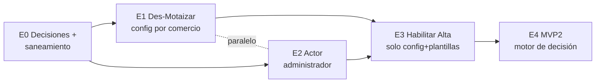

# Plan de evolución escalonada — de "Motai" a un modelo de renting genérico por comercio

> **Propósito.** Consolidar en un solo lugar (1) el **estado actual verificado** del flujo Motai, (2) **lo que se espera** según los dos documentos de referencia — el análisis de brechas de Jose ("Alta vs Motai Renting v1") y el PRD de negocio ("Motai MVP2", Manuela Romero, 23/05/2026) — y (3) un **plan de cambios escalonado** para dejar de "hacer cosas para Motai" y convertirlo en una capacidad genérica que cualquier comercio pueda usar por configuración.
>
> **Fuentes y verificación:** [MOTAI-FLUJO-ANALISIS.md](../codigo/MOTAI-FLUJO-ANALISIS.md) (análisis propio), `motai-jos.pdf`, `motai-manu.pdf`. Todas las afirmaciones sobre código fueron **re-validadas contra los repos el 2026-07-06** (`legacy-backend` y `frontend-monorepo`; `application` solo tiene scaffolding de esquema, cero lógica). Las citas `archivo:línea` corresponden a ese corte y pueden derivar.
>
> **Estado del doc:** BORRADOR para revisión con Jose y negocio. Las decisiones pendientes están marcadas **D1–D5**; nada de esto está comprometido aún.

---

## 1. Resumen ejecutivo (lectura no técnica)

**Qué hay hoy.** El flujo de renting de Motai (MVP1) está **construido y funcionando en el ambiente de desarrollo** — no está en producción. Un cliente puede elegir el modo (compra / renting / alquiler), validar sus ingresos de apps (Rappi/Uber/DiDi) con Ábaco en vez del buró, ver un precio calculado, y un humano aprueba o rechaza al final. **No existe ninguna política de crédito automática**: la decisión es 100% manual.

**El problema.** Todo eso funciona porque hay **valores y condiciones escritos directamente en el código, dispersos en muchos archivos** (nombres, precios, documentos, ids). Sumar un segundo comercio ("Alta") hoy implicaría volver a programar en decenas de puntos. Además, dos piezas clave quedaron **a medio conectar**: los ingresos que captura Ábaco **no alimentan ninguna decisión**, y el "administrador" que debe aprobar **no tiene rol, acceso ni pantalla propios**.

**Qué se espera.** Hay **dos expectativas de distinto tamaño** sobre la mesa:
- **Alcance A (doc de Jose):** que Alta reuse el flujo de Motai con el mínimo trabajo — generalizar lo hardcodeado. Transitorio (sostiene la operación hasta ~nov 2026), todo sobre legacy-backend.
- **Alcance B (PRD MVP2):** features nuevas — simulador de renting/rent-to-own, **política de riesgo automática** (reglas R1–R8, con consulta a Datacrédito al 100%), **codeudor** y documentos de formalización. Revenue estimado: **+40M/mes**.

**La propuesta de este doc.** Cinco etapas que se pueden entregar y verificar por separado, ordenadas para que cada una deje el terreno limpio para la siguiente:

| Etapa | Nombre | Qué entrega | Tamaño |
|---|---|---|---|
| **0** | Decisiones + saneamiento | Nombre/diccionario acordados, bugs conocidos resueltos, datos base verificados | S |
| **1** | Des-Motaizar (parametrizar) | Todo lo hardcodeado pasa a **configuración por comercio**; mismo comportamiento | M |
| **2** | Actor administrador | El comercio decide desde su propia pantalla, con acceso y notificaciones | M–L |
| **3** | Habilitar Alta | Alta opera **solo con configuración y plantillas**, sin tocar código | S |
| **4** | MVP2 (motor de decisión) | Simulador, política R1–R8, codeudor, formalización | L |

**La decisión más urgente no es técnica:** acordar el **nombre del concepto** (dejar de decir "Motai") y el **diccionario de productos**, porque hoy "renting" significa cosas **opuestas** en el código y en el PRD (§4.2), y eso contamina cualquier conversación y cualquier contrato.

---

## 2. Estado actual (línea base verificada)

### 2.1 Lo que funciona hoy (MVP1, en dev)

| Pieza | Qué hace | Dónde vive |
|---|---|---|
| Selección de modo | Pantalla inicial con los modos del comercio (`partner_modes`); la elección viaja en la **sesión del front** y fija el flag `isMotaiRenting` | `merchant-mode.tsx` (ruta y componente); `RegisterCellPhoneService.php:50` |
| Bypass de underwriting | Con `isMotaiRenting`: **no** se consulta Experian/buró ni `validateRiskCentrals`, y se fuerza `corbeta=false` | `OnboardingController.php:1216-1311` |
| Documento PEP | Opción PEP (Permiso Especial de Permanencia) en el formulario; **no dispara ninguna consulta** a centrales | `OnboardingService.php:293`; front `document-type.ts` |
| Ábaco (ingresos gig) | Gate `check-abaco-requirement` (por `config.isAbacoRequired` del modo) + flujo completo plataformas → credenciales → OTP → resultados; calcula `average_income` | `MotaiValidationService.php`, `AbacoService.php`, módulo front `abaco/` |
| Info laboral autocompletada | Cuando aplica Ábaco se inyecta laboral ficticia (`1500000, 'Empleado', 3`) — el paso manual es redundante en renting | `OnboardingService.php:317,714` |
| Calculadora | En la tarjeta del lender Motai (158): `total = monto + alistamiento 1.5M + margen 100% + IVA 19%`, **calculada en el front y duplicada en 2 archivos** | `LenderCardContent.tsx:214-222`; `useLenderSelection.ts:81-88` |
| Identidad | ADO + AML (TusDatos/Mareigua) corren en paralelo a Ábaco (polling extendido a 36 intentos si hay Ábaco) | `waiting-validation.tsx`; constantes de polling |
| Decisión manual | Pantalla de perfil financiero (hoy la ve el **asesor**) → `POST motai/update-status {approve}` → aprobado = **Estado 11** + voucher; rechazado = 9 | `financial-profile.repository.ts:46`; `BackDoorUserService.php:569-642` |
| Legal (aceptación) | TyC propios de Motai (ids **16/17**) al registrar el celular | `RegisterCellPhoneService.php:411-442` |
| Legal (firma) — patrón | Flujo de firma construido **para Credifamilia** (lender 24): PDF vía `pdf-mapper-service`, S3, correo, WhatsApp — es el patrón a reusar para Alta | `LegalService.php:31-41` |

### 2.2 Lo construido pero desconectado o roto (validado en código)

| # | Hallazgo | Evidencia | Impacto |
|---|---|---|---|
| 1 | **`average_income` es dato huérfano**: Ábaco lo calcula y persiste, pero **nadie lo lee** — ni backend (grep de consumidores vacío) ni frontend (solo usa el booleano `completed`) | `AbacoParserService.php:168-189`; `validation-status.tsx:62-83` | La "validación de ingresos" hoy **no valida nada**: es captura informativa |
| 2 | El ingreso que muestra la pantalla del perfil financiero viene de **otro servicio** (`FINANCIAL_HEALTH_API_URL`), no de Ábaco | `financial-profile.repository.ts:5-12` | El decisor manual no ve el dato de Ábaco que el cliente se esforzó en autorizar |
| 3 | `GET scraping/init/gig-economy` está **roto** (llama a `AbacoService::initGigEconomyFromToken()` que **no existe**) | `AbacoController.php:42-51`; `routes/api.php:205` | Revienta en runtime si alguien lo usa; solo el `POST` funciona |
| 4 | El webhook `scraping.completed` es **NO-OP** (dispatch comentado + `webhook_enabled=false` por defecto) | `AbacoService.php:610-615` | La finalización de Ábaco solo se detecta por **polling** del front |
| 5 | **Disparador dual inconsistente**: el bypass se activa con `isMotaiRenting` **o** `merchant_mode='motai_renting'`, pero el modo **solo se persiste** con el booleano | `OnboardingController.php:1216` vs `:1577-1599` | Se puede saltar el buró **sin** dejar registrado el modo |
| 6 | `MOTAI_RENTING_ALLIED_MODE_ID = 2` **hardcodeado, sin seeder** de `allied_modes` en ningún repo | `OnboardingController.php:36` | Si el id real difiere por ambiente, se fija el modo equivocado o revienta |
| 7 | Compra y alquiler **no persisten fila de modo** (solo renting lo hace) | `attachMotaiRentingModeIfNeeded` | No hay trazabilidad de qué modo eligió el cliente en 2 de 3 casos |
| 8 | La opción **"Validar codeudor"** de la pantalla del asesor (PRD MVP1 punto 7) **no existe en backend**: `update-status` solo recibe `approve` booleano | `MotaiUpdateStatusRequest.php` | El tercer botón no tiene a dónde llegar |
| 9 | El **reporte Excel automático a Motai** (consideración del MVP1 en el PRD) **no se encontró en código** | grep sin resultados | Confirmar si existe fuera del repo (manual / n8n) o es brecha |

### 2.3 El problema de fondo: hardcodes dispersos

El inventario del cap. 5 del doc de Jose es **correcto** (lo validamos punto a punto). Resumen de lo que hoy ata el flujo a Motai/Credifamilia:

- **Backend:** ids de TyC `16/17/18/13` repetidos en **3 lugares** (`RegisterCellPhoneService`, `UserService`, `OnboardingController`); `MOTAI_RENTING_ALLIED_MODE_ID=2`; cadena mágica `'motai_renting'`; literal `'PEP'`; laboral ficticia; `ENABLED_LENDERS_FOR_LEGAL=[24]` + slugs de plantilla de Credifamilia; `$lender_id=24` en la consulta Datacrédito.
- **Frontend:** `MOTAI_LENDER_IDS=[158]`; fórmula de la calculadora **duplicada**; comparación `merchantMode === "motai-renting"` repetida en **5 rutas** sin constante; branding Motai quemado (imagen/colores/logo); `nationality: "VENEZOLANA"` en la tarjeta PEP; excepción de cuota inicial "PARA MOTAI RENTING"; consentimiento como booleanos quemados.

**Dato clave para la solución:** la tabla `allied_modes` ya tiene una columna **`config` JSON** (hoy solo lleva `isAbacoRequired`), y `partner_modes` **ya viaja completo al frontend** con ese `config`. El "hogar" para la parametrización **ya existe** — no hay que inventar infraestructura.

### 2.4 Qué NO es parte de esto (deslindes)

- **IMEI / device-lock** (MDM, Trustonic): es el cierre del flujo de **compra de celulares** del allied Motai; árbol de rutas y módulo front separados, sin cruce de código con modos/Ábaco. Fuera de este plan.
- **`application` (repo viejo):** solo tiene 2 migraciones de esquema (settings + columna `abaco`) y copy de marketing; **cero lógica**. No hay nada que migrar desde ahí para esto.
- **Cobranza/servicing post-Estado 11:** vive en `application` (crons CreditopX). El PRD MVP2 lo pide (cobranza semanal por WhatsApp) pero es un **workstream aparte** — ver §5, Etapa 4.

---

## 3. Lo que se espera (dos alcances distintos)

### 3.1 Alcance A — Habilitar Alta (doc de Jose)

Objetivo: **Motai fase final + Alta fase 1**, reutilizando al máximo lo construido, todo sobre legacy-backend, sin microservicios nuevos, con carácter **transitorio** (sostener la operación hasta ~noviembre 2026). Sus brechas:

- **4.1–4.6 (código):** generalizar TyC, PEP, indicador de modo, calculadora, envío legal de Credifamilia; cargar plantillas TyC en S3 + microservicio de firma.
- **4.7–4.11 (operativas):** el **administrador** reemplaza al asesor en la decisión — su pantalla, su acceso/auth, su efecto en los pollings, el desacople del asesor en Alta y la notificación al terminar Ábaco.

### 3.2 Alcance B — MVP2 (PRD de negocio)

Sobre el MVP1, agregar:

1. **Simulador** renting y rent-to-own: planes de pago semanales con factores (semanal 1.25x / mensual 1.0x / trimestral 0.94x), tasa mensual 1.8%, y para rent-to-own **tabla de amortización** completa (plazos 12/18/24 meses, cuota inicial, extras).
2. **Política de riesgo automática (R1–R8):** 2 referencias; **Datacrédito al 100% de solicitantes**; score mínimo titular; canon semanal entre **$150.000–$300.000**; cuota ≤ **25%** del ingreso semanal promedio; endeudamiento (deudas + cuota) ≤ **40%** del ingreso mensual; endeudamiento total < 50% del patrimonio. Ingresos: perfil **App → Ábaco**; **No-App → AgilData/Mareigua/TusDatos**.
3. **Codeudor:** obligatorio si ingresos < $2.9M; requisito: score Datacrédito > 650.
4. **Documentos de formalización:** renting = contrato + pagaré; rent-to-own = contrato + pagaré + **garantía mobiliaria** (prenda sin tenencia).
5. **Cobranza:** semana vencida desde la firma, WhatsApp con 6 segmentos de mora, vencimientos los viernes.

### 3.3 Conflictos y vacíos entre A, B y el código (lo que hay que reconciliar)

| # | Conflicto / vacío | Detalle | Dónde golpea |
|---|---|---|---|
| C1 | **Terminología invertida** | Código: `motai-renting` = "con opción de compra", `alquiler` = "puro". PRD: *renting* = devuelve el bien; *rent-to-own* = se queda. **El "renting" del código es el "rent-to-own" del PRD** | Contratos, calculadora, comunicación — ver §4.2 |
| C2 | **MVP2 revierte el bypass del buró** | Hoy renting **salta** Datacrédito por diseño; R2 pide consultarlo al **100%** | El corazón de la rama `isMotaiRenting` cambia de semántica |
| C3 | **PEP vs "Datacrédito 100%"** | PEP existe **porque** no hay historial (thin-file). ¿R2 aplica también a PEP? Contradicción sin resolver | Política R1–R8, AML |
| C4 | **Ábaco no decide nada** | Jose (4.8) asume "cambios sencillos"; en realidad la evaluación de viabilidad es **greenfield**: hay que cablear `average_income` + Datacrédito + reglas | Etapa 4, estimaciones |
| C5 | **Administrador indefinido** | La decisión hoy entra por `BackDoorUserController` sin rol/auth. Jose lo deja como observación abierta (4.7/4.9/4.10/4.11) | Etapa 2 — mayor riesgo del plan |
| C6 | **`alquiler` hoy corre onboarding estándar** (con buró, sin Ábaco); el PRD quiere la **misma política** para ambas líneas de arrendamiento | La línea "renting operativo" del PRD no tiene hoy rama propia | Diccionario + Etapa 4 |
| C7 | **Calculadora del PRD ≠ calculadora del código** | PRD: planes por factor + amortización; código: fórmula fija simple en el front, duplicada | Etapa 1 (mover a config/backend) + Etapa 4 (planes) |
| C8 | **Cobranza semanal** | El servicing corre en `application` (fuera del alcance del doc de Jose, que es solo onboarding). ¿El motor CreditopX soporta cuotas **semanales**? Sin confirmar | Workstream aparte |
| C9 | **Inconsistencias internas del PRD** | R3 dice score titular ≥400, pero la tabla de riesgo dice "score mínimo titular: 0" y la regla de codeudor-por-score aparece tachada | Cerrar con Manuela antes de programar reglas |

---

## 4. Aterrizaje conceptual (antes de tocar código)

### 4.1 El nombre — D1

Dejar de nombrar el flujo por el primer cliente. El rasgo **invariante y generalizable** no es la moto ni el renting: es que **el comercio es dueño del riesgo y decide cada solicitud** (aprueba / pide codeudor / rechaza), sobre **underwriting alternativo** (ingresos gig u otras fuentes, con o sin buró), y CreditOp **opera** el pipe (originación, identidad, firma, desembolso, cobranza). Esto es coherente con el modelo económico CreditopX ya documentado (el comercio pone capital y riesgo; CreditOp gana comisión).

Propuesta (elegir una — **D1**):

| Candidato | A favor | En contra |
|---|---|---|
| **Originación con decisión del comercio** ⭐ recomendado | Nombra el invariante real; cubre manual hoy y asistido mañana | Largo (usar alias corto interno) |
| Crédito con revisión manual | Cercano a lo que pasa hoy | "Crédito" contradice el lenguaje de arrendamiento; "manual" caduca cuando llegue la política automática |
| Crédito con codeudor | — | El codeudor es una sub-regla condicional, no el flujo |

Alias técnico sugerido para código/config: `merchant_decision` (o mantener el eje existente `allied_modes` y tipificar el modo).

### 4.2 Diccionario de productos — D2

Fijar esta tabla y usarla en TODO (código, contratos, PRDs, pantallas). Corrige la inversión C1:

| Producto (nombre negocio) | Definición | `code` actual en `allied_modes` | Docs a firmar (PRD) | Underwriting hoy | Underwriting objetivo (MVP2) |
|---|---|---|---|---|---|
| **Rent-to-Own** (arrendar para poseer) | Paga cuotas y al final **se queda** con el bien — "crédito disfrazado de arriendo" | `motai-renting` ⚠️ | Contrato + Pagaré + **Garantía mobiliaria** | Ábaco (informativo) + decisión manual; **sin buró** | Política R1–R8 + codeudor condicional |
| **Renting operativo** (alquiler) | Paga por el uso y **devuelve** el bien | `alquiler` ⚠️ | Contrato + Pagaré | Onboarding **estándar** (con buró, sin Ábaco) | Misma política R1–R8 |
| **Compra financiada** | Crédito clásico para adquirir | `motai` (en pantalla del MVP1 apareció como "Motai X" ⚠️ — no confundir con el lender 62 histórico) | Estándar | Estándar | Sin cambios |

> ⚠️ Los `code` actuales quedan como **legado**: renombrarlos o mapearlos es parte de la Etapa 1 (con alias de compatibilidad — hay 5 rutas del front comparando el string).

### 4.3 Los dos ejes que hoy están fundidos y hay que separar

1. **Eje producto** (qué se contrata): compra / renting operativo / rent-to-own → define documentos, calculadora y comunicación.
2. **Eje underwriting + decisión** (cómo se aprueba): fuentes de ingreso (Ábaco vs centrales), con/sin buró, decisión manual del comercio vs política automática → define el riesgo.

Hoy el código funde ambos en un solo flag (`isMotaiRenting`). La configuración por modo (§6) los separa, y con eso **cualquier combinación** queda expresable sin código nuevo (p.ej. Alta podría querer rent-to-own **con** buró).

---

## 5. Plan escalonado

**Principio rector:** cada etapa (a) se entrega y verifica sola, (b) no cambia comportamiento salvo que sea su objetivo explícito, y (c) deja el terreno más simple, nunca más complejo. Las etapas 1 y 2 pueden correr **en paralelo** (tocan zonas distintas).



### Etapa 0 — Decisiones + saneamiento (S)

Sin features. Deja el terreno confiable para todo lo demás.

| Ítem | Acción |
|---|---|
| **D1** Nombre | Acordar el nombre de la capacidad y el alias técnico (§4.1) |
| **D2** Diccionario | Firmar la tabla de productos (§4.2) con negocio y legal |
| **D3** Alcance | Confirmar el orden A→B (Alta primero, MVP2 después) y comunicarlo — son tamaños distintos |
| **D4** Promoción a prod | Decidir si el MVP1 se promueve tal cual (con hardcodes) o después de la Etapa 1 (recomendado: **después**, para no llevar deuda a prod) |
| **D5** PEP en la política | Resolver C3 con negocio/compliance: ¿los PEP quedan exentos de R2? |
| Fix roto #3 | `GET scraping/init/gig-economy`: implementar el wrapper o **borrar la ruta** (recomendado: borrar; nadie la usa) |
| Fix #4 | Webhook Ábaco: decidir habilitar+despachar o eliminar; mientras sea polling-only, documentarlo |
| Fix #5 | Unificar el disparador dual (que el string implique persistencia del modo, o eliminar uno) |
| Fix #7 | Persistir el modo elegido **siempre** (también compra/alquiler) — trazabilidad barata |
| Datos base | Verificar/seedear `allied_modes` por ambiente y **matar la constante `=2`** (leer por `code`+`allied_id`) |
| PRD | Cerrar C9 (score 400 vs 0) y #8 ("Validar codeudor" sin backend) y #9 (reporte Excel) con Manuela |

**Criterio de salida:** decisiones D1–D5 registradas; los 4 fixes mergeados; `allied_modes` consistente en dev.

### Etapa 1 — Des-Motaizar: parametrización por comercio (M)

Mover **todo** el inventario de §2.3 a `allied_modes.config` (+ tablas donde corresponda), **sin cambiar comportamiento**. Es el alcance 4.1–4.6 de Jose con hogar concreto.

| Hoy (hardcode) | Mañana (config por modo/comercio) |
|---|---|
| ids TyC 16/17/18/13 en 3 servicios | `config.legalDocs` |
| Calculadora en el front, duplicada | `config.pricing` + **cálculo en backend** (una sola fuente; el front solo renderiza) |
| `MOTAI_LENDER_IDS`, excepción cuota inicial | `config.lenders` (el filtro `AlliedModeLenderFilterService` **ya lo soporta** — hoy es NO-OP porque el config no trae la lista) |
| Rama `isMotaiRenting` (bypass buró/corbeta) | `config.underwriting.skipBureau`, `.incomeSources` |
| Literal `'PEP'` + nationality quemada | `config.underwriting.documentTypes` |
| Branding Motai en `merchant-mode.tsx` | `config.branding` (logo/colores por comercio) |
| String `"motai-renting"` en 5 rutas front | Leer el `config` del modo elegido (ya viaja en `partner_modes`) |
| Envío legal atado a Credifamilia (`ENABLED_LENDERS_FOR_LEGAL=[24]`, slugs) | `config.legalDocs.templates` por comercio/producto |
| Modo por sesión del front (frágil, brecha 4.3 de Jose) | El backend deriva el comportamiento de la **fila persistida** en `user_request_modes`, no del string en cada request |

**Criterio de salida:** (a) E2E de los 3 modos de Motai pasa **idéntico** antes/después; (b) `grep -ri "motai"` en lógica de negocio solo devuelve datos/seeds, no condicionales; (c) la calculadora tiene una única implementación (backend) y el front la consume.

### Etapa 2 — Actor administrador (M–L) · el mayor riesgo del plan

Cubre 4.7–4.11 de Jose. Hoy la decisión la toma el **asesor** en una pantalla del wizard que pega a un endpoint **backdoor sin auth propia**. Objetivo: que la tome un **administrador del comercio** con acceso e identidad propios.

| Ítem | Contenido |
|---|---|
| Pantalla | Perfil financiero del solicitante en el módulo de administración (no en el wizard), mostrando **también el resultado de Ábaco** (hoy el decisor no lo ve — hallazgo #2) |
| Acceso | Definir auth/rol del administrador (pregunta abierta de Jose: cómo se autentica, qué permisos). Reusar el esquema de `corporate_user`/SSO existente si alcanza |
| API | Reemplazar/proteger `motai/update-status`: sacar la decisión de `BackDoorUserController`, autenticar y **auditar** (quién decidió, cuándo, con qué datos a la vista) |
| Notificación | Avisar al administrador cuando el solicitante termina Ábaco (hoy: nada; el webhook es NO-OP → definir si polling del panel o habilitar webhook) |
| Desacople del asesor | Definir qué ve el asesor tras su parte (selección de entidad) y desengancharlo del polling de decisión |

**Criterio de salida:** en dev, una solicitud de renting termina en la bandeja del administrador, este decide desde su pantalla (con datos de Ábaco visibles), y la decisión queda auditada. El asesor no interviene en la decisión.

### Etapa 3 — Habilitar Alta (S, si 1 y 2 están)

La prueba de fuego de la generalización: **Alta entra sin tocar código**.

1. Insertar filas en `allied_modes` para Alta con su `config` (productos, pricing, docs, underwriting, branding).
2. Cargar plantillas TyC/contratos de Alta en S3 + `pdf-mapper-service` (brecha 4.6).
3. E2E del flujo Alta punta a punta en dev.
4. Promoción a producción según **D4** (Motai y/o Alta).

**Criterio de salida:** Alta opera en dev **solo con datos y plantillas**. Si algo requirió código, es una brecha de la Etapa 1 — se corrige allí, no con un hack.

### Etapa 4 — MVP2: motor de decisión y producto completo (L)

Recién aquí las features del PRD. Aviso honesto a negocio: **esto no es "sencillo"** — la evaluación de viabilidad es esencialmente nueva (C4).

| Bloque | Contenido | Nota |
|---|---|---|
| Simulador | Planes por factor (1.25x/1.0x/0.94x), tasa 1.8% mensual, amortización semanal para rent-to-own | Se apoya en `config.pricing` de la Etapa 1; ver [MECANICA-CREDITO.md](../codigo/MECANICA-CREDITO.md) para la amortización |
| Política R1–R8 | Motor de viabilidad del renting: **cablear por fin `average_income`** (perfil App) + re-activar Datacrédito según config (C2, D5) + canon min/max + DTI 25%/40% | Convertir el resultado en recomendación para el administrador (decisión **asistida**, no reemplazada — o automática si negocio lo pide: decidirlo) |
| Codeudor | Modelo de datos + flujo de captura + validación score >650 + el tercer botón que hoy no tiene backend (#8) | |
| Formalización | Contrato/pagaré/garantía mobiliaria por producto, sobre el patrón legal generalizado en Etapa 1 | Rent-to-own agrega la prenda sin tenencia |
| Reporte a comercio | Resolver #9 (Excel) — probablemente reemplazable por el panel del administrador | |
| **Cobranza semanal** | **Workstream aparte**: el servicing vive en `application`; confirmar soporte de cuotas semanales en el motor CreditopX y la mensajería de 6 segmentos | No comprometerlo dentro del alcance de onboarding |

**Criterio de salida:** una solicitud App-profile con ingresos ≥$3M se aprueba con política completa (o queda recomendada-aprobar para el admin); una <$2.9M exige codeudor válido; los documentos correctos se firman según producto.

---

## 6. Esquema de configuración propuesto (borrador para discutir)

> ⚠️ **Actualización 2026-07-06:** este esquema **evolucionó** al discutirlo sobre el prototipo: la mayor parte de lo que abajo vive en `allied_modes.config` se reubica en **lenders CreditopX por producto** (reglas/precio/docs por lender + una **categoría de lender** que dispara el comportamiento). Ver **§10 Addendum**, que es el diseño vigente. Se conserva esta sección como historia de la discusión.

Una fila de `allied_modes` por comercio+producto; `config` JSON versionable. Todo lo que hoy es hardcode cabe aquí:

```jsonc
{
  "product": "rent-to-own",            // renting | rent-to-own | compra  (D2)
  "isAbacoRequired": true,              // ya existe hoy
  "underwriting": {
    "skipBureau": true,                 // hoy: rama isMotaiRenting (MVP2 lo pondrá en false — C2)
    "incomeSources": ["abaco"],         // abaco | agildata | mareigua | tusdatos
    "documentTypes": ["CC", "CE", "PEP"],
    "policy": null                      // Etapa 4: { minScore, canonMin, canonMax, dtiWeekly, dtiMonthly, coSigner: {...} }
  },
  "decision": {
    "model": "manual",                  // manual | assisted | auto (Etapa 4)
    "actor": "merchant_admin"           // hoy de facto: asesor (Etapa 2 lo cambia)
  },
  "pricing": {
    "alistamiento": 1500000,
    "margen": 1.0,
    "iva": 0.19,
    "tasaMensual": 0.018,               // Etapa 4
    "planes": [ { "frecuencia": "semanal", "factor": 1.25 } ]
  },
  "legalDocs": {
    "dataPolicy": 16,
    "terms": 17,
    "formalization": ["contrato", "pagare", "garantia-mobiliaria"],  // Etapa 4, por producto
    "templates": { "project": "motai", "s3Prefix": "legal/motai" }
  },
  "lenders": [158],                     // el filtro existente deja de ser NO-OP
  "branding": { "logo": "…", "primary": "#010C4E" }
}
```

Reglas del esquema: (1) **sin defaults mágicos** — lo que no está, no aplica (fail-closed donde toque riesgo); (2) validar el JSON contra schema al guardar; (3) el front **no interpreta strings de modo**, lee flags del `config` que ya recibe en `partner_modes`.

---

## 7. Riesgos transversales

| Riesgo | Por qué importa | Mitigación |
|---|---|---|
| **Administrador sin definición** (C5) | Bloquea Alta (Jose 4.7–4.11) y MVP2; hoy la decisión entra por un backdoor sin auth | Adelantar el diseño de acceso en Etapa 0–2; no dejarlo para el final |
| **PEP/AML** (C3) | Saltar identidad+buró por tipo de documento es política de riesgo, no un detalle técnico | Decisión explícita de negocio/compliance (D5), separando "sin buró" de "sin identidad" |
| Refactor sin red (Etapa 1) | "Mismo comportamiento" hay que **probarlo**, no declararlo | E2E de los 3 modos ANTES de refactorizar (conecta con el harness del squad); comparar trazas antes/después |
| Ábaco polling-only (#4) | UX del admin depende de enterarse a tiempo | Decidir webhook vs polling del panel en Etapa 2 |
| Doble fuente de "ingreso" (#2) | Perfil financiero muestra un ingreso ≠ al validado por Ábaco → decisiones inconsistentes | En Etapa 2 la pantalla del admin muestra ambos con su origen |
| Transitoriedad declarada | El propio doc de Jose avisa: esto **no** escala a muchos comercios ni alto tráfico | Mantener el alcance "pocos comercios"; el reemplazo de legacy es otro plan |

## 8. Preguntas abiertas (dueño sugerido)

1. Ids reales de `allied_modes` por ambiente (dev/prod) — **equipo** (Etapa 0).
2. ¿Quién llama hoy `motai/update-status` en dev y con qué protección? — **Jose/equipo** (Etapa 2).
3. ¿Existe el reporte Excel del MVP1 fuera del repo? — **Manuela** (#9).
4. ¿R2 "Datacrédito 100%" incluye PEP? (C3) — **negocio/compliance** (D5).
5. Score mínimo titular: ¿400 o 0? (C9) — **Manuela**.
6. ¿La decisión del MVP2 es asistida (recomendación al admin) o automática? — **negocio** (Etapa 4).
7. ¿El motor CreditopX soporta cuotas **semanales** post-Estado 11? (C8) — **por investigar en `application`**.
8. Diferencia contractual renting vs rent-to-own con **legal** (opción vs compromiso de compra; arrendador) — **legal** (D2).

---

## 9. Anclas de código (validadas 2026-07-06)

| Pieza | Archivo:línea |
|---|---|
| Constante modo renting hardcodeada | `Modules/Onboarding/App/Http/Controllers/OnboardingController.php:36` |
| Rama bypass (`isMotaiRenting`) | `OnboardingController.php:1216, 1222, 1279, 1311` |
| Persistencia del modo (solo renting) | `OnboardingController.php:1577-1599` |
| Gate Ábaco (MOTV1000/1/2) | `Modules/Onboarding/App/Services/MotaiValidationService.php:139-147` |
| Endpoint roto `GET init/gig-economy` | `AbacoController.php:42-51` · `routes/api.php:205` |
| Webhook NO-OP | `AbacoService.php:610-615` |
| `average_income` (huérfano) | `AbacoParserService.php:168-189` |
| Decisión manual (estado 11/9 + voucher) | `BackDoorUserService.php:569-642` |
| TyC ids duplicados ×3 | `RegisterCellPhoneService.php:411-442` · `UserService.php:325-362` · `OnboardingController.php:120,754,756` |
| PEP + laboral ficticia | `OnboardingService.php:293, 317, 714` |
| Legal Credifamilia (patrón a generalizar) | `LegalService.php:31-41` |
| Filtro lenders por modo (NO-OP hoy) | `AlliedModeLenderFilterService.php:16-41` |
| Calculadora front duplicada | `LenderCardContent.tsx:214-222` · `useLenderSelection.ts:81-88` |
| Constantes lender front | `lender.constants.ts:1-12` (`MOTAI_LENDER_IDS=[158]`) |
| String de modo en 5 rutas front | `phone-number.tsx:103` · `otp-verification.tsx:63` · `loan-request-form.tsx:80` · `bancolombia/onboarding/{otp:155,register:90}.tsx` |
| update-status embebido en el front | `customer-profile/src/lib/infrastructure/financial-profile.repository.ts:46` |
| Ingreso del perfil ≠ Ábaco | `financial-profile.repository.ts:5-12` (`FINANCIAL_HEALTH_API_URL`) |
| Front solo usa `completed` de Ábaco | `apps/loan-request-wizard/app/routes/api/validation-status.tsx:62-94` |

---

## 10. Addendum (2026-07-06) — arquitectura refinada, catálogo de reglas y veredicto de verificación

> Resultado de la sesión de diseño sobre los prototipos [`merchant-config/index.html`](../../merchant-config/index.html) (ficha en 2 columnas: comercio | CreditopX) y [`merchant-config/admin.html`](../../merchant-config/admin.html) (consola de decisión del administrador). **Esta sección supersede parcialmente el §6**: la "ficha única del comercio" se parte en capas y el hogar de la config deja de ser solo `allied_modes.config`.

### 10.1 Decisión de arquitectura: productos = lenders CreditopX separados

**Idea central:** renting / rent-to-own / compra **no son "modos" del comercio: son lenders del catálogo**, todos de la familia CreditopX (rt=2), que comparten la maquinaria in-platform (originación, firma, desembolso, cobranza, marketplace, motor de reglas). Igual que hoy CrediPullman, SmartPay y Motai Renting (158) son lenders hermanos tipo CreditopX.

| Código propuesto | Nombre | Categoría | Comportamiento que hereda de la categoría |
|---|---|---|---|
| `CTPX-BUY` | Buy-creditop | `crédito` | underwriting estándar (score/mora), sin Ábaco |
| `CTPX-RENT` | Renting-creditop | `arrendamiento` | decisión manual del comercio · docs de arrendamiento · Ábaco |
| `CTPX-RTO` | Rent-to-own-creditop | `arrendamiento` | ídem + pagaré + garantía mobiliaria |

Principios que fija esta decisión:

1. **La CATEGORÍA del lender —no el id— dispara el comportamiento.** `if lender.categoria == 'arrendamiento'` reemplaza a `if lender == 158` / `isMotaiRenting` / `MOTAI_LENDER_IDS=[158]`. ⚠️ **Esto es TARGET, no actual**: hoy no existe ningún campo de tipo/categoría de lender que ramifique el flujo (la tabla `lender_users_categories` segmenta *usuarios* por lender, no clasifica lenders). Construir la categoría **es parte del trabajo** — y es lo que finalmente mata el hardcode de Motai.
2. **Se cae el eje "modo del comercio"** (y con él `isMotaiRenting` y la pantalla de modos): el cliente elige el producto **en el marketplace**, como cualquier lender. Cambio de UX a validar (D6).
3. **Separar conceptos, compartir motor.** Regla para decidir lender-aparte vs atributo: cambian las **reglas/underwriting** → lender aparte; solo cambian **documentos o cálculo** → atributo/flag. Buy va aparte (underwriting distinto). Renting y RTO tienen política idéntica según el PRD → si negocio los quiere como **dos ofertas visibles** en la lista, son 2 lenders con **plantilla de reglas compartida** (para no desincronizar); si son "lo mismo con opción de compra", 1 lender + flag (D7).
4. **La ficha del comercio queda flaca:** marca/branding (existe) + qué lenders habilita (cobertura `lenders_by_allieds`, existe) + **cómo decide** (manual/mixta/automática — lo único nuevo a nivel comercio). Reglas, precio y documentos viven **por lender**.

Nuevas decisiones abiertas: **D6** = ¿la selección de producto pasa de la pantalla de modos al marketplace? (negocio/diseño). **D7** = ¿renting y rent-to-own son 2 entradas del catálogo o 1 con opción de compra? (negocio; el prototipo asume 2).

### 10.2 Catálogo de IDs estables de reglas (deprecar R1–R8)

Los "R1/R2…" del PRD son posicionales (insertar una regla renumera todo). Se propone una **clave estable y autodescriptiva** `dominio.atributo_[min|max|required]`; cada regla es una fila (clave + operador + valor + categoría de producto). R1–R8 queda, a lo sumo, como orden de despliegue en UI.

| Clave estable | Reemplaza | Valida | Fuente/dato existente | Estado |
|---|---|---|---|---|
| `references.count_min` | R1 | ≥ 2 referencias | campos EAV 176–182 | existe |
| `datacredito.query_required` | R2 | consultar buró | `datacredito_trigger` / `lender_datacredito_rules` | existe (bypass a revertir en renting) |
| `datacredito.score_min` | R3 | score titular ≥ 400 ⚠️ (vs 0 — C9) | `lender_datacredito_rules.score` | existe |
| `datacredito.overdue_max` | (mora) | mora vigente ≤ 10M | `lender_datacredito_rules.current_dues` | existe |
| `pricing.canon_weekly_min` | R4 | canon semanal ≥ 150k | `credit_line_by_lenders` | existe · extender (semanal) |
| `pricing.canon_weekly_max` | R5 | canon semanal ≤ 300k | `credit_line_by_lenders` | existe · extender (semanal) |
| `capacity.installment_to_weekly_income_max` | R6 | cuota ≤ 25% ingreso semanal | field 87 + cuota | existe |
| `capacity.dti_monthly_max` | R7 | (deudas+cuota) ≤ 40% ingreso mensual | `lender_users_category_rules` | existe |
| `capacity.debt_to_networth_max` | R8 | endeudamiento ≤ 50% patrimonio | ⚠️ no hay campo patrimonio | **nuevo** |
| `cosigner.required_below_income` | (codeudor) | codeudor si ingreso < 2.9M | — | **nuevo** |
| `cosigner.score_min` | (codeudor) | score codeudor ≥ 650 | `lender_datacredito_rules` sobre el codeudor | **nuevo** |
| `employment.tenure_months_min` | (solo Buy) | antigüedad ≥ 6 meses | field 161 `continuity_months` | existe |

### 10.3 Veredicto de la verificación adversarial (prototipo vs código vs PRD)

Se verificaron los claims del prototipo contra los 3 repos y `motai-manu.pdf`. Resumen honesto:

**Confirmado (se ajusta):** Motai = lender 158 rt=2 CreditopX; la calculadora del prototipo reproduce **exacto** la fórmula real y el ejemplo del PRD (`getMotaiTotalAmount`, hoy en `LenderCardContent.tsx:236-245` — deriva vs §9 — y duplicada en `useLenderSelection.ts:169`): `(4.534.000+1.500.000)·2·1,19 = $14.360.920`; reglas con CRUD de admin (`lender_rules`/`lender_datacredito_rules`); cobertura `lenders_by_allieds`; codeudor 2.9M/score 650 = PRD; los tres tags "nuevo" (decisión manual, Ábaco, codeudor) bien clasificados — codeudor es solo un string de estado + copy en PDFs, sin tablas.

**Target-no-actual (el prototipo muestra el deber-ser; la brecha ES el trabajo):**
- "La categoría dispara el comportamiento" → hoy dispara el **id 158 + `isMotaiRenting`**; no existe categoría de lender.
- "Consultar buró" → hoy el renting **saltea el buró** (bypass `OnboardingController.php:1279/:1311`); el PRD lo quiere al 100% (C2) ⇒ la tarea es **revertir un bypass**, no prender un toggle.

**"Existe" que era optimista (corregido en el prototipo):**
- **Precio renting:** la tabla `credit_line_by_lenders` existe, pero **la fórmula vive quemada y duplicada en el frontend** (sin columnas de margen/IVA en BD) → re-etiquetado "existe · extender": hay que moverla a BD/servicio.
- **Reglas para rt=2:** los evaluadores de legacy leen **solo reglas genéricas** (`LenderRuleRepository.php:25-26` `whereNull('group_rule_id')`; `LenderDatacreditoRulesRepository.php:24-26` `whereNull('allied_branch_id')`; `CreditopXQuotaController.php:214`): las reglas **por sucursal** que el CRUD de admin permite crear **son ignoradas por rt=2**, y en renting hoy ni corren por el bypass. "Cargar reglas y listo" requiere cablear ese tramo.
- **Frecuencia semanal:** `cutoff_type_id` solo modela mensual/quincenal → "extender" confirmado.

**Brecha dentro del alcance del prototipo:** el simulador de rent-to-own del PRD exige **tabla de amortización** (desglose por semana); el prototipo solo muestra el total. Bien omitidos (fuera de alcance de la config): cobranza semanal WhatsApp, reporte Excel a Motai, gates ADO/AML.

**Conflictos que siguen abiertos para negocio:** C2 (buró: bypass vs 100%), C9 (score 400 vs 0, interno del PRD), C1/terminología (PRD dice "Motai X / Motai Renting / Alquiler"; prototipo usa "Buy / Renting / Rent-to-own" — fijar diccionario D2).

### 10.4 Impacto en el plan escalonado (§5)

Las etapas se mantienen; cambia el **hogar** de la parametrización de la Etapa 1: en vez de concentrar todo en `allied_modes.config`, (a) reglas/precio/documentos → **config por lender** (tablas existentes + extensiones semanal/margen/IVA), (b) comportamiento de flujo → **categoría del lender** (nueva), (c) comercio → marca + cobertura + modo de decisión. La Etapa 2 (administrador) no cambia y ya tiene prototipo de referencia (`admin.html`: bandeja → perfil → evaluación de reglas visible → aprobar / validar codeudor / rechazar, con recomendación calculada para el modo mixto).
