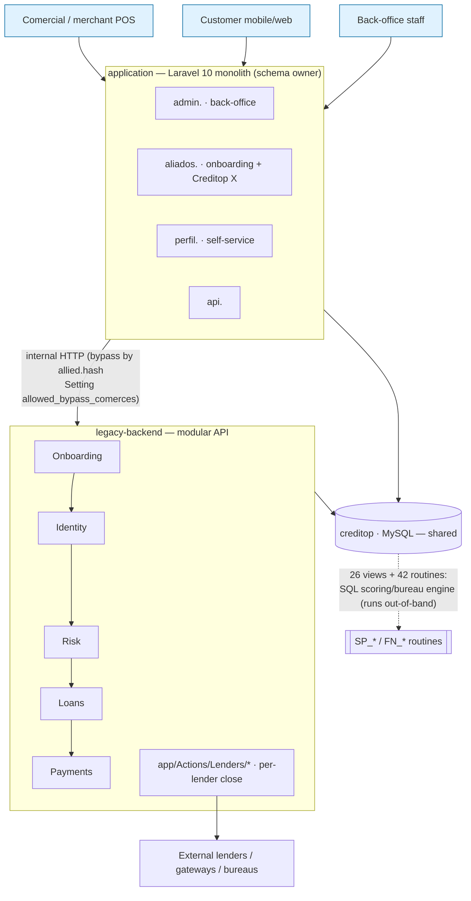

# Creditop — System Context (how it works today)

> **Purpose.** A single place to understand how Creditop's credit origination actually works
> **today** — the flows, the code that runs them, and their current shortcomings — **without
> re-reading the `legacy-backend` and `application` repos every time.** This is the *what-is*;
> the *to-be* (target model) lives in `src/data/modelo-dominio.json` and `docs/audit/`.
>
> Evidence base: multi-agent exploration of the three repos cross-checked against the live local
> DB (2026-06-03). **Every figure, file path and line number below was ground-truthed against the actual
> code and the local DB** (grep + `SHOW CREATE`/`SELECT`). Spanish long-form: `docs/audit/REALIDAD-ACTUAL.md`.
> Alignment (table↔entity): `docs/audit/ALINEAMIENTO.md`.
>
> 🔀 **Flow diagrams** (sequence + closing patterns + special flows) live separately in
> **`../flows/`** — kept apart from this repo's table-redesign work.

## Table of contents
1. [Repo map & architecture](#1-repo-map--architecture)
2. [The origination flow (end-to-end)](#2-the-origination-flow-end-to-end)
3. [legacy-backend module map](#3-legacy-backend-module-map)
4. [The `application` monolith](#4-the-application-monolith)
5. [The SQL scoring/bureau engine](#5-the-sql-scoringbureau-engine)
6. [Lender closing mechanism](#6-lender-closing-mechanism)
7. [Eligibility rules engine](#7-eligibility-rules-engine)
8. [Roles & permissions](#8-roles--permissions)
9. [Special flows](#9-special-flows)
10. [Current shortcomings / tech debt](#10-current-shortcomings--tech-debt)
11. [Where reality diverges from the target model](#11-where-reality-diverges-from-the-target-model)

---

## 0. Recent changes (pull 2026-06-03)

Delta validated via `git diff ORIG_HEAD..HEAD` in both repos. What moved relative to this doc:

- **`lender_term_capital_adjustment_factors` is now live** (legacy-backend): new model `LenderTermCapitalAdjustmentFactor` + `LenderRetrievalService` attaches it to each marketplace lender and resolves the **FGA by cascade** (default `lenderByAllied` → `LenderUsersCategory.FGA` → if `response_type=3`, `RevolvingCredit.fga`). (Table may still be empty in our mirror.) → the `termCapitalAdjustmentFactor` entity is no longer "unused".
- **New "Neo" KYC sub-flow** (application): `ValidateIdentityController@validateFrontId/validateBackId/validateIdentityFace` + `*Neo.vue` pages validate **front / back / selfie separately**, persisting `front_status/back_status/face_status` in `identity_validation_attempts` (confirms that table's shape from §4).
- **New "Eventos / Experiencia" vertical** (application): `ProductsController` + routes `/experiencia/{event}`, `/evento/{slug}/boletas...` + `*EventTwo.vue` — financing **event tickets (boletas)**. A new product/intake vertical not yet modeled.
- **New `client-code` intake**: `/codigo-cliente/...` (`ClientCodeController`) — 4-digit client code (Corbeta-style purchase code).
- Misc: new lenders 155/164 (PDF/consent templates; not yet in our DB mirror), Welli refinements (`welli/sync-installments`, 404 on update-amount), `registrar-imei` route (SmartPay IMEI close), revolving-credit incentive command + criteria tests.

The flows simulator (`../flows/`) was updated for the FGA cascade (Marketplace step) and the Neo KYC sub-flow (KYC step). The rest below is unchanged by this pull.

## 1. Repo map & architecture

Three repos under `~/Desktop/CREDITOP/`:

| Repo | What it really is | Role |
|---|---|---|
| **`bitbucket/application`** | The **Laravel 10 monolith** (Inertia + Vue, Spatie, Fortify, Sanctum). **313 migrations, 159 models → it owns the `creditop` schema.** Four subdomains on one host: `admin.` (back-office), `aliados.` (customer onboarding + Creditop X + merchant portal), `perfil.` (customer self-service, mobile), `api.` | Monolith + schema owner |
| **`github/legacy-backend`** | A **modular Laravel** API (`Modules/`: Identity, Loans, Onboarding, Partner, Payments, Risk, System). The origination API. *The name is misleading — it is the newer, modular codebase.* | Origination API (mid-migration) |
| **`playground/backend-e2e`** | Go harness that **validates reality** against API+DB (flows + `prep`/`get`/`doctor`). The validated knowledge lives in `playground/docs/` (hallazgos-backend, flujos-especiales, schema-remoto-logic) and `domain-model/docs/`. *(Consolidated the now-removed `creditop-cli`.)* | Validation / investigation |

**The boundary between the two backends (important):** `application` and `legacy-backend`
**share the `creditop` database** *and also* call each other over **internal HTTP**
(`INTERNAL_LEGACY_API_URL`). The loan-application flow is **half-migrated**: for some merchants
`application` delegates to `legacy-backend` (conditional bypass keyed on `allied.hash ∈ allowed_comerces`),
with an explicit `// todo: remove the legacy methods when all tests pass`. Both write `user_requests`
in the same DB.

> ⚠️ **Two databases in dev, with different IDs.** `legacy-backend` (local Sail) and `application`
> (RDS `inertia-dev…`) are **separate databases whose IDs do not match.** Our **local mirror**
> (`legacy-backend-mysql-1`) was loaded from the **`inertia-dev` dump** → it carries the
> **`application`/RDS IDs** (e.g. Corbeta 209/210/211, lender 153/158). Never mix IDs across sources.



> The customer-facing flow lives in **both** backends during migration: `application` handles it for
> most merchants and **delegates to `legacy-backend` over HTTP for whitelisted ones**; both persist to
> the same `creditop` DB; the **SQL engine** (views + routines) runs alongside, partly out-of-band.

Eloquent models in `legacy-backend` live in `app/Models/` (shared), not inside the modules; the
modules hold controllers/services/repositories.

---

## 2. The origination flow (end-to-end)

```
Comercial (#4) starts a sale
  → register cellphone → OTP → personal-info → laboral-info        [Onboarding]
  → KYC / identity (CrossCore, Evidente, TusDatos, Rekognition)    [Identity]
  → risk / bureau / scoring  (SQL engine — see §5)                 [Risk]
  → marketplace: eligible lenders                                  [rules: merchant AND lender]
  → select lender → close (branches by response_type — see §6)     [5 patterns]
  → states: origination 1→2→9→3, decision 10→11; converges at 11 (Authorized/Disbursed)
```

Step → route → controller/service (file paths in `github/legacy-backend`):

| Step | Route | Controller → Service |
|---|---|---|
| **(1) Capture** | `POST onboarding/.../register`, `loan-application/{otp-validate,personal-info,laboral-info}` (`Modules/Onboarding/routes/api.php:20-45`) | `RegisterCellPhoneController`, `OnboardingController@validateAndStorePersonalInfo/storeLaboralInfo` → `UserRequestService::createUserRequest()` (`Modules/Onboarding/App/Services/UserRequestService.php:56`) → `UserRequestRepository::create([... user_request_status_id=1])` |
| **(2) Identity/KYC** | `POST identity/crosscore/*`, `identity/evidente/*` (`api.php:90-124`) | `CrossCoreController`, `EvidenteController` + `Modules/Identity/App/Services/*` (`IdentityValidationService`, `TusDatosService`, `RekognitionService`, `AdoService`, `SwitchValidationProviderService`, `IdentityValidationStepResolver`) |
| **(3) Risk/bureau/scoring** | Risk controllers (`Modules/Risk/App/Http/Controllers/Customer/ProfilingReviewController.php`, `ProfilerML/ProfilerMLController.php`, `Matrix/v1/MatrixModelController.php`) | Call SQL routines (`CALL SP_AgilData_Mareigua_Extract_Data`, `CALL SP_Experian_Extract_Data`) + `Modules/Onboarding/App/Services/ExperianProfileService.php` (`SELECT FN_User_Income_Average`, `FN_User_Occupation`) |
| **(4) Eligibility (rules)** | `GET loan-application/lenders[-v2]/{user_request_id}` (`api.php:47-48`) | `ListLenderController`/`LenderListingController` → `Modules/Onboarding/App/Services/lenders/*` (`LenderListingService`, `ProfilingRulesService`, `RiskCentralValidationService`, `LenderValidationService`) + `Modules/Loans/App/Services/LenderRuleEvaluator.php` |
| **(5) Close/disburse** | `POST loan-application/update-user-request/{id}` → `ListLenderController@updateUserRequest`; `POST loan-application/validate/otp` → `ValidateOtpController@validateLenderOtp` (`api.php:49,52`) | `UserRequestService::updateUserRequest()` (`UserRequestService.php:255`) → `app/Actions/Lenders/*`; OTP close in `ValidateOtpController.php:45` |

**Tables touched per step:**
- (1) `user_requests` (W, status=1), `users`, `user_field_values`/`user_fields`, `allied_branches`, `ecommerce_requests` (+ `user_requests_by_ecommerce_request`).
- (2) `identity_validation_attempts`, `identity_validation_types`, `lender_identity_validation_types`, `compare_face_logs`, `creditop_x_consents`, `creditop_x_blacklisted_documents`.
- (3) `risk_central_user_data`, `user_request_risk_central_user_data`, `risk_centrals`, `profilings`, `credit_scores`, views `VW_Risk_Central_*`, `VW_Profiling_*`.
- (4) `lender_rules`, `group_rules`, `lender_datacredito_rules`, `lender_users_category_rules`, `lender_user_category_scoring_policy_rules`, `creditop_x_lender_scoring`, `cities_by_lender`.
- (5) `user_requests` (W: status, `final_amount`, `request_number`), `lender_transactions` + `lender_transaction_statuses`, per-provider tables (`payvalida_transactions`, …), `lender_allied_credentials`, `vouchers`.

**Eligibility = two AND'd layers:** (A) merchant/branch rules (`group_rules` by `allied_branch_id` +
`lender_rules`) and (B) the lender's intrinsic rules (`lender_users_category_rules`,
`lender_datacredito_rules`, `lender_guarantee_criteria`, the `creditop_x_*` family). The customer
must pass both and land in a `lender_users_category`. Marketplace = merchant config
(`lenders_by_allieds` = 990 associations / 230 merchants, plus `lenders_by_allied_branches`).

**Who originates:** the **Comercial (#4)** role sells; Admin/Superadmin-comercio administer;
back-office authorizes by state. There are **28 rows in `user_request_statuses`** (the CLI counts 27
active — legacy state 5 is inactive; no seeder, they come from the dump);
post-disbursement transitions (billing 25 / settlement 26→27) fire from back-office/jobs, **not REST**.

---

## 3. legacy-backend module map

`Modules/` (each has `App/Http/Controllers`, `App/Services`, `routes/api.php`):

- **Onboarding** — capture + the loan-application orchestration (`UserRequestService`, the lender
  listing/eligibility services, `ExperianProfileService`). The heart of origination.
- **Identity** — KYC/identity providers (CrossCore, Evidente, TusDatos, Rekognition/face, ADO/AML),
  provider-switching (`SwitchValidationProviderService`), step resolution.
- **Risk** — profiling controllers that call the SQL engine (ML profiling, matrix model).
- **Loans** — `LenderRuleEvaluator` (the rule engine), loan-side logic.
- **Payments** — payment/disbursement-side controllers (gateways, webhooks).
- **Partner** — merchant/allied-facing pieces.
- **System** — cross-cutting/system endpoints.

Lender integrations are **not** in the modules — they live in `app/Actions/Lenders/*` (see §6).

---

## 4. The `application` monolith

Laravel 10, **owner of the `creditop` schema**. `app/Providers/RouteServiceProvider.php` maps four
subdomains on the same host:

- **`admin.` → `routes/admin.php`** (back-office): users/clients (`UserController`,
  `UserProfilingController`), merchants (`AlliedController`, branches, zones, corporate users,
  ecommerce credentials), lenders (`LenderController`, usury rate), **requests** (`UserRequestController`,
  documentation, beneficiaries, **authorization** via `AuthorizationController`/`ManualValidationController`,
  profiling), payments & payment-links, month-end reports, modal surveys, dashboards, logs.
- **`aliados.` → `routes/customer.php`** (customer onboarding + Creditop X + commercial): cellphone →
  OTP → personal/laboral info → bureau queries (TusDatos, AgilData) → profiling (`GenericFormController`);
  **Creditop X origination** (Rekognition identity, Datacredito security questions, ADO/AML, initial-fee
  payment, lender selection, cycle/installments, **promissory-note/consent/guarantee e-signature via OTP**,
  PDF generation); commercial SSO via Cognito (`SsoCognitoController`).
- **`perfil.` → `routes/profile.php`** (mobile self-service): login, security questions, face/OTP, disbursements.
- **`api.` → `routes/api.php`**.

**DB connection:** single `mysql` connection to `creditop` (`config/database.php`); plus an external
`pullman_db` connection (special flow) and Redis. **It is the schema owner** (313 migrations in
`database/migrations/`). For some merchants it **delegates loan-application to legacy-backend** over
HTTP (`Customer/PersonalInfoController.php`, `ValidateOtpController.php`, `ListLenderController.php`
call `INTERNAL_LEGACY_API_URL`) — migration in progress.

---

## 5. The SQL scoring/bureau engine

A **second engine living entirely in SQL** (**26 views + 42 routines** in dev; the local mirror has
25 views — one broken view didn't import, see `ALINEAMIENTO.md`), separate from PHP. Key pieces:

- **`SP_Update_User_Request_Risk_Centrals`** — consolidates each central's latest query per day/user
  into `user_request_risk_central_user_data`. **Not called from any PHP** (runs out-of-band:
  scheduler/cron/manual). Contains **6 copy-pasted blocks with hardcoded `risk_central_id`**:
  `IN (1,9)`=Experian/Acierta, `2`=TusDatos-ID, `3`=AgilData, `4`=TusDatos-AML, `5`=Ado, `6`=Mareigua.
  **No notion of country.**
- **`SP_Experian_Extract_Data(id, decrypt_key)`** — decrypts the bureau JSON and extracts ~30 fields
  via **literal json_paths** (`$.models[0].scoreValue`, `$.agregatedInfo.overview…`).
- **`FN_User_Income_Average` / `_Continuity` / `_Occupation`** — **hardcoded waterfall**
  AgilData → Mareigua → form values, with embedded paths and nested IF/ELSE.
- **`SP_CreditopX_Revolving_Credit` + `FN_CreditopX_Revolving_Credit(_Multiplier)`** — computes the
  revolving credit line (income, fixed expenses, payment capacity). Core of the Creditop X engine.
- **`FN_Decrypt_Data`** — **hardcoded AES key** → critical security debt (should be KMS).
- **`actualizar_json`** — normalizes `profiling_reviews.ML_predictions`.
- Views `VW_*`: `VW_Profiling_Predictions(_ML/_V2)`, `VW_Risk_Central_*` (Experian/TusDatos/AgilData/AML/
  Mareigua/ADO), `VW_CtopX_*`, `VW_User_Request_Track/Costs`, `VW_Revolving_Payments_Report`.

Bureaus/gig-income platforms in play: **Experian-Acierta, TusDatos, AgilData, Mareigua** (the last two
estimate income for informal workers). Inspect routines on the local mirror:
`docker exec legacy-backend-mysql-1 mysql -uroot -ppassword creditop -e "SHOW CREATE PROCEDURE SP_Update_User_Request_Risk_Centrals\G"`.

---

## 6. Lender closing mechanism

**Hybrid data + hardcode** (it is *not* a clean pattern):

- **As data:** `lenders.action` stores the Action class FQCN (e.g. `App\Actions\Lenders\Payvalida`),
  instantiated dynamically (`new $lender->action()` in `LegacyLenderService.php:48,77`,
  `ValidateOtpController.php:56`, `UserRequestService.php:488`). **But only 16/153 lenders have
  `action` populated.**
- **As hardcode (contradicts "closing as data"):**
  - `UserRequestService::updateUserRequest` (`Modules/Onboarding/App/Services/UserRequestService.php`) —
    `switch($lender->response_type)` (data, lines 426 & 452) nesting `case 24` (Credifamilia, :497) /
    `case 23` (Welli, :523) + `if(credential type)` + a second `switch($lender->name)` (:555) for UI flags.
  - `ValidateOtpController::validateLenderOtp`
    (`Modules/Onboarding/App/Http/Controllers/ValidateOtpController.php`) — `switch($lender->name)` with
    `case 'Compensar'` (:70) / `case 'Sistecrédito'` (:75), extracting response fields by hand per lender.
  - **STATUS_MAP hardcoded per Action class** (`app/Actions/Lenders/BancoDeBogota.php:264`:
    `switch($apiResponse['Status']){ 'Disbursed'→11, 'Failed'→7, 'Pending'→10, 'Aborted'→8 }`;
    `Welli.php const STATUS_MAP`). `lender_transaction_statuses` only stores status **names** per lender
    — not the external→internal map.
- **20 PHP files** in `app/Actions/Lenders/` — the abstract `Integration` base (`register()` is abstract,
  `Integration.php:101`) + an `OtpValidation` helper + ~18 lender integrations (Addi, Approbe,
  BancoDeBogota(+CeroPay), Bancolombia(+Bnpl/ConsumerLoan), Compensar, Credifamilia(+Consumo), Meddipay,
  Payvalida, Prami, Sistecredito(+Pay/Pos), Welli, Wompi). **Non-uniform interfaces** between them.
- **`LenderServiceFactory`** (the modern type-safe pattern) is **half-migrated**: only `WelliService`
  implements it; everything else falls back to `LegacyLenderService`.

**Lender taxonomy by `response_type`** (local DB, 153 lenders): rt=0 **47** (UTM, redirect, no close),
rt=1 **16** (real-time close; 12 have an Action class), rt=2 **76** (Creditop X in-platform), rt=3 **13**
(revolving), rt=4 **1**. (The CLI counts 148 *active*: 46/16/74/12.) 5 closing patterns validated by test:
A (CX in-platform→11), B (Credifamilia polling→41), C (Sistecrédito/Payvalida/Approbe webhook→11),
D (Welli job→11), A-like (Compensar OTP→11).

---

## 7. Eligibility rules engine

`lender_rules`: **37,963 rows, 142 lenders, but only 63 distinct `(column,operator,value)` triples** —
the condition is **physically copied per lender**. (Only **2 literal `column` values exist — `age` and
`gender`**; ~19,600 rows use `column=NULL` and resolve via `field_id`.):

| Predicate | operator | value | distinct lenders | rows |
|---|---|---|---|---|
| min age | `>=` | 18 | **80** | 3,947 |
| occupation (field 29) | `=` / ` =` | Empleado\|Pensionado\|Independiente | **141** | 7,064 |
| monthly income (field 87) | `>=` | 1300000 | 63 | 3,398 |
| max age | `<=` | 69 | 63 | 1,562 |

The model's figures ("age in 79 lenders", "occupation in 140") **match reality** (80, 141). **Data drift**
betrays manual copy: the leading-space ` =` is actually the *dominant* operator variant (17,669 rows) vs
plain `=` (2,036) — the evaluator must `trim()` — plus the same predicate with different value order. Engine: `LenderRuleEvaluator` resolves the user value via
`field_id`→`user_field_values` and applies `match(operator)`; any failed rule ⇒ rejection. No shared
rule definition. (`group_rules`: ~7,800 rows, also heavily duplicated by `allied_branch_id`.)

---

## 8. Roles & permissions

- **Two twin tables:** `roles` (13) and `user_profiles` (12), seeded by hand so the **ids match**
  (1=Cliente, 2=Admin, 3=Operaciones, 4=Comercial, 5=Entidad, 6=Superadmin-comercio, 7=Admin-comercio,
  8=Mesa-servicio, 9=Tesorería, 10=Contabilidad, 11=Analista, 12=Logística; `roles` has an extra
  13=Entidad-Comercio).
- **The 1:1 is broken in data:** ~219k clients with `user_profile_id=1` have **no Spatie role** assigned.
  The **profile** drives identity; **Spatie roles** only gate back-office permissions and are partially populated.
- **5 back-office roles share the same 4 permissions** — they differ by **which state they authorize**
  (analyst 16 / treasury 13 / accounting 14 / service-desk 15). `status_per_profiles` (allied × profile ×
  state) is the closest thing to "which stage each profile sees".
- **Real mechanism:** Spatie `HasRoles` + permission strings (`'view users'`, `'edit lender rules'`…)
  shared to the Inertia front (`auth.allPermissionsNames`) and gated in Vue. **There is no
  `authorize:{stage}` capability**; several admin routes have **no server-side gate** (front-only) —
  re-validating on the backend is open debt.

---

## 9. Special flows

Branching by **document / merchant / lender** — validated by the CLI (`flujos-especiales.md`),
**not represented in the target model**:

| Flow | Trigger | What makes it special |
|---|---|---|
| **PEP (migrants)** | `document_type==='PEP'` | Bypasses risk centrals + ML scoring; injects dummy laboral (Empleado, $1.5M); real income later via **Abaco**; alphanumeric document |
| **Motai** (#158, CX renting) | `isMotaiRenting` | Shares the PEP bypass; requires Abaco; merchant modes |
| **Corbeta** (Alkosto 209 / K-TRONIX 210 / Alkomprar 211) | `in_array(alliedId,[209,210,211])` | Own doc-type→Corbeta-code mapping; POS purchase code; amount forcing |
| **Pullman** (Amoblando #94) | `allied_id==94` | Always re-queries; Experian `aciertaQuanto` (not `quanto`); own `pullman_db` connection (in `application`) |
| **DENTIX** (#189) | `allied_id==189` | Experian block using `quanto` |
| **Smartpay** | data-driven | `DynamicForms*` subsystem (form configurable per merchant/mode) |
| **Magnocréditos** (#84) | CE → fixed category 22 | Document-based eligibility exception |

---

## 10. Current shortcomings / tech debt

The "falencias" — known problems, so you don't re-discover them:

**Architecture / migration**
- **Origination is half-migrated** between `application` and `legacy-backend`: shared DB + internal HTTP
  + per-merchant bypass (`allowed_comerces`) + `// todo: remove legacy methods`. No single owner of the flow.
- **Dual RBAC unsynced:** `roles` and `user_profiles` are hand-maintained twins; Spatie assignment is
  mostly empty for clients and out of step with `user_profile_id`. Drift risk on migration.
- **Front-only authorization on some admin routes** — permission checks live in Vue; backend doesn't
  always re-validate.
- **Ecommerce web entry — multiple parallel branches for one feature** (in progress 2026-06): the
  base64 checkout URL has divergent implementations across `ecommerce-web-origination` (wizard
  `/checkout?o=…` → legacy `ecommerce-request/create` → cookie hydration), `fe-ecommerce-hydration`
  (`?ecommerce_request_id=N` + `public-layout` loader + `EcommerceContext`),
  `feat/ecommerce-checkout-integration` (+copies), `ecommerce-new-components`,
  `corbeta/ajustes-ecommerce`, `procesoEcommerce`. Needs reconciliation of the canonical entry/hydration.
- **Merchant webhook (`process_url`) on close** — was not auto-fired in legacy (only the `notify-store`
  endpoint called `EcommerceRequestService::processEcommerceTransaction`, which also had **missing `use`
  imports** `Http`/`EcommerceRequestsLog` → latently broken). **Hooked + validated for Creditop X**:
  `ValidateOtpPromissoryNoteController::disburse` now calls `notifyEcommerceStore` at Estado 11 (maps
  11→completed; E2E 26/26, webhook `{"status":"completed"}` captured locally). **Still pending** for the
  other in-platform close points (`BancoDeBogota`, `Compensar`, `ValidateIdentityController`, IMEI
  `DeviceController`). **Reliability caveat**: `notifyEcommerceStore` runs in the controller *after*
  `authorize()`; if a post-commit side-effect inside authorize (e.g. `sendVoucherEmail` with null email)
  throws, the controller 500s and the webhook never fires even though the credit IS at Estado 11 — needs
  hardening so the webhook fires reliably on reaching 11.
- **Ecommerce `return_url` used raw**: `EcommerceRequestService::buildReturnUrl()` (which would add
  `?orderId=&payment_method=`) is defined but never called → the customer returns to the bare URL.

**Risk / SQL engine**
- **`SP_Update_User_Request_Risk_Centrals` has no PHP caller** → depends on an external scheduler; risk
  of stale per-request bureau data if the job doesn't run.
- **`FN_Decrypt_Data` uses a hardcoded AES key** → critical security debt (move to KMS).
- Scoring logic is **trapped in SQL** (json_paths, central routing, income waterfall) — hard to test,
  version, or make multi-country; mono-Colombia bias is baked into the routines.

**Lender closing**
- **Hardcoded per lender:** `switch(lender->id)` / `switch(lender->name)` + per-class STATUS_MAP;
  `lender_transaction_statuses` only stores names. Magic state numbers (1,3,6,8,9,11,21…) scattered, no central enum.
- **`LenderServiceFactory` half-migrated** (only Welli on the type-safe path).
- **`selfManager`** defined in 6 Action classes but **no endpoint invokes it** (manual close planned, unvalidated).
- **`lenders.action` can hold a non-FQCN** (e.g. SmartPay #153 → `action='2'`) → `class_exists` would fail.
- **Hardcoded error-email recipients** (`santiago@creditop.com`, `laura.cabra@creditop.com`) in OTP close.

**Integrations / external HTTP (null-host crashes)**
- **Unconfigured integrations 500 the flow instead of degrading.** Multiple lender/risk-central Actions
  pass null config to a type-hint-`string` HTTP builder method **before sending** — `->baseUrl(config('services.X.host'))`
  or `->withBasicAuth(config(...->username), config(...->password))` — so PHP throws `TypeError: Argument
  #1 must be of type string, null given` → HTTP 500. The `TypeError` is an **`Error`, not `Exception`**, so
  `catch (Exception)` blocks don't catch it, and **`Http::fake()` doesn't prevent it** (the builder blows
  up before the request is sent). Verified at: `Lenders/SistecreditoPos.php:43`, `Lenders/Welli.php:165`,
  `RiskCentrals/Agildata.php:120/121`, `RiskCentrals/Experian.php:159` (fires at `personal-info` via
  `OnboardingService::storePersonalInfo → Experian::creditScore`), plus the `AwsS3V3Adapter` constructor
  with `AWS_BUCKET` null (explicit `Storage::disk('s3')`, e.g. in `/lenders`). Fix (PROD, still pending):
  null-guard or ensure config defaults.
- **Resolved for LOCAL via the mock profile** (not bypasses): `legacy-backend/docs/local-dev.md` +
  `.env.mock` set dummy non-null hosts/creds for the 4 KYC (which have `Http::fake` wildcards), `AWS_BUCKET`,
  Wompi (`WOMPI_MOCK_*`), and the marketplace lenders (Sistecrédito/Welli/Meddipay/Bancolombia — no fake,
  but a dummy host makes the request fail with a *caught* `ConnectionException` → that lender is excluded
  and the rest list = graceful degradation). The close path additionally needs a **PdfMapper fake** (kept
  in `git stash`). The old in-code bypass stash is **superseded** by this.

**Rules**
- **Massive duplication** (37,963 rows / 63 distinct triples) with operator drift (` =` dominant vs `=`)
  and value-ordering inconsistencies — manual-copy artifacts; no canonical rule definition.

**Code health (legacy-backend)**
- `OnboardingController` has duplicate `*Orchestrator` methods alongside the non-orchestrator ones →
  half-done refactor / possible dead code.
- `Prami.php:239` has `FN_User_Continuity` commented out (continuity calc disabled).
- `Welli.getAllowedStatuses()` commented ("uncomment when Welli webhook is migrated").

**Known bugs (CLI-detected, not yet PR'd because they touch prod — await human go-ahead)**
- `front_url` JSON bug (#2); `catch(\Exception)` → `\Throwable` in webhooks (#3/#6); 3 unregistered
  webhook routes (Sistecrédito #8, Payvalida + Approbe #11); SQLSTATE/`error()` (#4);
  `ProfilingReviewController` namespace (#11).
- **BancoDeBogota (#5)** E2E not reproduced locally (branch gated by credential flags
  `bancolombia_type`/`wompi_method`).
- **rt=0 (~46 UTM lenders)** have no integration close — unvalidated.
- **`CreditopCash`** — a new Action class, undocumented.
- **Seed ≠ real for `lender_users_categories`** — the local seed is an old/simplified version.

---

## 11. Where reality diverges from the target model

The target model (`src/data/modelo-dominio.json`) is **honest about its aspirations**: the three big
re-modeled mechanisms are marked `NUEVA_greenfield` with `legacy.ref` pointing at the real hardwired
construct. Summary verdict (detail in `docs/audit/REALIDAD-ACTUAL.md` §8 and `ALINEAMIENTO.md`):

| Mechanism | Model proposes | Reality | Verdict |
|---|---|---|---|
| Bureau "as data" | `CountryBureauPolicy` + `BureauFieldMapping(json_path)` + `CountryProviderBinding` | 6 copy-paste blocks + literal json_paths in SP/FN; no country axis | **Aspirational** (correctly labeled green-field) |
| Closing "as data" | `ClosingPattern` + `IntegrationContract` + `LenderStatusMapping` | hardwired per lender (~18 Action classes, switches, per-class STATUS_MAP) | **Partial/aspirational**; `LenderStatusMapping`/`ClosingPattern` honest |
| Canonical rules | `RuleDefinition` + bindings | 37,963 duplicated rows / 63 triples | **Aspirational but empirically justified** (figures match) |

**What the model still lacks** (candidates for next changes): the **special flows** (§9) as an
override/exception mechanism; the **SQL scoring engine** (§5); the new `CreditopCash` Action; and a note
that the `lender_users_categories` seed ≠ real. Already well-covered: the DB findings (N:M channels,
Role≡UserProfile, `multiple_allieds`→CustomerMerchant, per-lender KYC), the 5+1 closing patterns, the
27 states, the `FN_Decrypt_Data` AES-key debt, and the mono-country bureau bias (in `preguntasAbiertas`).
